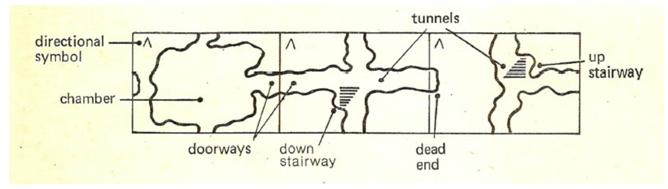
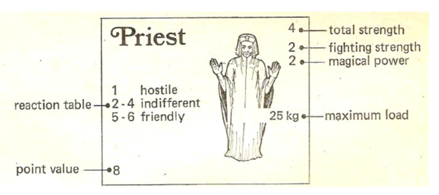
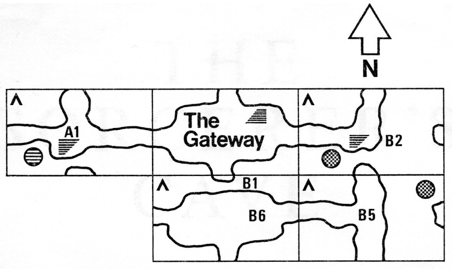
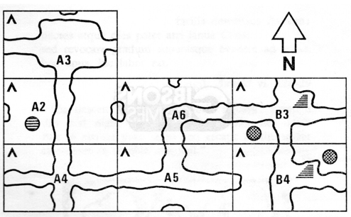

## THE SORCERER’S CAVE

IN THE HEART OF A FOREST in a faraway land is the entrance to a vast underground labyrinth, the treasure house of an evil Sorcerer. During his long lifetime of wicked deeds this Sorcerer has gathered immense wealth: heaps of silver and gold and glittering jewels, and artefacts of wondrous power. The fame of the Sorcerer’s treasure-house has spread far and wide, and many a thief and adventurer longs to carry off a portion of the bounty. To protect his hoard, the Sorcerer has made of his magic arts an ever-changing Cave of many tunnels and chambers, and filled it with all manner of pitfalls and fearsome creatures to beset those who venture within.

Yet many still come to the Cave to match wits and strength with the Sorcerer, and with the other bands of brigands found there. You can be one of these adventurers. You may enter the Cave alone or with a few companions. Within its twisting passages and echoing caverns you may find friends, and enemies too. You will encounter magic which may harm or help you; you will find treasure; and perhaps you will meet the Sorcerer himself.

May you have good luck. But heed this warning: many do not return from the perils of the Sorcerer’s Cave!

## HOW TO USE THE RULES

First read the section entitled BASIC RULES. This gives you enough information to begin playing the game. As soon as an exploring party becomes involved in a fight, read the section called FIGHTS. If any other points arise which are not covered in these two sections, refer to the NOTES ON THE CARDS.

Until you have learned the basic principles of the game you are unlikely to need the rules governing PLAYER INTERACTION. These are followed by a section on OPTIONS AND VARIATIONS, which may be experimented with by experienced players.

The BASIC RULES are for a game with two to four players. Solitaire play is essentially the same; see under OPTIONS AND VARIATIONS. Any number of players may co-operate as a team in competitive or solitaire play. Young children who are not able to grasp all the rules can still enjoy helping make decisions, turning over cards, and so on.

## BASIC RULES

## Game Equipment

1. A pack of large cards, each of which is called an area. These cards are laid down one by one to form a map of the part of the Cave that has been explored. An area may be a tunnel, a chamber, or one of the special areas, the gateway, the deep pool, the viper pit, the chasm, the whirlpool, the bell rope, the well, the lair, and the gallery. Each area has two, three, or four doorways along the edges which may meet matching doorways on adjacent cards, or which may lead to dead ends. Some tunnels also have stairways which lead up or down to the centre of an area directly above or below. Each area card has a directional symbol which should be in the upper left-hand (northwest) corner when the card is in place.

2. A pack of smaller cards, from which cards are drawn each time an exploring party enters a chamber that has not been explored before. These cards are of three types:

  a. Hazard cards. These represent phenomena or events that may affect the party entering the chamber.

  b. Treasure cards. These are of two kinds: heavy treasure, found mainly in sacks weighing 25 kg each; and artefacts, which for the purposes of the game are considered weightless.

  c. Creature cards. These represent various human and inhuman beings. Certain information about each creature is given on the card: fighting strength, magical power, and the weight it can carry, if any. The original exploring parties are made up of one or more creature cards. Creatures found within the Cave may, on being approached, react in a hostile, indifferent, or friendly manner to an exploring party, according to a die roll and the reaction table of the creature being tested.

 - Where only one number appears in the upper right-hand corner, the total strength is equivalent to fighting strength.

 - Each treasure and creature that can be brought out of the Cave is worth a number of points, shown in the bottom left-hand corner.

  

3. A six-sided die, used in determining various events but not movement.

4. Four different tokens, each to represent an exploring party and show its position on the map.

5. Plain markers of four different colours, used to orient different levels of the Cave to one another, and to mark secret doors.

## Object

Players form exploring parties and, by turns, explore the Cave area by area until the large pack is exhausted or no one cares to go any further. Play ends when all parties which are able to do so have left the Cave. The winner is the player whose party has left the Cave with the most points in creature and treasure cards. Points may also be acquired by slaying the Sorcerer.

## Making up the exploring parties

Players roll the die to determine order of play. The player who has first choice of an exploring party is the last to move, and vice versa. Each player makes up his exploring party by choosing one or more creatures from the small pack, ignoring reaction tables. Referring to the table below, a player may select available creatures with a total selection value of 6; e.g. a priest and a woman, or a troll and two dwarves.

| Type       | Magical  Power | Fighting Strength | Carries (kg) | Number in Pack | Other Characteristics                                    | Selection Value |
|------------|----------------|-------------------|--------------|----------------|----------------------------------------------------------|-----------------|
| Hero       | -              | 5                 | 75           | 1              | Has Charisma: adds 1 to die roll when testing strangers. | 6               |
| Woman Hero | -              | 4                 | 50           | 1              | Has capabilities of  woman and hero.                     | 5               |
| Witch      | 4              | 1                 | -            | 3              | Uses artefacts as priest.                                | 5               |
| Priest     | 2              | 2                 | 25           | 3              |                                                          | 4               |
| Ogre       | -              | 5                 | 100          | 3              | Inhuman, cannot use  most artefacts.                     | 4               |
| Troll      | -              | 4                 | 75           | 3              | Inhuman.                                                 | 3               |
| Man        | -              | 3                 | 50           | 6              |                                                          | 3               |
| Scholar    | 1              | 2                 | 25           | 1              | Uses artefacts as priest.                                | 3               |
| Thief      | -              | 2                 | 25           | 1              | Steals strangers' treasure.                              | 3               |
| Woman      | -              | 2                 | 25           | 4              | Befriends unicorn.                                       | 2               |
| Lion       | -              | 3                 | -            | 1              | Will not quarrel.                                        | 2               |
| Wolf       | -              | 2                 | -            | 1              | Safe from Medusa; will not quarrel.                      | 1               |
| Dwarf      | -              | 1                 | 25           | 4              | Inhuman. Guides past traps.                              | 1               |

The composition of the exploring parties will change throughout the game as creatures and treasure are gained and lost. At all times the players should keep their holdings neatly arranged and open to view, each creature with whatever treasure it may be carrying. A player may redistribute treasure among the creatures of his party at the beginning or end of a turn, providing the party is not involved in a fight at the time.

Normally a player is out of the game if they no longer have any creatures in their exploring party. In friendly play they may be permitted to begin again at the gateway with an exploring party made up from the dead pile. In competitive play they may carry on as zombies (see OPTIONS and VARIATIONS).

After the exploring parties have been chosen, shuffle the small pack thoroughly and put it face down in a place handy to all the players.

## Exploring the Cave

Remove the gateway card from the large pack and place it, face up, near one end of a spacious floor. Allow enough space around it for the first level to be explored in all directions, and allow plenty of space in the rest of the room for other levels to be mapped. Place the rest of the large pack face down in a convenient spot. Put the tokens representing the exploring parties on the gateway card. The gateway card forms a starting point for exploration, and is the nucleus of a map (i.e. top view) of the first level. Maps of deeper levels will be built up separately. See Starting a New Level below, and the example at the end of the book.

The parties are now just under the surface of the earth, on the highest level of a labyrinth that may have many deeper levels.

Play proceeds by turns. Basically it takes one turn to explore one area. But a variety of things may happen in one turn. In the following discussion, any event or decision which marks the end of a player’s turn will be indicated thus: (*).

To explore an area, a player announces through which doorway his party intends to leave the area it is now in. He then draws the top card from the large pack and puts it next to the area his party is in. If his chosen doorway leads to a dead end on the new card, he places the card face down and leaves his party where it is (*). (Later, a party may be able to enter this area from another direction, at which time the card is placed face up.)

But if his chosen doorway matches a doorway in the new area, the player leaves the card face up and moves his token into it. If the new area is a tunnel (*), the party can explore any of its doorways or stairways in the following turn. If it is the Whirlpool, Viper pit or Deep pool, the player leaves his token just inside the doorway (*) and may proceed across the barrier and through another doorway on the following turn.

If the new area is a chamber, the player draws one or more cards from the small pack, and his turn continues as described in Entering a Chamber, below.

At any time, a party may move through areas that have already been explored, at the rate of one area per turn. If he enters a chamber that has been previously explored no more small cards are drawn, but any hazards, creatures, or treasure remaining in the chamber must be dealt with in the usual way.

Occasionally, it may happen that a player or players meet nothing but dead ends wherever they turn, and cannot continue exploring. If all available doorways and stairways have been tried, including those which may be reached by backtracking, the last area card played to make a dead end may in the same turn be put back into the middle of the pack, and another one drawn, until a way is found. This course cannot be followed when there is any other means of continuing the exploration, however time consuming, difficult, or dangerous.

## Entering a Chamber

The player whose party first enters a chamber must draw from the small pack. If the chamber is on the first level he draws one card; if it is on the second level he draws two; if on the third level three; and if on the fourth or any deeper level he draws four. He shows these cards to all the players, and places them on the area card.

If he has drawn a hazard card which affects his party, he must immediately act on its instructions.

If he has drawn unguarded treasure cards, he may pick them up and distribute them among members of his exploring party, taking care that no creature is given more heavy treasure than it can, or will, carry (*).

If he has drawn any creatures (which we call strangers as long as they are not attached to an exploring party), he may not for the moment pick up any treasure in the chamber, and his turn continues as follows.

## Encountering Strangers

When a party has entered a chamber containing strangers, it must in the same turn adopt one of the following three courses of action.

1. If the way is open, withdraw from the chamber by the way it came in. The strangers remain in the chamber, along with any treasure found there (*).

2. Attack the strangers, and fight one round (*). (see FIGHTS)

3. Approach the strangers to test their reaction. Determine which of the strangers is the leader of the group according to the priority in this list: Sorcerer, Apprentice, Demon or Spectre, Dragon, Wizard, Hero or Woman-hero, Priest, Witch, Man, Woman, Scholar, Thief, Giant, Ogre, Troll, Lion, Wolf, Dwarf (Note that Demon, Spectre or Dragon found with friendly Apprentice remain indifferent on that turn)

The other strangers will react in the same way as the leader. Roll a die and consult the leader’s reaction table. Note that a bonus on this die roll (through having a hero, or the ring) does not apply to a score of 1, which will always cause potentially unfriendly strangers to attack.

If the strangers are hostile, they immediately attack the exploring party, and one round is fought (*). If the party subsequently retreats, the strangers remain hostile to it for the rest of the game ; however, they may still be approached by other parties.

If the strangers are indifferent (*), in its next turn the party may test them again, or attack them, or leave the chamber by any doorway without picking up any treasure found there.

If the party chooses to remain in the chamber, or finds itself delayed by a dead end, or if at any time it re-enters the chamber, then it must in the same turn either test the strangers again or attack them. Meanwhile other parties entering the chamber have the usual options.

If the strangers prove friendly, the player immediately adds them to his party as allies, and may take any treasure found in the chamber (*).

## Starting a New Level

The cave may have any number of levels, or floors, extending down from the first level.

When a party descends a stairway or falls down a trap it goes to the approximate centre of an area directly underneath, and one level down. The new area card is placed on another part of the playing surface, preferably in line with the card representing the area directly above it, and plain markers of one colour are placed on the two cards to show the relationship between them. The new card forms a starting point for the new level,which may now be explored for any distance in any direction. A level may be built up in more than one section if parties arrive on it at different points; these sections may or may not join up eventually but in any case a true scale must be maintained between them. See the example at the end of this book.

Movement upwards from lower levels is dealt with in the same way. Any stairway leading up from the first level is an exit from the Cave. Once a party leaves the Cave by one of these stairways, it may not return.

## Secret doors

More often than not, a stairway will lead to an area on which no corresponding stairway is pictured. In such a case, one end of the stairway is considered to be concealed by a secret door.

When a player explores such a stairway, marking the two levels as usual with plain markers of his colour, the marker at the hidden entrance to the stairway will show that the player has knowledge of the secret door, and may use it to retrace his steps. No other party may use his secret door, unless it has also explored the stairway from its visible end, or has been shown the secret door by a knowledgeable party in the same area, or is in the same area when another party uses the door, or has the ability to find secret doors with the charmed flute. Every player who discovers a secret door should mark it with his colour.

The charmed flute will discover any secret door, even if it has never been explored, as long as the stairway it leads to is visible among the area cards that have been played.

## Curse

A party under a curse subtracts one from all its die rolls. Multiple curses have a cumulative effect. A curse has no effect if the Sorcerer is dead.

## Note on die scores

Additions to and subtractions from die rolls are accumulated: thus a hero with the ring will add 2 to his score when testing strangers. Except in fights, a die score of less than 1 equals 1, and a score of more than 6 equals 6. Remember that a roll of 1 when testing strangers always counts as 1, regardless of any addition that would normally be made.

## Ending and scoring the game

It is not necessary to play all the area cards, and a party which is able to go up a stairway on the first level may leave the Cave at any time. When all area cards have been played, a special magic seals off all doorways and stairways leading off the map, other than stairways to the surface. Parties still in the Cave at this point may continue to move about as long as they like. Any cards left in chambers continue in effect, and it may still be possible to gain treasure and allies. Sometimes there will be a hidden chamber originally played as a dead end, but now approachable by another doorway or stairway. There may also be possibilities of ambushing other parties under the PLAYER INTERACTION rules.

Players whose parties succeed in leaving the Cave receive points for all the cards they hold. (Note that Magic carpet, Lotus dust, Strength potion, and healing balm are discarded once used.) Dragon-slayers count 10 points extra for each dragon killed. A party which has killed the Sorcerer receives a bonus of 30 points (divided equally if two or more parties combined against the Sorcerer). A player whose party is under a curse deducts 30 from his score.

## FIGHTS

A fight occurs when an exploring party attacks or is attacked by strangers or another exploring party. Only fights with strangers will be discussed here; guidelines for fights between parties are given in the PLAYER INTERACTION section.

A fight may last one or more rounds, each round ending a turn of play. The fight will continue until all the strangers or all of the exploring party have been killed or put to sleep, or until the party chooses to retreat and does so successfully.

## Setting up the fight

Take all the cards involved and lay them out on an open part of the floor. Any members of the exploring party who are to fight hand-to-hand must drop any heavy treasure they are carrying (this is left on the area card until the issue is decided), but they may continue to use artefacts.

Strangers will use the ring, magic staff, and magic sword/axe/shield to best advantage, but not lotus dust, holy water or strength potion.

The player involved in the fight lays out the stranger cards in a line, and pairs off his own fighting creatures against them. If the party is numerically larger than the group of strangers, the player may send two against one. If the group of strangers is larger, the player must send one against two; if he is still unable to engage all the strangers, he must fight the strongest combination.

Priests, wizards, witches, apprentice or scholar can either fight hand-to-hand, using their total strength, or remain in the background, adding their magical power to the fighting strength of a creature in the front line, or to the combined strength of two creatures fighting a single enemy. Any number of priests, wizards, witches, apprentice or scholar may combine their magical power against a single enemy in this way. Priests, wizards, witches, apprentice, scholar and the Sorcerer among strangers will normally fight hand-to-hand, except when the over-all strength of the strangers will be improved if they remain in the background.

Example. A party made up of a single hero becomes involved in a fight with a priest, a troll, a man, and a dwarf. Being unable to engage all the strangers, the hero must engage the strongest combination: that is, the troll and the man fighting hand-to-hand, with the priest in the background contributing his magical power, for a total strength of 9.

## Advantage of Surprise

The party or group of strangers which gains the advantage of surprise in a fight adds 1 to all its die rolls in the first round of the fight.

A party gains the advantage of surprise over strangers when attacking immediately after coming into the chamber by a doorway or stairway that has not been used before, or when arriving by magic carpet. There is no advantage when the party has fallen down a trap, unless it has done so deliberately.

Strangers gain the advantage when they attack on being approached.

## A Round of Fighting

Each pairing off or match is resolved separately. A die is rolled for each side, with that side’s total strength (together with any bonus for advantage of surprise, the ring, etc.) being added to the score. The side with the higher score wind that match, and the opponent (or one of them, if there are two) is slain. After each match has been resolved in this way, one round of fighting is completed, and the turn ends.

Example. A party comprising a hero with the magic sword, a woman, a dwarf, and a priest has approached an ogre and a troll, and found them hostile. The player may set up the fight thus:

The strength of each creature is shown in brackets. Only the magical power of the priest is shown, as he remains in the background using his power to support the woman and the dwarf. Note that he could have been placed alongside the hero, where he could have used his total strength of 4 against the ogre.

There are two matches taking place. In the first, the player throws 3 for the ogre and 4 for the hero. Since the strangers have the advantage of surprise, the ogre’s total score is 3+5+1=9. The hero’s score is 4+5+2=11; so the ogre is slain. In the other match, the player rolls 5 for the troll and 3 for his own side. The troll’s score is 5+4+1=10; the player’s score is 3+2+2+1=8; so the player loses that match, and one of his creatures is slain. The priest, being in the background, is not vulnerable; therefore either the woman or the dwarf must perish. The player states which he prefers to remove from play; he then rolls a die and if the score is 4,5 or 6 he gets his preference.

When the round of fighting has been completed, on his next turn the player may choose to have his party retreat (see below) or continue fighting. If he chooses to go on fighting, he may shift forces which are not engaged hand-to-hand. (in the example, the hero could turn and fight alongside the survivor of the other match, or the priest could be put into the front line.)

## Retreat

A party may retreat by any doorway or stairway. However, if the way proves to be blocked by a dead end or by creatures from which the player wishes to withdraw, the party must return and fight another round in the same turn.

Note that retreat is not the same as withdrawal. A party withdraws from creatures it does not wish to attack or approach, and must withdraw in the same turn and by the same doorway or stairway by which it entered the chamber. A party retreats after at least one round has been fought, and may leave the area by any available doorway or stairway.

A party which retreats must leave behind any treasure dropped in the area, including artefacts that were being carried by creatures which have perished.

## CARD REFERENCE

## Special area cards

### Deep Pool

*“Only GIANTS may carry heavy treasure through this area.”*

On first turning the card over you move your token onto it, but not across the water. On the following turn you may either move back to the area you were last in or cross the water and proceed through any doorway. If a giant has to carry across more than one load of heavy treasure there is a delay of one turn per additional load before the party can proceed.

Heavy treasure that has to be left behind is left in the doorway. Treasure may be deliberately cast into the pool, and is recoverable only by a giant.

A stairway or trap leading to the deep pool comes out on an island in the middle. Treasure may be left on this island.

### The Chasm.

*“You may go down a level but may not return this way.”*

On the turn following entry you may either go back the way you came in, or descend to the next level. A stairway up or down to the chasm leads to the island or column in the middle, from where the party can only descend, except to trace its steps up a stair. A trap to here sends you down a further level.

## The Gallery. 

*“Draw as usual. All strangers found here are of STONE (except Sorcerer, Spectre and Demon.”*

Draw as usual when you enter. Stone strangers may be ignored and their treasure taken, but if you have the means to reanimate one or more of them you may do so, either singly (one per turn) or in a group, and approach the strangers in the usual way. For example, a party finds a spectre, dragon, ogre and priest in the gallery. After fighting the spectre, which is not affected by the gallery, the party on its next turn reanimates the ogre and priest (with the power of a wizard with the staff) and approaches them, consulting the priest’s reaction table. The dragon remains of stone. The ogre and priest remain in the game as usual.

## The Lair. 

*“Draw as usual.”*

On first entering draw as usual. If harpies have already stolen artefacts, these are now placed here with whatever else you find. If harpies are drawn here, they give your artefacts to any strangers in the lair, and if you draw a trap here the artefacts are left behind. Artefacts brought here later are defended by any strangers or trap in the lair.

The Bell Rope. “Assign one to pull it. 1 Puller disappears. 2-3 Bell rings. 4-6 Draw 2 small cards & do not withdraw. Once only.”

A party may pass through the area as if it were a simple tunnel, ignoring the bell rope. The rope can be pulled only once, and if strangers appear, the party must approach or attack them. The party cannot gain the advantage of surprise at this time. The strangers remain in the game as usual.

### The Great Hall. 

*“Draw 2 extra small cards.”*

### Tomb of Kings. 

*“Draw 1 extra small card.”*

### Viper pit. 

*“Roll die for each creature crossing one segment of narrow ledge. Creature perishes with roll of 1 or 2.”*

On first turning the card over you move your token onto it, but not onto the narrow ledge. On the following turn, you may either go back to the area you were last in or cross one segment of the narrow ledge and, if you wish, try to leave by that doorway. To cross another segment and proceed through that doorway requires another turn. Any treasure carried by a creature who falls off the ledge remains in the pit, and is recoverable only by a party with the charmed flute. Treasure may be deliberately cast into the pit. A stairway or trap leading to the viper pit comes out on a safe island in the middle.

### The Well. 

*“You may draw 1 small card and not withdraw.”*

The idea is that you pull up the rope. Basically this area is like the bell rope, but you do have the advantage of surprise if attacking a stranger crawling up the shaft. If you draw the Eye of God, you must take it; if you draw the lost ruby, it is free for the taking. A trap drawn here continues to affect the whole area.

### The Whirlpool.

*“Roll die each time the party crosses the shallows: On 1 or 2 the entire party goes to area below.”*

Basically like the viper pit, except that you roll only once for the entire party. Any stairway leading to this area is considered blocked. A trap to this area sends you down another level.

## Hazard cards

When two or more different hazard cards are drawn in the same chamber, they are dealt with in this order: Earthquake, Spell, Harpies, Medusa, Ghouls, Quarrel, Desertion, Mutiny, Trap 

### Earthquake. 

*“The last area your party was in collapses and remains impassable. Place this card in the affected area”*

If two earthquake cards are drawn in the same chamber, the last two areas your party was in are destroyed. Any small cards in a destroyed area, including exploring parties represented by tokens, are permanently removed from play.

### Ghouls. 

*“Each creature in your party is immediately attacked by GHOULS with a strength of 2. They are then driven off until the chamber is entered again; meanwhile your turn proceeds as usual.”*

A round of battle is fought in the normal way, each creature in the party being matched against ghouls with a total strength of 2. There is no advantage of surprise on either side. Any members of the party killed are removed from play and the turn continues. All heavy treasure must be dropped; this may be picked up at the end of the turn, providing the party is not involved in a fight with other creatures at the time. Like Medusa, ghouls will not attack the party again unless it actually leaves the chamber and comes back again.

### Harpies. 

*“They take all your party's artefacts to LAIR and disappear. If LAIR has not appeared, leave artefacts aside until it does appear. If you have no artefacts”, or have TALISMAN, leave this here.”*

They do not take artefacts found in this chamber. If your party has no artefacts, or has the talisman, the harpies remain in this chamber until able to steal at least one artefact from a party entering the area.

### Medusa. 

*“All who catch her glance are turned to STONE. Whenever a party enters the area, roll a die for each creature in the party. A throw of 1 or 2 turns that creature to STONE. STRANGERS are not affected.”*

She only attacks parties actually entering the chamber, not those delayed by dead ends or by strangers. Her victims cannot be moved, but anything they were carrying can be taken from them at the end of the turn, providing the party is not involved in a fight at the time. The Eye of God renders Medusa powerless.

### Mutiny. 

*“All ALLIES in your party revert to the status of STRANGERS. They join with any other STRANGERS in this chamber and may be retested in the normal way.”*

The mutineers immediately join forces with any strangers in the chamber, and the mutiny card is discarded. They will not fall down a trap in the area. You have the same options as with any group of strangers. If your party consists entirely of allies, all original members having been lost before the mutiny, one ally of your choice will remain loyal to your cause.

## Spell.

*“The last unoccupied tunnel your party was in is put into the middle of the pack and replaced by the next card, face down. Any secret doors there disappear.”*

This hazard affects the last tunnel your party was in that now contains no exploring party or small card (after any earthquake card drawn here has been placed.) Chambers are not affected. Markers for secret doors in the affected area must be removed, as well as markers for secret doors on adjacent levels connected to stairs in the vanished area. Stairs visible on other levels and leading to the new card can, of course, be explored as usual, and new secret doors in the new area may be discovered.

### Quarrel

*“The two strongest members of your party fight one round, then eyour turn continues as usual.”*

The two strongest are determined by total strength, including sword, staff or axe, where these are carried, you may choose between equals. For example, a quarrel in a party of giant, priest and man with sword would involve the giant and either of the others. In a party of man, wolf and dwarf the quarrel would be between the man and the dwarf. After one round the quarrel is immediately over and your turn comes as usual.

### Desertion

*“Roll a die for each ALLY in your party. On a roll of 1 or 2, that ALLY disappears with any treasure it carries.”*

Remember that allies are those who have joined your party since the beginning of the game; original members are not affected. As with mutiny, if your party consists entirely of allies you may designate one creature to be immune from desertion.

### Trap

*“Your entire party goes to the area one level below. Any creatures or treasure found in this chamber remain here. Continues in effect.”*

A party which falls down a trap ignores any treasure or creature cards found with it, but proceeds normally with the turn in the area below, drawing more cards if this is a newly discovered chamber. A party which includes a dwarf may ignore a trap, but not two traps drawn in the same chamber. If a party guided by a dwarf becomes involved in a fight in a chamber where there is a trap, and the dwarf is killed, the party falls down the trap as soon as it tries to leave the chamber.

## Treasure Cards

### Charmed flute. VP 10.

*“Artefact. When played by a MAN, WOMAN, HERO, PRIEST or WIZARD, lulls DRAGONS and VIPERS to SLEEP. Also opens SECRET DOORS. Sleeping creatures are protected by a CURSE.”*

Dragons and vipers will be lulled to sleep immediately, and remain asleep until the party leaves the area. The flue-player may fight in the same turn. A dragon may be put to sleep before strangers are approached, so that a friendlier creature will be their leader. A creature involved in a fight cannot use the flute to find a door to retreat by.

### Crypt/Gems. WGT 25 kg. 0/20 vp. 

*“You may enter at the beginning of a turn and roll a die. 1-2 unavoidable TRAP: party goes to area below. 3-6 find GEMS.”*

Your party can enter the crypt only after having slain or befriended any strangers in the chamber, if you find a trap, it has effect once only and then this card is discarded. If you find gems, they remain in the game as usual.

### Elixir

*“Artefact. Any creature may drink it. Roll a die: 1 poison kills. 2-3 nothing happens. 4-6 permanently increases strength by 2.”*

It can be taken at any time, even between rounds of fighting, and its effect is immediate. Remember that the ring adds one to all die rolls, so would be proof against poison; and healing balm can be administered as an antidote. Neither the poison nor the strengthening elixir is truly magic, so the Eye of God does not affect either. Undrunk elixir has no points value at the end of the game.

### Eye of god. 

*“Artefact. A gem which renders powerless all magic in the area, and annihilates SPECTRES and ZOMBIES. Having taken it up, you must keep it, otherwise you will be CURSED.”*

Priests, witches, scholar, apprentice and wizards, and all other artefacts are powerless when this gem is in the same area (priests, witches, scholar, apprentice and wizards retain fighting strength); spectres and zombies are permanently destroyed. The statue bearing the lost ruby is powerless to attack. Once a party has taken up the Eye, the gem must be kept with the main body of the party; otherwise there is a curse on that party until the gem is again taken up by the same or another party. This applies even if the gem is left behind involuntarily, e.g. on the body of a slain creature. Note that on encountering the Eye your party is under no obligation to pick it up.

### Gems. WGT 25 kg. 20 vp.

### Gold. WGT 25 kg. 10 vp.

### Healing balm. 

*“Artefact. In the hands of a WIZARD, PRIEST or WOMAN, will restore to life any creature just killed. Enough for one cure only, use at the start of your turn when not fighting.”*

It may be applied only at the beginning of a turn in which the party is not involved in a fight.

### Holy Water. 

*“Artefact. Reanimate creature of STONE. Destroys MEDUSA, SPECTRE, or DEMON, or weakens SORCERER or APPRENTICE by 2. One use only.”*

### Idol. WGT 50kg. 10/20/30/40/50/60 vp. 

*“Determine value at end of game. 10 times a die roll.”*

### Lost ruby. 20 vp. 

*“Artefact. Set in the forehead of a colossal statue. Try to remove it at the beginning of a turn. The statue attacks you with a strength of 8, and you must defeat it to win the jewel.”*

If a party has aroused the statue and then retreated, the statue attacks any party which later enters the area.

### Lotus dust. 5 vp.

*“Artefact. Enough to put one creature to sleep for 2 turns of the player who uses it. Works on MEDUSA, but not on GHOULS, SPECTRES or ZOMBIES. Sleeping creatures are protected by a CURSE.” It may be used before approaching strangers, or before any round of fighting.*

### Magic axe. 15 vp. 

*“Artefact. Adds 1 to the strength of a MAN, WOMAN, or HERO; 3 to that of a DWARF. Also enables the bearer to fight a DEMON.”*

It can be carried with the sword, but only one or the other can be used in a fight by the bearer.

### Magic carpet. 5 vp. 

*“Artefact. When commanded by a PRIEST or WIZARD, will transport a party to any adjacent area in any direction (including up or down), drawing another tile if necessary. You may not withdraw, and the carpet remains behind.”*

It will transport the party to any area in play, including one that has been left face down. The carpet must be left in the area where it was used, but can be retrieved and used again.

### Magic shield. 15 vp. 

*“Artefact. When borne by a MAN, WOMAN, or HERO, nullifies the opponent's magical power. Reduces the power of Sorcerer or APPRENTICE by 2.”*

It affects any creature with magical power who is matched against the bearer in a fight, whether in the background or fighting hand-to-hand. For example, a troll and a man with the shield are fighting wizard; the wizard fights with only his strength of 2. Again, a hero with the shield meets two women and a priest; the priest cannot use his power from the background to support the two women. Except for magic staff, artefacts held by the opponents are not affected. Magicians not matched against the shield-bearer may still use their magical power against others. In any round of a fight the shield-bearer may match himself against a spectre or demon, and the spectre or demon is simply ignored for that round; neither it nor the shield bearer will be killed.

### Magic staff. 15 vp. 

*“Artefact. Increases the magical power of a PRIEST or WIZARD by 2. In the hands of a WIZARD, reanimates creatures turned to STONE, and wards off MEDUSA.”*

If warded off, Medusa ceases to have any effect until the staff and wizard leave the area.

### Magic sword. 15 vp. 

*“Artefact. Adds 1 to the Strength of the MAN or WOMAN who bears it, or 2 to a HERO. Also enables the bearer to fight SPECTRES.”*

### Scroll. 

*“Artefact. On being read by any HUMAN, destroys all enemies in an area other than those with Magical Power. Any party using it is CURSED.”*

This only works when your party is attacking, not when it is being attacked. It may double the normal advantage of surprise, or give you an advantage when you have forfeited the normal advantage by not attacking immediately. It cannot be used twice in one area. It can be read by witch or scholar, who use artefacts like a priest.

### Silver. 25 kg. 5 vp.

## Strength potion.

*“Artefact. Adds 2 to the Strength of a MAN, WOMAN or HERO for the duration of a fight. One draught only.”*

It can be taken immediately before any round of fighting.

### Talisman. 10 vp.

*“Artefact. Wards of ZOMBIES and GHOULS from the party displaying it. On the fourth level or deeper, also wards off SPECTRES.”*

It has no warding-off power until actually taken up by an exploring party; i.e. it may be guarded by ghouls or spectres. When warded off, ghouls and spectres cease to have any effect as long as the party with the talisman remains in the area. The party possessing it may use its power to protect other parties in the same area.

### The Ring. 30 vp.

*“Artefact. When worn by a MAN, WOMAN, PRIEST, WIZARD, HERO or DWARF, adds 1 to the die rolls of your party. Also makes the bearer invincible on the fourth level or deeper.”*

The bonus value of the ring applies to all die rolls in a round of fighting, even if the bearer is slain in that round. On the fourth level or deeper the bearer fights in the normal way, but die rolls which would normally indicate his death are ignored. On being defeated an invulnerable stranger will disappear with the ring, leaving other treasure behind.

### Treasure Chest. 100 kg. 0/20/40/80 vp. 

*“When you wish to open it, roll a die. The chest contains: 1. A CURSE. 2. A SPECTRE, which attacks. 3.
Sand. 4. Silver (20vp). 5. Gold (40vp). 6. Gems (80vp).”*

Two or more creatures may join in carrying it. It can be opened at the beginning of any turn when the party is still in the Cave. If a spectre appears, it attacks with a magical power of 5 and the turn ends after one round of fighting. If the spectre is not defeated, it remains in the area and is hostile to all parties.

## Creature Cards

### Apprentice. STR 9 (PHY 2, MAG 7). CAP 0 kg. Reacts: 1-5 Hostile 6 Friendly. 

*“Uses artefacts as a WIZARD. Will not go to the surface. If the SORCERER is dead, is always HOSTILE.”*

Though he is nominally an ally of the Sorcerer, the apprentice is ambitious and may befriend a party for the sake of overthrowing his master. Once the Sorcerer is dead, the apprentice is always hostile. If he is with a party at the time, he will attack the party in its next turn if it does not immediately leave the area. If he is the only member of a party when the Sorcerer is slain, that player is eliminated from the game. Since he will not leave the Cave with a party, he must be left behind at some point if still friendly when the party wishes to leave.

### Demon. STR 6 (MAG 6). Reacts: 1-5 Hostile 6 Indifferent. 

*“Appears in the area your party just left. Can be fought with Magical Power only.”*

Basically like a spectre, except that when first drawn the demon appears in the last area your party was in, joining any strangers who may be there. If that area has been affected by earthquake or spell, the demon goes to the last open area. If the demon is placed in an area occupied by another party, that party must leave the area on its next turn, or deal with the demon; the party may leave by any doorway.

### Dragon. STR 6. Reacts: 1-4 Hostile, 5-6 Indifferent. 

*“Anyone who slays a DRAGON single-handed adds 1 to the Fighting Strength.”*

If a creature slays a dragon single-handedly, the dragon card is inverted and put with its slayer to indicate that creature’s status as a dragon-slayer. The creature may acquire greater strength by slaying more dragons.

### Dwarf. STR 1. CAP 25 kg. 2 vp. Reacts: 1-4 Indifferent. 5-6 Friendly. 

*“Guides past TRAPS.”*

### Giant. STR 7. CAP 150 kg. 7 vp. Reacts: 1-3 Hostile. 4-5 Indifferent. 6 Friendly.

### Hero. STR 6. CAP 75 kg. 10 vp. Reacts: 1-3 Hostile. 4-6 Friendly. 

*“If there is a HERO in your party, add 1 to the die roll when testing STRANGERS.”*

The presence in a party of two heroes does not double the bonus on die rolls when testing strangers.

### Lion. STR 3. CAP 0 kg. 3vp. Reacts: 1-4 Hostile 5-6 Friendly. “Not affected by QUARREL. Does not carry or use any artefact.”

### Man. STR 3. CAP 50 kg. 5 vp. Reacts: 1-2 Hostile. 3-4 Indifferent. 5-6 Friendly.

### Ogre. STR 5. CAP 100 kg. 5 vp. Reacts: 1-4 Hostile. 5 Indifferent. 6 Friendly.

### Priest. STR 4 (PHY 2, MAG 2). CAP 25 kg. 8 vp.

### Scholar. STR 3 (PHY 2, MAG 1). CAP 25 kg. 5 vp. Reacts: 1-2 Hostile. 3-4 Indifferent 5-6 Friendly. “Use artefacts as a PRIEST.”

### Spectre. STR 4 (MAG 4). Reacts: 1-5 Hostile. 6 Indifferent. 

*“Can be fought with MAGICAL POWER only.”*

Spectres are not of flesh and blood, so they cannot be fought hand-to-hand, except by a man, woman or hero bearing the magic sword, priests, witches, wizards, scholar and apprentice not otherwise engaged may fight spectres, using their magical power only. In any round of a fight in which a party does not have any magical power to pit against a spectre, the strongest creature in the party must be matched against the spectre, and is automatically slain.

### Sybil. CAP 0 kg. Reacts: 1-4 Indifferent. 5-6 Friendly. 

*“Remains Neutral in fights; Invulnerable. Test once only, and only after other STRANGERS have been dealt with. If you have SYBIL to guide you, you may examine any area tile at the beginning of your turn, including the top card of the pack. She will go to the surface.”*

### The Sorcerer. STR 13 (PHY 4, MAG 9). Reacts: 1-6 Hostile. 

*“LOTUS DUST and EYE OF GOD each reduce his Strength by 2.”*

An exploring party which encounters the Sorcerer may withdraw from the chamber or attack in the normal way; but it may not approach the Sorcerer or his companions to test them, as they will always be hostile.

A player who defeats the Sorcerer and his companions has the option of sparing the Sorcerer’s life on condition that he immediately transport the party and any treasure in the chamber, by magical means, to an area of the players choice. This option must be taken up in the first turn after the fight is over. It cannot be done if the Eye of God is present. The Sorcerer remains in the chamber.

A party which attacks the Sorcerer and fails to defeat him falls under a curse.

### Thief. STR 2. CAP 25 kg. 5 vp. Reacts: 1-2 Hostile 3-4 Indifferent 5-6 Friendly. 

*“Will steal treasure from any group of indifferent STRANGERS. Uses artefacts as a MAN.”*

As a member of your party, the thief will steal one treasure of your choice from any group of indifferent strangers, providing the thief can carry the treasure. The strangers immediately become hostile to your party and will attack on the following turn if you do not leave the area. The thief will also steal one treasure from any other party in the same area at the end of the thief’s party’s turn; it is of course up to the other player to decide whether he wants to attack on his turn. The thief will not steal from the same party twice.

### Troll. STR 4. CAP 75 kg. 4 vp. Reacts: 1-3 Hostile. 4 Indifferent. 5-6 Friendly.

### Unicorn. STR 4. CAP 0 kg. 4 vp. 

*“Friendly to WOMEN, otherwise indifferent.”*

If found with a woman, it will remain loyal to her. Otherwise it may not be approached till other strangers in the chamber have been befriended, found indifferent, or slain. Then it will join your party if it contains a woman; otherwise it will remain indifferent, guarding any treasure in the area. A unicorn will remain allied to your party only as long as it contains a woman.

### Witch. STR 5 (PHY 1, MAG 4). CAP 0 kg. 10 vp. Reacts: 1-2 Hostile 3-5 Indifferent 6 Friendly. 

*“Uses artefacts as a PRIEST.”*

### Wizard. STR 7 (PHY 2, MAG 5). CAP 0 kg. 15 vp. Reacts: 1 Hostile. 2-5 Indifferent. 6 Friendly.

### Wolf. STR 2. CAP 0 kg. 2 vp. Reacts: 1 Hostile. 2-3 Indifferent. 4-6 Friendly.

### Woman. STR 2. CAP 25 kg. 5 vp. Reacts: 1-2 Hostile. 3-4 Indifferent. 5-6 Friendly.

### Woman Hero. STR 4. CAP 50 kg. 10 vp. Reacts: 1-3 Hostile. 3-6 Friendly. 

*“If there is a HERO in your party, add 1 to the die roll when testing STRANGERS.”*

The presence in a party of two heroes does not double the bonus on die rolls when testing strangers. The woman-hero has all the capabilities of a woman and a hero.

## PLAYER INTERACTION

At any time, two or more exploring parties may occupy the same area and continue to act independently. Obviously, the first party to enter a chamber will have the first opportunity of befriending or fighting strangers and of picking up booty.

For beginners, it is suggested that parties in the same area not be permitted to fight one another or to combine against a common enemy, and that no party be permitted to enter an area where a fight is in progress. Once the basic rules have been mastered, however, parties may interact in the ways set out in this section.

## Trading Cards

Players whose parties are in the same area may trade any cards they hold. The Eye of God may be traded without a curse falling on the original holder.

## Fights between Exploring Parties

A player can attack another player whose party is in the same area, unless the parties are in the viper pit, deep pool or Chasm, or any chamber containing strangers, Medusa, trap or ghouls. A party may move into the area and attack in the same turn.

A party gains the advantage of surprise over another party only when attacking immediately after arriving in the area by another way than the one by which the defender entered the area. In other words, you cannot gain the advantage over a party which you are following.

Fights between parties are conducted in basically the same way as fights with strangers. (See FIGHTS.) The first round is fought during the attacker’s turn, the second in the defender’s turn, and so on until one of the parties is wiped out or retreats, or both parties agree to end the fight at the end of a round. Meanwhile other players continue to take their turns as usual.

A fight between parties is set up as follows;

1. The defender lays out all his creatures in a line of battle. If his party has the numerical advantage, he may deploy magic users behind the line, without specifying where they are to direct their magical power.

2. The attacker now deploys his fighting creatures, engaging every creature in the other’s front line if he can (sending one against two if necessary). If his party has the numerical advantage, he may deploy magic users behind the line, specifying where they are to direct their power.

3. The defender now assigns the magical power of any magic users he has in the background.

After a round has been fought the defender may, in his turn, either retreat or fight another round. If he chooses to continue fighting he may shift uncommitted forces. He must continue to engage each enemy creature in the front line if he can. If after doing so, he still has uncommitted forces, they may attack any enemy creatures in the background. In any subsequent rounds the player whose turn it is has the same options.

It is always a player’s privilege to roll the die for his own scores, regardless of whose turn it is.

## Retreat from Another Party

A party retreating from another party may take two turns in a row in order to escape possible pursuit, provided that in its first turn of retreat it does not encounter strangers, another party, a hazard (whether or not it affects the party), the viper pit, deep pool or chasm, and does not stop to pick up any unguarded treasure.

## Union of Exploring Parties

At the beginning of any turn of a player involved, two or more parties in the same area may form a union under the command of one player. The commander may move the combined party only during his own turn, and only after the other players in the union have each forfeited a turn. (If attacked in the meantime, the union may defend itself.)

A party in a union may end his involvement in it by retaking his place in the normal order of turns, unless the union is involved in a fight at the time. He may also refuse to let his party be moved during the commander’s turn. Once a union has entered an area, however, the commander has complete control over it till the end of the turn, or until any ensuing fight is over. The commander cannot deploy the union in a fight in such a way that creatures of a subordinate partner party are most likely to be killed; the principle of strongest fights strongest must apply if there is any disagreement among the partners in such a case.

Two parties which wish to co-operate in fighting a common enemy, whether strangers or another party, must form a union. Two parties involved in a fight with one another can stop the fight at the end of any round and form a union to meet a common enemy.

A party which enters an area where a fight is in progress may form a union with a party involved in the fight, after forfeiting a turn and placing his party under the other’s command. Otherwise, the party cannot interfere in the fight, nor may it pick up any treasure in the area, nor may it pass through the area. After the fight is over it must deal with any strangers in the usual way.

If a union has gained new allies since being formed, these allies may be divided among the parties by agreement when the union is dissolved. If an agreement cannot be reached and a fight ensues, new allies will remain neutral until the fight is over, and then join the victorious party.

## Division of a Party

A player may divide his party, but he may continue to move only one part of it. He may leave creatures behind (e.g. to guard treasure) with instructions to attack other parties which enter the area, but these may not move except to retreat. They will rejoin the main party when it comes back to the area. If the main party is wiped out, the splinter group may may begin to move.

## OPTIONS AND VARIATIONS

### Hidden Cards

For beginners' or co-operative play it is recommended that all cards drawn from the small pack be shown to all the players and left face up. In serious competitive play, however, each player should keep as much information as possible to himself.

Players need keep on display in their parties only their creature cards and any artefact which is being used. (It is wise to keep the talisman on display so that ghouls and spectres can be passed by without comment.) They must also show the top edges of any other treasure cards they hold.

On first drawing cards from the small pack, a player need show only hazards which affect him. If he wishes to approach strangers, the leader must be shown. If he becomes involved in a fight with strangers, they must all be shown. Other cards may be left in the area, face down, and only another party which enters the area may see what they are.

An area card which has been left face down may be examined only in the normal course of exploration, even by the player who originally drew it. A small card which has been shown to all the players in accordance with the rules is left face up, and can be examined by any player at will.

### Zombies

If this option is to be used, any creatures which die in the course of the game are not removed from play, but are left in the appropriate area, with a short edge to the north. If all other creature cards are left with a long edge to the north, it will be easy to distinguish the living from the dead. Dragons and spectres vanish when slain.

When a player's entire party has been slain he cannot win the game, but he can try to keep any other player from winning. He forfeits one turn, then the body of the last creature of his party to die is resurrected as a zombie, along with any other bodies in the area. This party of zombies is moved by the player during his turn. Whenever the party enters an area containing dead creatures, these immediately rise up and join the party. If the party enters an area containing the Sorcerer, he and any companions join the party, subject to the same rules of movement but fighting as living creatures. All other living strangers are indifferent to zombies.

Zombies cannot carry or use treasure. They will not attack strangers. They are not affected by Medusa, vipers, or ghouls, but they will fall down traps unless accompanied by a living dwarf. They will not cross water. If the Sorcerer is with them they have access to all secret doors; otherwise they have access to none.

Zombies can form a union with other zombies. They can attack or be attacked by living creatures in the normal way. They have no magical power and may fight only with normal physical strength. A zombie which is "killed" is reanimated after one full turn of the controlling player has elapsed since the end of the fight, provided the main party of zombies is still in the area.

If the Sorcerer is killed all zombies are annihilated and no more may be created.

## Solitaire Play

In solitaire play there is only one exploring party, and rules governing turns are ignored. Strangers (including mutineers) which remain indifferent after three rolls of the die stay indifferent for the rest of the game.

You may set your own objectives, or simply try to better previous scores or improve your average. A score of 150 or better may be considered a win; 250 qualifies you as a Novice, 350 as an Initiate, and 450 as a Cave Master.

## Elaborations

Blank cards are provided so that players can make up new treasures, creatures, and hazards. We suggest that you use light pencil, or number the cards and keep separate descriptions.

Here are a few suggestions for cards and scenarios.

**Cerebus.** The three-headed dog of classical mythology. He has characteristics of a dragon, but must be slain three times before actually perishing.

**Genie's lamp.** When you rub it, roll a die. With score of 1 a hostile spectre appears; othenvise a friendly spectre. On being defeated, or at the end of any fight, the genie goes back into the lamp.

**Sibyl.** This card is provided but its use is optional. She does not guard treasure found with her. She is not affected by mutiny. She will not be the only member of a party.

**Damsels in distress.** Any woman found in a group of strangers who are all inhuman, or in the company of the Sorcerer, is considered to be a captive of the strangers, and will be friendly to any party which slays them.

**The Sorcerer's Den.** The Great Hall is placed on the fourth level directly under the gateway. Certain small cards may be placed here beforehand, and others drawn on entry to make a total of six. The object may be to reach this area and slay the Sorcerer. A good solitaire game has Orpheus (hero with charmed flute) trying to rescue Eurydice (woman in Den with the Sorcerer) and bring her to the surface.

**The Quest.** A valuable treasure, such as the ring or the treasure chest full of gold, is put in a hard-to- get-at place, such as in the Sorcerer's Den, or on the island in the viper pit at the centre of the third level and guarded by a spectre. In a competitive game, certain tasks may be assigned to each player by secret lot, with extra points awarded for the accomplishment of the tasks. These tasks might include killing a giant (10 points), reaching the fifth level (20), finding the magic sword and killing a spectre with it (25), and carrying the lost ruby to the island in the viper pit (40).

**The Ringbearer.** A party with a selection value of 4 tries to carry the ring from the gateway to the deep pool, which is at the centre of the fourth level. This party has a head start of seven turns over a party of three trolls, whose object is to capture the ring and bring it to the surface. The Sorcerer and companions are indifferent to the troll-party. The game ends when either party achieves its goal.

---

If you would like your Cave to be bigger and more varied, a SORCERER'S CAVE EXTENSION KIT is available. The kit contains 30 area cards and 30 small cards. including many new types.

If you have enjoyed THE SORCERER'S CAVE, may we suggest you try THE MYSTIC WOOD, also designed by Terence Donnelly and published by Gibsons. The game is set in an ever-changing forest that lies somewhere between Earth and Heaven. Each player chooses as his champion a Knight, who sets forth from the Earthly Gate to fulfil a certain Quest. The game is suitable for 2-4 players.

## EXAMPLE OF EXPLORATION

The early wanderings of two players, A and B, are traced in the diagram. The shaded circles represent coloured markers used to show the connections between levels.

*First Level*

*Second Level*

The following points should be noted :

**(A1)** Player A finds a down stairway on his first turn, and descends it on the second. 

**(B1)** Player B tries to go south but finds a dead end. He places the chamber face down and remains in the gateway. 

**(A2)** The bottom of this stair is concealed by a secret door. 

**(B3)** The stairway from B2, on the contrary, is visible at both ends. Note that the two players are now in separate parts of the second level. When B descended to B3 he placed the card two rows east of A2, just as B2 is two rows east of Al. 

**(A3)** He draws two small cards for this chamber, and discovers an ogre and a spectre, from whom he withdraws to A2. 

**(B4)** Going south, player B discovers another up stairway. Deciding to ascend it, he of course comes up one row south of B2, at a secret door. 

**(A6)** Establishes a connection between the two sections of the second level. This area is directly under the gateway.

**(B6)** He is now able to enter this chamber and draw one small card.

## ADDENDUM - REFERENCE TABLES

### ARTEFACTS – WHO CAN USE?

<table>
    <tr>
        <td><b>Creature Class</b></td>
        <td>Human</td>
        <td>Priest</td>
        <td>Inhuman</td>
        <td>Inhuman</td>
        <td>Human</td>
        <td>Priest</td>
        <td>Inhuman</td>
        <td>Inhuman</td>
    </tr>
<tr>
<td><b>Creature Role</b></td>
<td>Ally</td>
<td>Ally</td>
<td>Ally</td>
<td>Ally</td>
<td>Stranger</td>
<td>Stranger</td>
<td>Stranger</td>
<td>Stranger</td>
</tr>
    <tr>
    <td><b>Creature Type</b></td>
<td>Man Woman Thief Hero</td>
<td>Priest Witch Scholar Wizard Apprentice</td>
<td>Ogre Troll Lion Wolf</td>
<td>Dwarf</td>
<td>Man Woman Thief Hero</td>
<td>Priest Witch Scholar Wizard Apprentice Sorcerer</td>
<td>Ogre Troll Lion Wolf</td>
<td>Dwarf</td>
</tr>
<tr>
    <td>Charmed Flute</td>
<td>YES</td>
<td>YES</td>
<td></td>
<td></td>
<td></td>
<td></td>
<td></td>
<td></td>
</tr>
<tr><td>Eye of God</td>
<td>YES</td>
<td>YES</td>
<td></td>
<td></td>
<td></td>
<td></td>
<td></td>
<td></td>
</tr>
<tr><td>Magic Carpet</td>
<td></td>
<td>YES</td>
<td></td>
<td></td>
<td></td>
<td></td>
<td></td>
<td></td>
</tr>
<tr><td>Magic Staff</td>
<td></td>
<td>YES (#1)</td>
<td></td>
<td></td>
<td></td>
<td>YES</td>
<td></td>
<td></td>
</tr>
<tr><td>Magic Sword</td>
<td>YES</td>
<td>YES</td>
<td></td>
<td></td>
<td>YES</td>
<td>YES</td>
<td></td>
<td></td>
</tr>
<tr><td>Strength Potion</td>
<td>YES</td>
<td>YES</td>
<td></td>
<td></td>
<td></td>
<td></td>
<td></td>
<td></td>
</tr>
<tr><td>Talisman</td>
<td>YES</td>
<td>YES</td>
<td></td>
<td></td>
<td></td>
<td></td>
<td></td>
<td></td>
</tr>
<tr><td>The Ring</td>
<td>YES</td>
<td>YES</td>
<td></td>
<td></td>
<td>YES</td>
<td>YES</td>
<td></td>
<td>YES</td>
</tr>
<tr><td>Elixir (#3)</td>
<td>YES</td>
<td>YES</td>
<td>YES</td>
<td>YES</td>
<td></td>
<td></td>
<td></td>
<td></td>
</tr>
<tr><td>Holy Water</td>
<td>YES</td>
<td>YES</td>
<td></td>
<td></td>
<td></td>
<td></td>
<td></td>
<td></td>
</tr>
<tr><td>Lotus Dust</td>
<td>YES</td>
<td>YES</td>
<td></td>
<td></td>
<td></td>
<td></td>
<td></td>
<td></td>
</tr>
<tr><td>Magic Axe</td>
<td>YES</td>
<td>YES</td>
<td></td>
<td>YES (#2)</td>
<td>YES</td>
<td>YES</td>
<td></td>
<td>YES (#2)</td>
</tr>
<tr><td>Magic Shield</td>
<td>YES</td>
<td>YES</td>
<td></td>
<td></td>
<td>YES</td>
<td>YES</td>
<td></td>
<td></td>
</tr>
<tr><td>Scroll</td>
<td>YES</td>
<td>YES</td>
<td></td>
<td></td>
<td></td>
<td></td>
<td></td>
<td></td>
</tr>
</table>

**NOTES**

**(#1)** Wizard gains additional powers. 

**(#2)** Dwarf gains additional powers. 

**(#3)** House rule: Although rules read “any creature”, Strangers have no way to make that type of decision.

## CREATURES – by STR, VP – CARD DISTRIBUTION

| Creature   | STR | PHY | MAG | CAP | VP | No in Base | No in Ext |
|------------|-----|-----|-----|-----|----|------------|-----------|
| Sybil      | -   |     |     | -   | -  | 1          |           |
| Sorcerer   | 13  | 4   | 9   | -   | -  | 1          |           |
| Apprentice | 9   | 2   | 7   | -   | -  |            | 1         |
| Wizard     | 7   | 2   | 5   | -   | 15 | 3          |           |
| Giant      | 7   | 7   |     | 150 | 7  | 3          |           |
| Demon      | 6   |     | 6   | -   | -  | 1          | 1         |
| Dragon     | 6   | 6   |     | -   | -  | 3          |           |
| Hero       | 6   | 6   |     | 75  | 10 | 1          |           |
| Witch      | 5   | 1   | 4   | -   | 10 |            | 3         |
| Ogre       | 5   | 5   |     | 100 | 5  | 3          |           |
| Spectre    | 4   |     | 4   | -   | -  | 3          |           |
| Woman Hero | 4   |     |     | 50  | 10 |            | 1         |
| Priest     | 4   | 2   | 2   | 25  | 8  | 3          |           |
| Troll      | 4   |     |     | 75  | 4  | 3          |           |
| Unicorn    | 4   |     |     | -   | 4  | 1          |           |
| Man        | 3   | 3   |     | 50  | 5  | 6          |           |
| Scholar    | 3   | 2   | 1   | 25  | 5  |            | 1         |
| Lion       | 3   | 3   |     | -   | 3  |            | 1         |
| Thief      | 2   |     |     | 25  | 5  |            | 1         |
| Woman      | 2   |     |     | 25  | 5  | 3          | 1         |
| Wolf       | 2   |     |     | -   | 2  |            | 1         |
| Dwarf      | 1   | 1   |     | -   | 2  | 3          | 1         |

| TREASURE        | VP (Ave) | WGT | Value /kg |
|-----------------|----------|-----|-----------|
| Idol            | 35       | 50  | 0.7       |
| Treasure Chest  | 35       | 100 | 0.35      |
| The Ring        | 30       |     |           |
| Gems            | 20       | 25  | 0.8       |
| Lost Ruby       | 20       |     |           |
| Magic Axe       | 15       |     |           |
| Magic Shield    | 15       |     |           |
| Magic Staff     | 15       |     |           |
| Magic Sword     | 15       |     |           |
| Charmed Flute   | 10       |     |           |
| Crypt/Gems      | 10       | 25  | 0.4       |
| Gold            | 10       | 25  | 0.4       |
| Strength Potion | 10       |     |           |
| Talisman        | 10       |     |           |
| Lotus Dust      | 5        |     |           |
| Magic Carpet    | 5        |     |           |
| Silver          | 5        | 25  | 0.2       |
| Elixir          | 0        |     |           |
| Eye of God      | 0        |     |           |
| Healing Balm    | 0        |     |           |
| Holy Water      | 0        |     |           |
| Scroll          | 0        |     |           |

## AREAS by No of EXITS

| No of Exits | Area Type | Exits / Name  | No (Base)   | No (Ext)   | No (Total)   |
|-------------|-----------|---------------|-------------|------------|--------------|
| 6           | Tunnel    | NEWSUD        | 1           |            | 1            |
| 5           | Tunnel    | NEWSD         | 1           |            | 1            |
| 5           | Tunnel    | NEWSU         | 1           |            | 1            |
| 4           | Chamber   | NEWS          | 6           | 5          | 11           |
| 4           | Special   | BELL-ROPE     |             | 1          | 1            |
| 4           | Special   | CHASM         |             | 1          | 1            |
| 4           | Special   | DEEP-POOL     | 1           |            | 1            |
| 4           | Special   | GALLERY       |             | 1          | 1            |
| 4           | Special   | GATEWAY       | 1           |            | 1            |
| 4           | Special   | GREAT-HALL    | 1           |            | 1            |
| 4           | Special   | LAIR          |             | 1          | 1            |
| 4           | Special   | TOMB-OF-KINGS | 1           |            | 1            |
| 4           | Special   | VIPER-PIT     | 1           |            | 1            |
| 4           | Special   | WELL          |             | 1          | 1            |
| 4           | Special   | WHIRLPOOL     |             | 1          | 1            |
| 4           | Tunnel    | NESD          | 1           | 1          | 2            |
| 4           | Tunnel    | NESU          | 1           | 1          | 2            |
| 4           | Tunnel    | NEWD          | 1           |            | 1            |
| 4           | Tunnel    | NEWS          | 2           | 1          | 3            |
| 4           | Tunnel    | NEWU          | 1           |            | 1            |
| 4           | Tunnel    | NWSD          | 1           |            | 1            |
| 4           | Tunnel    | NWSU          | 1           | 1          | 2            |
| 4           | Tunnel    | SEWD          | 1           | 1          | 2            |
| 4           | Tunnel    | SEWU          | 1           | 1          | 2            |
| 3           | Chamber   | NES           | 3           | 2          | 5            |
| 3           | Chamber   | NEW           | 2           | 1          | 3            |
| 3           | Chamber   | NWS           | 3           |            | 3            |
| 3           | Chamber   | SEW           | 4           | 1          | 5            |
| 3           | Tunnel    | NED           | 1           |            | 1            |
| 3           | Tunnel    | NES           | 2           |            | 2            |
| 3           | Tunnel    | NEW           | 2           |            | 2            |
| 3           | Tunnel    | NSD           | 1           |            | 1            |
| 3           | Tunnel    | NWS           | 2           | 1          | 3            |
| 3           | Tunnel    | SEW           | 2           | 1          | 3            |
| 3           | Tunnel    | SWD           | 1           |            | 1            |
| 3           | Tunnel    | WEU           | 1           |            | 1            |
| 2           | Tunnel    | NE            | 2           | 2          | 4            |
| 2           | Tunnel    | NS            | 2           |            | 2            |
| 2           | Tunnel    | NW            | 4           | 1          | 5            |
| 2           | Tunnel    | SE            |             | 1          | 1            |
| 2           | Tunnel    | SW            | 2           | 1          | 3            |
| 2           | Tunnel    | WE            | 2           | 2          | 4            |
|             |           |               | **Base** 60 | **Ext** 30 | **Total** 90 |
