# Dead-End Detection (the 'area card swap') scenario — revised

The current implementation of dead-end detection defined in [2026-09-13-swap-dead-end-area-card-plan.md](2026-09-13-swap-dead-end-area-card-plan.md)
isn't working correctly, so we will re-implement the algorithm and replace the current implementation.

This document is a revision of [2026-09-30-swap-dead-end-area-card-reimplemented.md](2026-09-30-swap-dead-end-area-card-reimplemented.md),
incorporating the review findings listed under [Changes from the previous draft](#changes-from-the-previous-draft).

This algorithm is player-specific - it has to be run based on the player's current location as an input.

**Scope: solitaire play only.** Multiplayer is a future decision. The algorithm is written so that it takes only a game
state and a starting area, which keeps that door open. See [Multiplayer (future decision)](#multiplayer-future-decision)
for the progress to date and the known gaps.

## Clarification of the Board Game Rules

From the rules: [Expanded Consolidated Rules PV2026.md](../rules/Expanded%20Consolidated%20Rules%20PV2026.md).
When a player is manually playing the board game, there is a rule that is designed to allow them to continue
exploration when their latest move results in a dead-end, and they have no other moves available to them:

_Occasionally, it may happen that a player or players meet nothing but dead ends wherever they turn, and cannot continue
exploring. If all available doorways and stairways have been tried, including those which may be reached by
backtracking, the last area card played to make a dead end may in the same turn be put back into the middle of the pack,
and another one drawn, until a way is found. This course cannot be followed when there is any other means of continuing
the exploration, however time consuming, difficult, or dangerous._

Three consequences drive the design:

1. **Backtracking counts.** The search for "any other means" covers every area the player can still walk to through
   passable doorways, not only the area they are standing on.
2. **Only exploration counts.** A way of leaving the Cave (a stairway up from level 1) is not a means of continuing the
   exploration.
3. **Any other means blocks the swap.** If a single untried, passable way forward exists anywhere in the reachable
   region, the drawn card is laid as an ordinary dead end.

**Known extension of the printed rule:** the printed rule only lets a card that made a *dead end* be put back. A card that
connects but closes the party into a loop with no way out (a **Sealing Card**, see below) is outside it. The
specification extends the rescue to that case, as a lookahead **before** the card is laid (a rehearsal of the whole entry,
so it also covers an Earthquake or Spell drawn on entering a chamber, decision 9), because otherwise the party
is soft-locked with no dead end to rescue (decision 7, and `docs/requirements/2026-09-30a-swap-dead-end-card-loop-trap.md`).

**Known deviation from the printed rule:** traps, and likewise a crossable Whirlpool, are deliberately *not* counted as a means of
continuing (decisions 1 and 6).
In the board game a party without a Dwarf could drop through a trap deliberately, so the printed rule would forbid a
swap in that situation. The simplification means the swap can occasionally fire where the rule strictly says it
should not. It only ever helps the player.

## Definition of Terms

**Area Card**: any chamber, tunnel or special area (Deep Pool, Viper Pit, Whirlpool, and so on)

**Card To Be Laid**: the card drawn from the pack to complete a player move turn, before it has been placed

**Exits**: any exit from an area card, North, South, East or West, Up or Down

**Attempted Exit**: an exit the player has already tried. It is recorded on the map itself, as a laid face-down
dead-end card with the exit crossed off, so no per-player history is needed. The exit being tried right now counts as
attempted for the purposes of the check.

**Blocked Doorway**: a doorway that can never open, whatever the party does:
- toward an area destroyed by an earthquake (rubble is impassable)
- a stairway toward a Whirlpool

**Cave Exit**: a stairway up from level 1. It leaves the Cave rather than continuing the exploration, so it is never a
viable exit.

**Passable Link**: an exit toward an already-laid area card, that is not a Blocked Doorway, where the two cards
actually connect (a lateral move needs the matching reverse doorway on the far card, stairs always connect). The
party can walk through a Passable Link. It is a route for backtracking, **never** a viable exit in its own right.

**Frontier Exit**: an exit toward empty space, where no area card has been laid, and where at least one card remains in
the pack to draw. A Frontier Exit is the only kind of viable exit found by walking the map, apart from the Chasm (see
[Special areas](#special-areas)).

**Viable Exit**: a Frontier Exit, or a reachable Chasm. An exit toward a laid card that does not connect (a dead-end
already on the table) is **not** viable. Neither is a Blocked Doorway, a Cave Exit, a trap, a Whirlpool, or a Frontier Exit once the
pack has no cards left to draw.

**Entry Dry Run**: a rehearsal, on a **copy** of the game state, of everything that happens when a given card is laid and
entered: the card is laid, the party moves in, the chamber's small cards are drawn, and every hazard fires, using the
game's own code. It is exact, not an estimate, because none of it depends on anything hidden from the engine: the number
of small cards drawn on entry depends only on the level and the card type (one to four by level, one more for the Tomb of
Kings, two more for the Great Hall, at most eight), the cards come off the small pack in a fixed order, and Earthquake, Spell and
Trap change the map without any dice. Its only output is the resulting map and where the party stands. The real state, the
small pack, the pack order, the random seed and any Test Mode overrides are never touched.

**Would-be Map**: the map as it would be left if a given card were laid. For a dead end, the card is laid face-down and the
exit tried is crossed off. For a card that connects, it is the map the **Entry Dry Run** ends with, including the effect
of any hazard that fires on entry, with the party standing wherever the dry run leaves it.

**Sealing Card**: a Card To Be Laid that **connects**, but whose Would-be Map has no Viable Exit anywhere in the Reachable
Region. Entering it would trap the party in a closed loop or pocket. There are two ways that happens: the card itself
closes a loop (for example, a tunnel that joins back into a chamber whose way to the rest of the cave was destroyed by an
earthquake), or a hazard drawn on entering it does (an Earthquake that destroys the only tile with a way on, or a Spell
that replaces it with a card whose doors do not line up).

**Reachable Region**: every area card the party can walk to from its current location by following Passable Links.

**Arrival Doorway**: the side of an area the party entered it by (a party that came from the tile to the north arrived by
the north doorway). It only matters on the Whirlpool, where it decides which doorways can be used next.

**Earthquake Card**: a hazard that destroys the last area(s) the party was in. Destroyed areas are marked as such and are
Blocked Doorways from then on.

**Trap**: a trap hazard is never a Viable Exit and is ignored by the search (decision 1). A trap fall is involuntary,
one-way, and depends on whether the party has a Dwarf, so it is left out to keep play simple.

**Swap Episode**: one run of `swapAreaCard` for one dead-end attempt. All swap bookkeeping lives and dies inside one
episode.

**Area Card Swap**: the process of returning the drawn but not laid area card to the pack and trying a new area card.
Because the swap selects only cards that connect, one swap is always sufficient. This collapses the several
physical redraws of the board game into one step with the same distribution of outcomes.

## New Algorithm

The algorithm decides, when a card is drawn, whether the player is 'stuck' or is about to be. There are two triggers: the
card is a dead end, or the card connects but entering it would leave the party in a closed region (a Sealing Card, whether
the card closes a loop itself or a hazard drawn on entry does it). It does so by
**computing the answer on demand** from the map, and stores nothing new in the game state.

An earlier draft proposed a running count of unexplored exits. That is dropped: a stored count would be invalidated by
earthquakes, the Spell hazard (which replaces a tunnel), and retreats, and a whole map is at most about 100 cards, so a
fresh search on the rare dead-end turn is cheap.

## How to Implement

There are three functions to implement, `moveCheck`, `viableExitsCheck` and `swapAreaCard`, plus a small shared helper
`isBlockedDoorway` (also used by the existing connection test, so movement and detection can never disagree).

All three are pure functions of the game state. Any randomness uses the game state's seeded random number generator
and threads the updated seed back into the state, so replaying a game's action log reproduces every swap exactly.

The algorithm only runs on the fresh-draw path of an exploration `move`, and only if there are area cards left to draw
from the pack. When the pack is empty a move toward empty space is already a no-op and nothing here is reached.

`retreat` is **excluded** and keeps its own, deliberately harsher, dead-end rule (a failed retreat forces another fight
round). Its call site never asks for the swap.

### Order of operations

For an exploration move in direction `D` from the party's area:

1. Draw the `Card To Be Laid` from the pack. Let `n` be the number of undrawn cards **remaining after this draw**.
2. Call `moveCheck(card, D)`. If `true`, the card connects: go to step 3. If `false`, the card is a dead end: go to step 5.
3. *Sealing check (the card connects).* If `n` is 0, lay the card face up and move, exactly as today, and stop. The pack is
   empty, so exploration is over by the rules, no swap is possible, and this is not the party's misfortune.
4. *Sealing check, continued.* Run the **Entry Dry Run** for the card and call `viableExitsCheck` on the resulting
   Would-be Map, from wherever the party ends up (a Trap can drop it a level). If no undrawn card remains after the dry
   run, treat the card as acceptable and go on as in step 3: exploration is over by the rules. If it returns `true`, lay
   the card and move, exactly as today, and stop. If it returns `false`, the card is a **Sealing Card**: go to step 7 with
   reason `sealed`.
5. *Dead-end check (the card does not connect).* Build the Would-be Map with the card laid face-down at the target, and
   exit `D` crossed off on the current area. Doing this first matters twice over: the exit being tried must not still
   look unexplored, and the laid card may open another route (a face-down chamber that a different tile's doorway now
   matches).
6. *Dead-end check, continued.* Call `viableExitsCheck` on that map, starting from the party's area. If it returns
   `true`, there is another means of continuing: keep the card laid as an ordinary dead end, and stop. If it returns
   `false`, go to step 7 with reason `deadEnd`.
7. *Swap (both reasons).* Call `swapAreaCard(D, reason)`.
8. If it returns a card, the swap succeeded: put the original card back into the middle of the pack, lay the returned
   card face up, and move the party into it. Log a swap, with its reason.
9. If it returns null: for reason `deadEnd`, lay the original card as an ordinary dead end; for reason `sealed`, lay the
   original card face up and move into it (it connects, so the move is legal).
10. *Warning.* If the party now stands in a region with no Viable Exit (the null result in step 9, or a second-tier swap
    that accepted a card which still seals the party, see `swapAreaCard`) **and `n` is at least 1**, inform the player
    that there are no remaining viable exits, via a modal dialog requiring close. Play then continues. From here it is up
    to the player to quit if they wish (decision 2). When `n` is 0 no warning is shown.

### `moveCheck` function

**Parameters:** the `Card To Be Laid`, the direction of travel.

**Returns:** `true` only if laying the card results in a valid move into it.

- `Up` and `Down`: `true`, **unless** the card is the Whirlpool, which blocks any stairway leading to it (rules,
  Whirlpool). For a Whirlpool the result is `false` and processing continues to `viableExitsCheck`.
- `North`, `South`, `East`, `West`: `true` only if the card has the matching reverse doorway (moving `East` needs a
  `West` entrance on the card). A tunnel connecting `North` and `South` drawn while travelling `East` returns `false`.

A `false` result does not yet mean the player is stuck. It only means the card is a dead-end, and the player is stuck only
if `viableExitsCheck` returns `false`.

Note that a Test Mode scripted area (see [Test Mode](#test-mode)) is decided by the same door check as a real draw.

### `viableExitsCheck` function

**Parameters:** the Would-be Map (built in step 4 or step 5 above, or for a swap candidate as described under
`swapAreaCard`), the starting area (the party's tile on that map).

**Returns:** a boolean. `false` **only** if no Viable Exit exists anywhere in the Reachable Region, meaning the player
has no possible way to continue exploring.

This function is a fail-fast search. It may be written recursively or with an explicit stack, and it unwinds and
returns `true` the moment a Viable Exit is found.

It keeps a **visited set that is local to the call**. Nothing is marked on the area cards themselves, so a later call
never sees stale marks. The set is keyed by area, **except for a Whirlpool, which is keyed by (area, arrival
doorway)**, because the doorways usable from a Whirlpool depend on how the party arrived (see
[Special areas](#special-areas)).

1. Start with the starting area on the stack, together with its arrival doorway (for the party's own area, the doorway
   toward the tile it came from, as `getSubLocation` already derives it).
2. Pop an entry. If it is already visited, skip it. Otherwise mark it visited.
3. For each exit on the area, except any doorway the Arrival Doorway rule forbids (below), classify the doorway using
   `areaCardViableExits` (below).
   - If it is a **Viable Exit**, return `true`.
   - If it is a **Passable Link** to an area not yet visited, push that area, with the arrival doorway on the far side
     (moving `East` arrives by the `West` doorway).
   - Anything else is ignored.
4. When the stack is empty, return `false`.

**Arrival Doorway rule.** On a Whirlpool only, the doorway directly opposite the Arrival Doorway is not usable: from
the north doorway the party may leave by north (retracing), east or west, but not south. Every other area ignores the
Arrival Doorway. A Frontier Exit behind a forbidden doorway does not count, because it cannot be tried from there.

The search returns `false` only after the **whole** Reachable Region has been examined. It never triggers a swap
part-way through, and never calls `swapAreaCard` itself. The caller decides that.

### `areaCardViableExits`

**Parameters:** the map, an area card.

**Returns:** for each exit on the card, one of `viable`, `link` (with the neighbouring area), or `ignore`.

For each exit direction shown on the card:

| The exit leads to… | Result | Why |
| --- | --- | --- |
| A stairway up from level 1 (Cave Exit) | `ignore` | Leaves the Cave, not exploration |
| Empty space, and the pack has cards | `viable` | A card can be drawn for it |
| Empty space, and the pack is empty | `ignore` | Moving there is a permanent no-op |
| A laid card, and a Blocked Doorway (destroyed area, or stairway onto the Whirlpool) | `ignore` | Can never open |
| A laid card, and the two connect | `link` | Walk through it (backtracking) |
| A laid card, and the two do **not** connect | `ignore` | An already-known dead end |

Stairs `Up` and `Down` follow the same table: a stairway with no card beyond it is a Frontier Exit (`viable`), one with a
card beyond it is a `link`.

### Special areas

Every special area card in the deck has all four doorways (N, E, S, W), no stairways, and is a chamber. That has two
consequences that apply to all of them:

- **As the Card To Be Laid** a special is never a lateral dead end, since it always has the matching doorway. The only
  vertical exception is the Whirlpool (already handled in `moveCheck`).
- **As an area in the Reachable Region** it is traversed like any other area. "However time consuming, difficult, or
  dangerous" means barriers, hostile strangers and hazards never stop the search from reaching further exits.

Each special was reviewed against the algorithm. The result:

| Special area | Rule | Effect on the algorithm |
| --- | --- | --- |
| **Gateway** (start tile) | A tunnel with all four doorways, plus a stairway up on level 1 | Traversed normally. Its stairway up is a Cave Exit and is ignored. |
| **Deep Pool** | Enter, then next turn cross to **any** doorway; heavy treasure may delay or be left behind | Traversed normally, all four doorways passable. No change. |
| **Viper Pit** | Enter, then cross the ledge one segment per turn; each creature crossing may die | Traversed normally, all four doorways passable. The Precise Locations restriction (only the two adjacent doorways from a doorway) does not matter, because the house-rule jump to the island lets the party reach the opposite doorway. No change. |
| **Whirlpool** | Crossing the shallows: a roll of 1-2 sends the whole party to the area below. Any stairway to it is blocked. | Traversed under the Arrival Doorway rule. **Not** a Viable Exit. See below. |
| **Chasm** | Go back the way you came in, or descend (reusable, deliberate) | Counts as a **Viable Exit**. See below for a lateral-movement note. |
| **Tomb of Kings** | Draw 1 extra small card | Ordinary chamber. No change. |
| **Great Hall** | Draw 2 extra small cards | Ordinary chamber. No change. The extra draws can produce an earthquake, which the search already handles because it reads destroyed areas afresh every time. |
| **Bell Rope** | The party may pass through as a simple tunnel; the rope is optional and once only | Traversed as a tunnel. The rope is not an exit. |
| **Lair** | Draw as usual; holds stolen artefacts | Ordinary chamber. No change. |
| **Gallery** | Strangers are stone and may be ignored | Ordinary chamber. No change. |
| **Well** | Optionally draw 1 small card | Ordinary chamber. The Well draws small cards and does not explore the map, so it is **not** a Viable Exit. |
| **Crypt/Gems** (a treasure card that parks a chamber) | Entering rolls a die: 1-2 is an unavoidable trap and the party falls | Ordinary chamber. Like a trap, it is not a Viable Exit (decision 1). |

**Whirlpool, in detail** (decisions 5 and 6):

1. *Vertical draw.* A Whirlpool drawn while moving `Up` or `Down` is a dead end, and stairways to it are Blocked Doorways.
2. *Opposite doorway (decision 5: modelled exactly).* Under the Precise Locations rule, from a doorway the party can
   reach only the two adjacent doorways and the one it came in by. There is no island to jump to, so the doorway directly
   opposite is not usable (unlike the Viper Pit). The search therefore treats the Whirlpool as (area, arrival doorway)
   states and applies the Arrival Doorway rule. This only changes the answer when both adjacent doorways lead nowhere
   and the only way forward lies beyond the opposite doorway, but that case would otherwise wrongly report "not stuck".
   The party can still reach the opposite side by leaving through an adjacent doorway and re-entering the Whirlpool
   from a different side, if that neighbour is a Passable Link. The search finds this on its own.
3. *A Whirlpool is not a way forward (decision 6).* A crossing roll of 1-2 drops the party a level, and crossing can be
   repeated, so it is an eventual, random descent. For simplicity, and consistent with traps (decision 1), it is
   **not** a Viable Exit. A reachable Whirlpool is walked through (subject to the rule above) and otherwise ignored. This
   is a known deviation from the printed rule, of the same kind as the trap one.
4. *The drag.* A crossing roll of 1-2 cancels the move and drops the party a level. The reducer already undoes the
   move's placed tile and rewinds `largeIdx` (`reduce.ts`, the `dragged` branch). A swap would make that rewind
   corrupt the pack, and would leave a stale `deadEndCardSwapped` event in the log. See the integration requirement
   below.

**Chasm, lateral movement.** The printed rule allows only "back the way you came in, or descend". The engine does not
model that restriction, and offers all four doorways as ordinary moves (SC-10.5-8 records "no lateral crossing modelled
at all, unchanged"). The search follows **engine behaviour**, so a Chasm is traversed like any other area. This errs
toward "not stuck". If the engine is ever changed to match the printed rule, the search must change with it.

**Integration requirement: swap and the pack.** A swap must keep the pack a valid permutation whichever way the move
ends. Implement it **in place**: the drawn card's slot (the last drawn index) takes the replacement card, the
replacement's old undrawn slot is removed, and the original card is inserted at a random undrawn position. `largeIdx`
does not change. Then any caller that rewinds `largeIdx` and removes the placed tile (the Whirlpool drag) leaves a pack
with exactly the same cards. On a drag, the swap events must be discarded with the rest of the cancelled move. The
cleaner fix is to restore the whole pre-move state rather than patch it up.

**Other special notes:**
- **Traps**: never a Viable Exit (decision 1). A chamber containing a trap is traversed like any other chamber, and
  the trap itself is ignored.
- **Hostile strangers, Viper Pit deaths, Deep Pool treasure delays**: all "dangerous" or "time consuming", so they never
  block the search.
- **Spell hazard**: replaces the last unoccupied *tunnel* with the next card, laid face down, drawn directly from the pack
  (not through a move). It is not a move, so the algorithm is not invoked, and no special handling is needed.

### `swapAreaCard` function

**Parameters:** the entrance direction, that is the side of the new card the party would enter by (derived from the
direction of the **original move attempt**: `East` becomes `West`, `Up` becomes `Down`, and the same for the whole call),
and the reason (`deadEnd` or `sealed`).

**Returns:** an area card, or null if none is available.

This function is responsible for finding the replacement card. It only reads and reorders the **undrawn** part of the
pack.

Bookkeeping is a `considered` set that is **local to the call** (one Swap Episode). It is not stored on the cards, not
persisted, and not carried between turns.

**Acceptability.** A candidate is acceptable in one of two tiers:

- **Strict:** the entrance is valid (a lateral direction needs the matching doorway on the candidate, `Up`/`Down` needs
  it not to be the Whirlpool) **and** an **Entry Dry Run** of the candidate leaves a Viable Exit. The second part is what
  stops a swap from picking a card that connects but seals the party in, whether by the card itself or by a hazard it would
  draw. The dry run is done on a copy of the state **after the swap has been applied to that copy**: the candidate removed
  from its slot and the original reinserted at a random undrawn position, drawn from the random generator on the copy.
  Applying the swap first matters because a Spell takes "the next card off the pack", which depends on the pack order.
- **Connecting:** the entrance is valid, with no requirement on what the card leads to. This is the rule's own test,
  "until a way is found".

The procedure runs the strict tier first, then, only for reason `deadEnd`, the connecting tier:

1. If every undrawn card is in `considered`, this tier finds nothing.
2. Pick one undrawn card not in `considered` at random, using the seeded random number generator.
3. Add it to `considered`.
4. If it is acceptable in this tier, return it.
5. Otherwise go to step 1. (Write this as a loop, not a recursion, to avoid deep call stacks on a full pack.)

When the strict tier finds nothing:

- reason `deadEnd`: clear `considered` and run the connecting tier. A card found here connects but seals the party in,
  so it is still "a way" by the printed rule, and the party at least gains the new area. The warning in step 10 then
  applies.
- reason `sealed`: return null. The original card already connects, so there is nothing better to fall back to.

On success the swap that was applied to the accepted candidate's copy **becomes the real one**, including the position of
the random number generator, so the real entry that follows is identical to the dry run that approved it. Concretely, the
candidate leaves the undrawn pack and the **original** card is inserted at a uniformly random position among the undrawn
cards ("into the middle of the pack"), so the pack size is unchanged. A rejected candidate's copy is discarded.

On null, the pack is left **unchanged**, and the original card is the one laid.

Selecting only acceptable cards is equivalent to the physical procedure. Every rejected draw in the board game is itself
put back into the middle of the pack, so the net effect is a random matching card. It also guarantees a matching card is
found whenever one exists, so the swap is no longer probabilistic. The extra strictness only narrows which of the
matching cards may be chosen.

Cost: at most one dry run (a copy of the state and one entry) and one region search per candidate, so at most a few dozen of
each, on the rare turn where a swap is needed.

### Hazard sealing (Earthquake and Spell)

A hazard drawn from the small pack when the party enters a chamber can close the party in *after* the area card is laid.
An Earthquake destroys the area the party came from. In the extension kit, a Spell replaces that area, when it is a
tunnel, with the next card off the pack, and the new card's doors may not line up. If the only way on lay through that
area, the party is cut off.

**Why a rescue after the fact is hard.**

- There is no area card left to put back. The chamber has been laid and entered, its small cards have been drawn and their
  effects applied, and neither hazard draws an area card that the printed rule could swap.
- Undoing it means rewinding the move, the small-card draw and the dice, or editing the chamber under the party's feet.
- A rescue that happens after the hazard needs a pause in the middle of a move, and a choice from the player.

**The chosen design: rehearse the entry first.** The engine does not have to wait and see. Because an **Entry Dry Run** is
exact, it can work out, before the card is laid, whether entering it would seal the party in. Such a card is simply a
**Sealing Card**, handled by the sealing check (steps 3 and 4) and the strict tier of `swapAreaCard`. There is no new
state, action or pause.

- The party's location for the check is wherever the dry run leaves it. A Trap in the same chamber (and no Dwarf to guide
  past it) drops the party a level, so the party is judged from the tile it lands on, not from the chamber.
- A Medusa pause, which waits for the player to choose, is treated as already resolved. Medusa has no effect on the map.
- What the player sees is an ordinary swap with reason `sealed`. The hazard is **not** named, the small cards are not
  revealed, and they stay in the small pack, so the hazard fires on a later entry that it does not seal.
- The engine reads the small pack only to decide whether to swap. An earlier draft rejected "peeking" because it would
  reveal hidden information. It does not: the dry run's only output is yes or no, and the only thing the player learns is
  that a swap happened.
- The dry run uses the game's own code, so it follows any later change to those hazards. Today the engine's Earthquake
  destroys only the area the party came from (the printed rule has a second earthquake destroy a second area), and its
  Spell acts only on that same previous area when it is a non-Gateway tunnel. Neither difference matters here.

**Where player input is, and is not, needed.** The chosen design needs **none**. The replacement card is chosen at random,
as the printed rule draws it. The printed rule's "may" is treated as always taken, as for a dead-end swap. There is only one
remedy, so there is nothing to choose between. Input would be needed only in the reactive alternatives:

| Alternative | How it works | Player input | Why it was not chosen |
| --- | --- | --- | --- |
| **Dry-run lookahead (chosen)** | Rehearse the entry and swap the drawn card first | None | |
| Replace the chamber card in place, after the hazard | Swap the chamber the party now stands in for another plain chamber, keeping its small cards | Accept or decline, through a new pause in the move | An edit under the party's feet. The small cards were drawn for a different card. Special areas cannot be swapped and vertical entries need stair mirroring. It interacts with the Medusa pause. |
| Reopen an old dead end | Pick up a face-down dead-end card next to the party's region and retry that doorway | Choose which one (a new pause, picked on the map) | Rewrites earlier turns and the party must walk back. There is nothing to reopen in a loop pocket. |
| Rewind the whole move | Restore the state before the move, return the area card and the small cards to their packs | Accept or decline | A re-roll of the hazard that reshuffles hidden cards, which invites abuse. |
| Refuse to enter | Lay the sealing card as a dead end | None | Contradicts the card being valid, and changes what a dead end means. |

If the designer later prefers a reactive rescue, the three that need input would share one new `rescue` phase, like the
existing Medusa pause, with actions to accept, decline or (for reopening a dead end) choose a target.

**Not covered.** Hazards from draws made *later*, by the player's choice, in a chamber they already stand in (the Well and
the Bell Rope), cannot be rehearsed into a swap, because no area card is being drawn at that moment. See Future
Considerations.

### Events and player messages

- A successful swap emits `deadEndCardSwapped { removed, drawn, reason }` ahead of the move's own final event, where
  `reason` is `deadEnd` or `sealed`. It is marked as a swap in the debug and game logs, with the reason.
- The swap event does not name a hazard, even when a hazard caused the sealing (see Hazard sealing).
- The null result emits a new event, `deadEndNoViableExits`, which the client turns into a modal dialog that must be
  closed. The player is then allowed to continue play.
- The modal must reach the player through the same held-notice mechanism as other move notices. An earlier notice
  attached to the swap event was reverted because it raced the optimistic move animation (`eventNotices.ts`), so this
  needs a small design spike before building it.

### Feature flag and leaderboard

The existing controls are **kept**, and only the detection and swap mechanics are replaced:

- `variants.forcedRedraw`, stamped server-side from the `FORCED_REDRAW_ENABLED` environment variable, and never
  client-settable.
- The leaderboard rule flags shown on a score.
- The `deadEndCardSwapped` event, the game-log narration, and the Test Mode swap badge.

The old `isPartyStuck`, `restoreExit` and the reshuffle-and-retry loop are removed. `existingAreaConnects` stays, and
gains the shared `isBlockedDoorway` helper.

### Test Mode

- A scripted area (`testPlaceArea`) is consumed by the first draw only. If it turns out to be a dead-end and the player
  is stuck, the swap draws from the real pack.
- Scripted plain tiles obey the same door check as a real draw, so they can be dead-ends too.
- The dry run works on a copy, so it never consumes an armed `testNextChamber` or `testNextArea`. The dry run does see a
  scripted chamber, so a scripted Earthquake chamber that would seal the party is swapped like any other sealing card, and
  the script stays armed for the replacement. To watch an Earthquake seal the party, turn `forcedRedraw` off.

### Documentation

`docs/specs/engine-spec.md` must be updated in the same change (repository `CLAUDE.md`): SC-6.3-2 (including the Sealing
Card lookahead and the two-tier swap), the section 6 narrative, and the test coverage list. The plan in
[2026-09-13-swap-dead-end-area-card-plan.md](2026-09-13-swap-dead-end-area-card-plan.md) is superseded.

## Requirement Traceability

| Rule clause | Where it is satisfied |
| --- | --- |
| "all available doorways and stairways have been tried" | Attempted exit recorded on the map; the exit being tried counts as attempted (order of operations, step 5) |
| "including those which may be reached by backtracking" | `viableExitsCheck` searches the whole Reachable Region through Passable Links |
| "the last area card played to make a dead end" | Only the `Card To Be Laid` is swapped |
| "put back into the middle of the pack, and another one drawn" | Original reinserted at a random undrawn position; a random matching card is drawn |
| "until a way is found" | `swapAreaCard` finds a matching card whenever one exists; the connecting tier is the rule's own test |
| (not in the printed rule) a card that connects but seals the party in | Sealing check, steps 3 and 4 of the order of operations, and the strict tier of `swapAreaCard` (extension, decision 7) |
| (not in the printed rule) an Earthquake or Spell that seals the party in on entry | The Entry Dry Run inside the sealing check (extension, decision 9) |
| "cannot be followed when there is any other means of continuing" | The swap only runs when `viableExitsCheck` returns `false` (traps excepted, see the known deviation above) |
| "however time consuming, difficult, or dangerous" | Barrier areas, hostile areas and the Chasm do not block the search |

## Test Scenarios

The following test scenarios should be implemented to check the algorithm works correctly. Scenarios 1 to 3 are those
from the previous draft, with scenario 3 changed to match decision 1.

### Diagram key

Each scenario has a diagram. Where the scenario is about the map, it is drawn as a **cave layout**: North is up, East is
right, and each box is an area card with its doorways written in it. A line between two boxes is a doorway, and its label
says what it is. A line marked ✗ is a doorway that is tried, blocked, or not usable. Scenarios 10 and 11 are about the
pack and the replay rather than the map, so they use a sequence diagram and a flow diagram instead. In scenarios 20 and 21 the pack cards are drawn below the map.

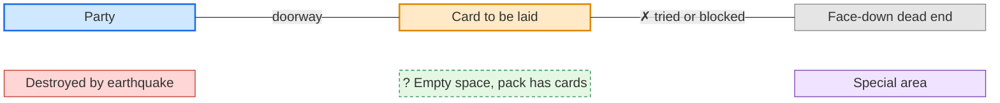

### Test Scenario 1 - Valid Swap

Create a test scenario where an area card is selected for the player's next turn that results in a dead-end, the player
doesn't currently have any viable exits, but that a swapped card allows the player to proceed.

Expected Outcome: the player moves to the swapped area card. This should be marked in the logs as a swap. The original
card is back in the pack, and the pack size is unchanged.

Before the move:

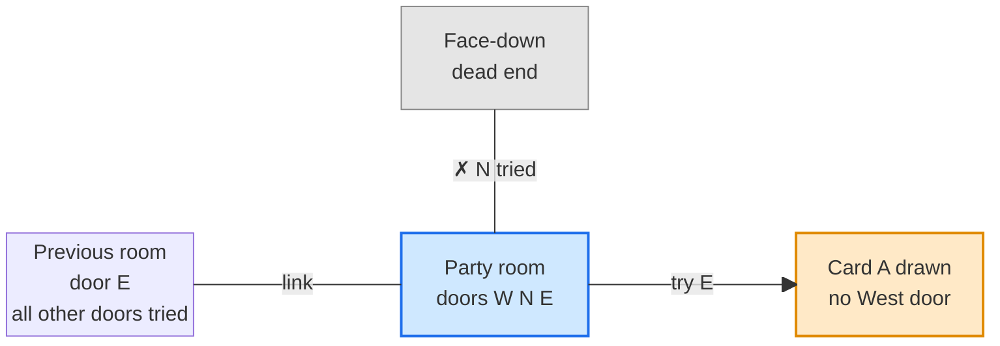

After the swap:

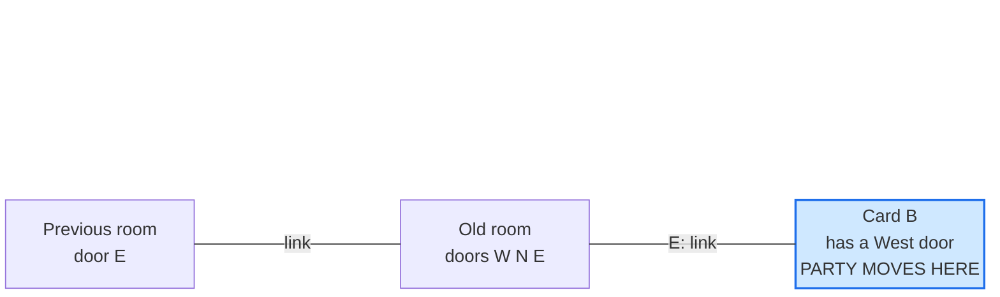

### Test Scenario 2 - No remaining valid swaps

Create a test scenario where the player has explored all viable exits, the next area card selected is a dead-end,
and there are no remaining area cards in the deck that allow a player to proceed.

Expected Outcome: a warning modal is issued to the player and must be closed, the initial area card is laid face-down as
an ordinary dead end, the player stays where they are, and the pack is unchanged.

Before the move:


After (no swap is possible):

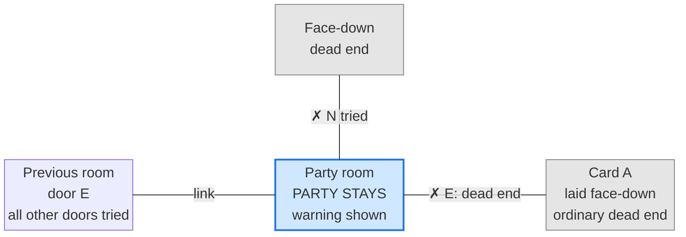

### Test Scenario 3 - A trap is not a viable exit

Create a test scenario where the player has explored all viable exits *except* a chamber containing a trap. Run it
twice, with and without a living Dwarf in the party.

Expected Outcome: in both cases the trap is ignored, so this behaves as scenario 1 (swap when a matching card exists) or
scenario 2 (warning when none does). The chamber itself is still walked through when searching for other exits.

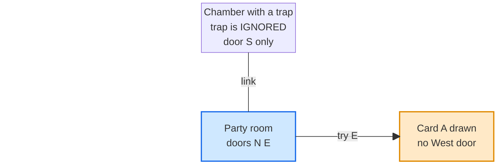

### Test Scenario 4 - Backtracking finds another way

The player stands in a room whose every other door has been tried, and the drawn card is a dead end. A tile the player
came through, reachable through Passable Links, still has an untried doorway toward empty space.

Expected Outcome: no swap. The card is laid as an ordinary dead end.

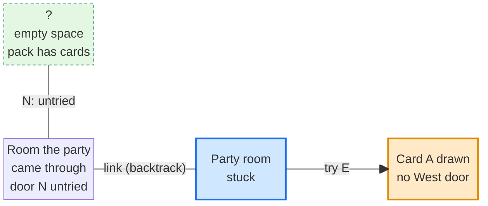

### Test Scenario 5 - A collapsed neighbour isolates the player

The party is in a room whose only remaining doorway leads to an area destroyed by an earthquake, while a tile beyond
the rubble still has untried exits (the case in `docs/bugs/ZICR-log.json`).

Expected Outcome: the Reachable Region is only the current room, so the player is stuck and the swap fires.

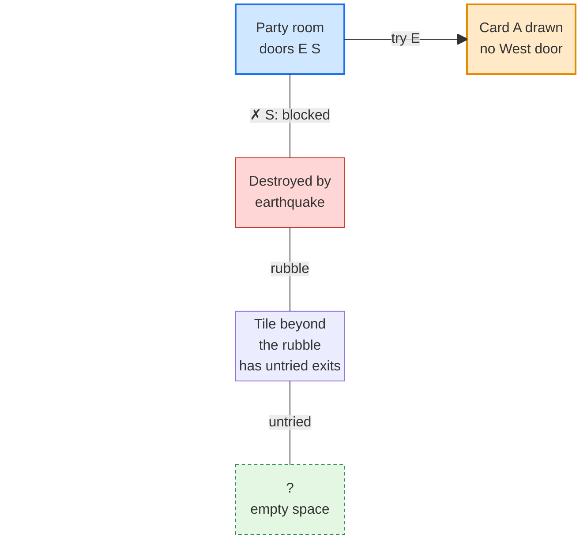

### Test Scenario 6 - Cave exit is not a way forward

The only other doorway in the Reachable Region is a stairway up from level 1 (for example the Gateway's).

Expected Outcome: it is ignored. The player is stuck and the swap fires.

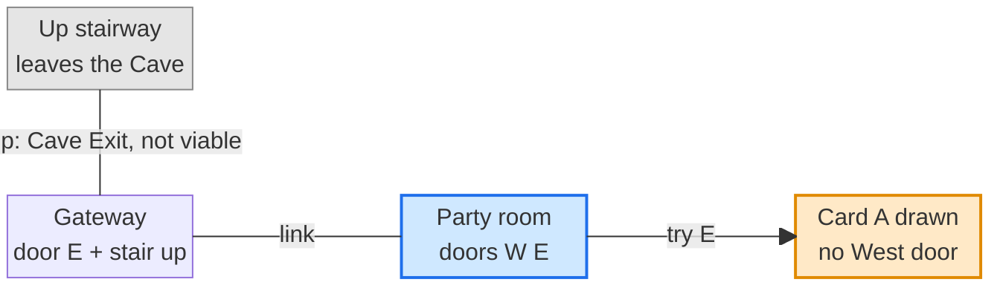

### Test Scenario 7 - Whirlpool blocks a vertical draw

The player tries to go `Down` and draws the Whirlpool while having no viable exits.

Expected Outcome: the draw is treated as a dead end and the swap fires, exactly as for a lateral mismatch. Drawing any
other card while moving `Up` or `Down` moves the player with no check.

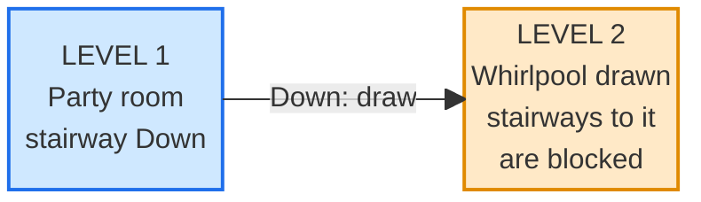

### Test Scenario 8 - A face-down card that a later card now matches

A face-down dead-end card is adjacent to another tile whose doorway now matches it.

Expected Outcome: walking into it from that tile is a Passable Link, so it is a route for backtracking. A face-down
card that still does not match is ignored.

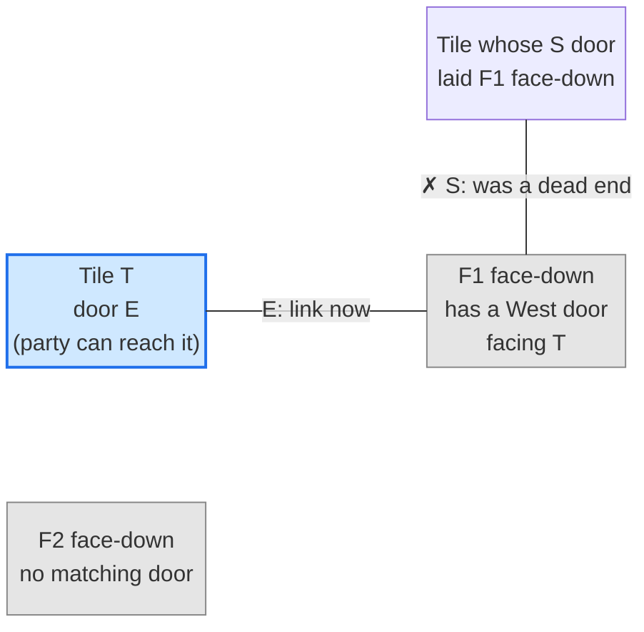

### Test Scenario 9 - The laid card opens another route

The dead-end card, once laid at the target, matches a doorway on a different tile in the Reachable Region.

Expected Outcome: the check sees that route on the would-be map, so it counts as another means, and there is no swap.

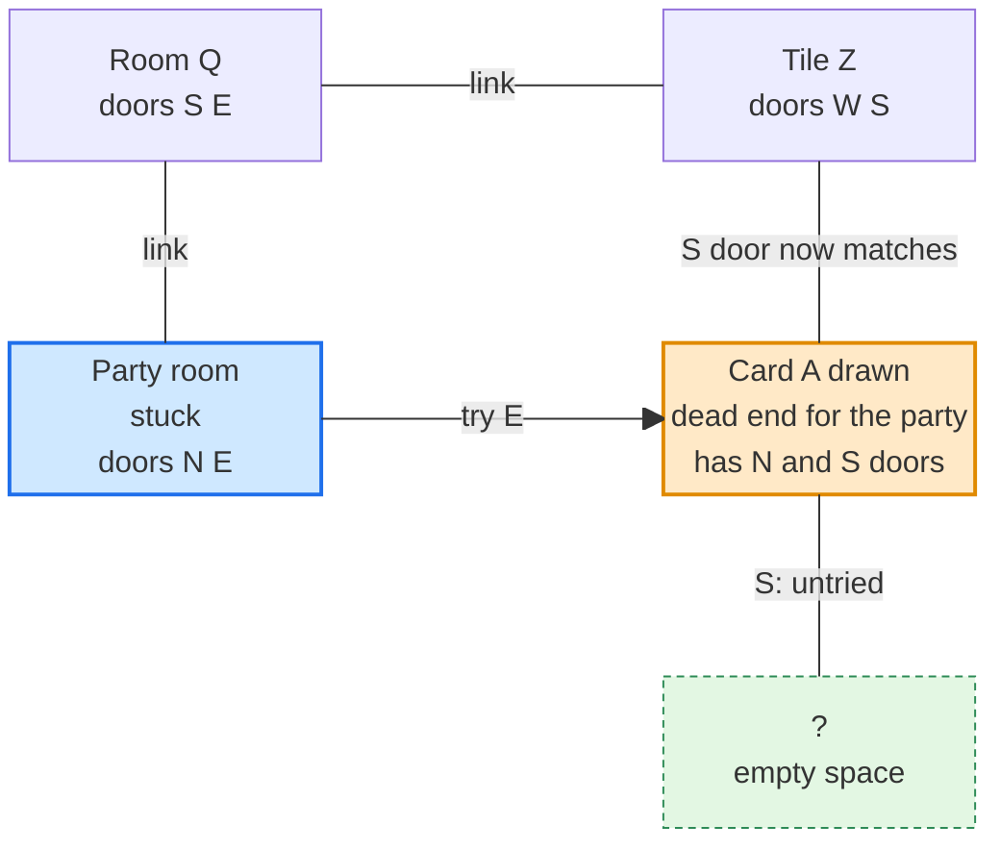

### Test Scenario 10 - Swap bookkeeping does not leak

Run two swap episodes in different turns needing different entrance directions.

Expected Outcome: a card rejected for one direction in the first episode is still a candidate in the second. No
`considered` state persists.

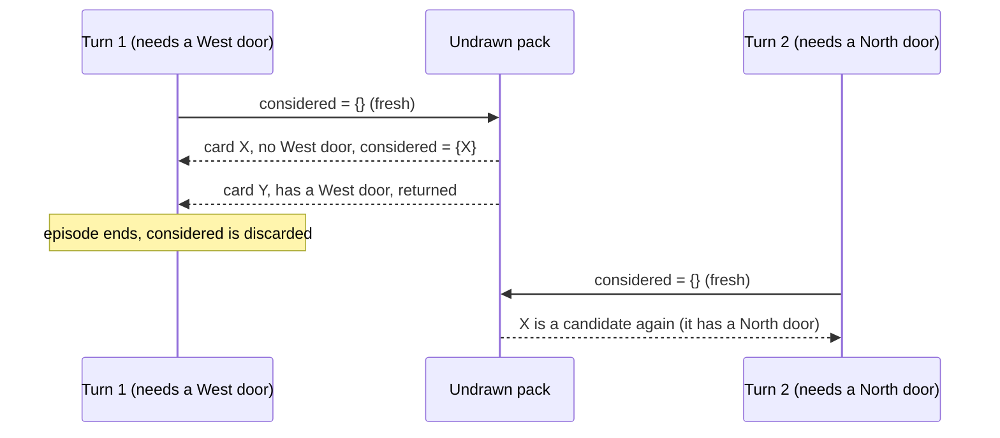

### Test Scenario 11 - Determinism and replay

Replay a recorded game that contains a swap.

Expected Outcome: identical states and events, including which card was drawn and where the original was reinserted.

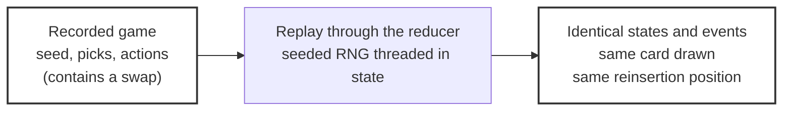

### Test Scenario 12 - Retreat is excluded

A retreat runs into a dead end in a position where an exploration move would have swapped.

Expected Outcome: no swap. The existing retreat dead-end rule applies unchanged.

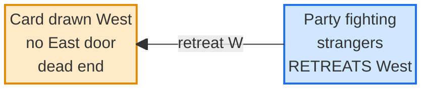

### Test Scenario 13 - Flag off is unchanged

With `forcedRedraw` off, exploration and dead ends behave exactly as before, and none of the new events is emitted.

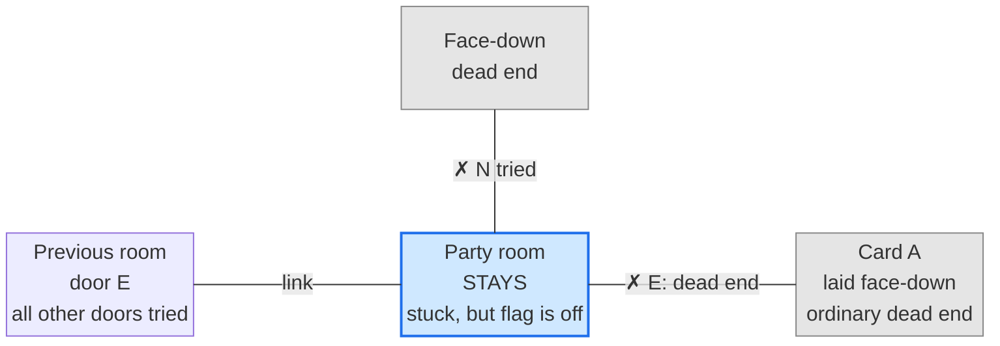

### Test Scenario 14 - Passing through each barrier special

For each of Deep Pool, Viper Pit and Chasm, place the special between the party and an untried doorway toward empty space.

Expected Outcome: the special is traversed, the untried doorway is found, and there is no swap. (Whirlpool: see
scenario 15.)

Deep Pool:

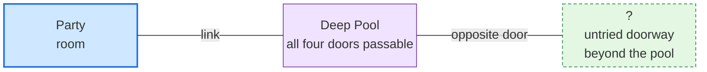

Viper Pit:

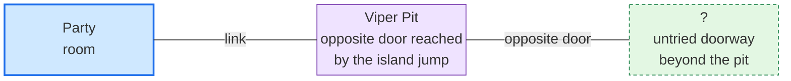

Chasm:

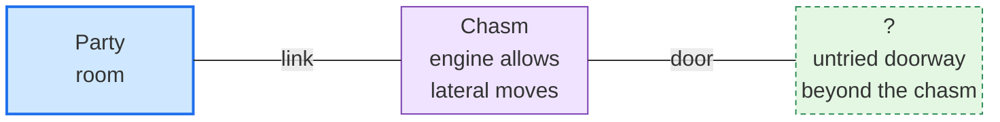

### Test Scenario 15 - Whirlpool opposite doorway

The party enters a Whirlpool by its north doorway. Its east and west neighbours are both dead ends. The only untried
doorway lies beyond the south neighbour.

Expected Outcome: the south doorway is not usable from the north arrival doorway, so the party is stuck and the swap fires.

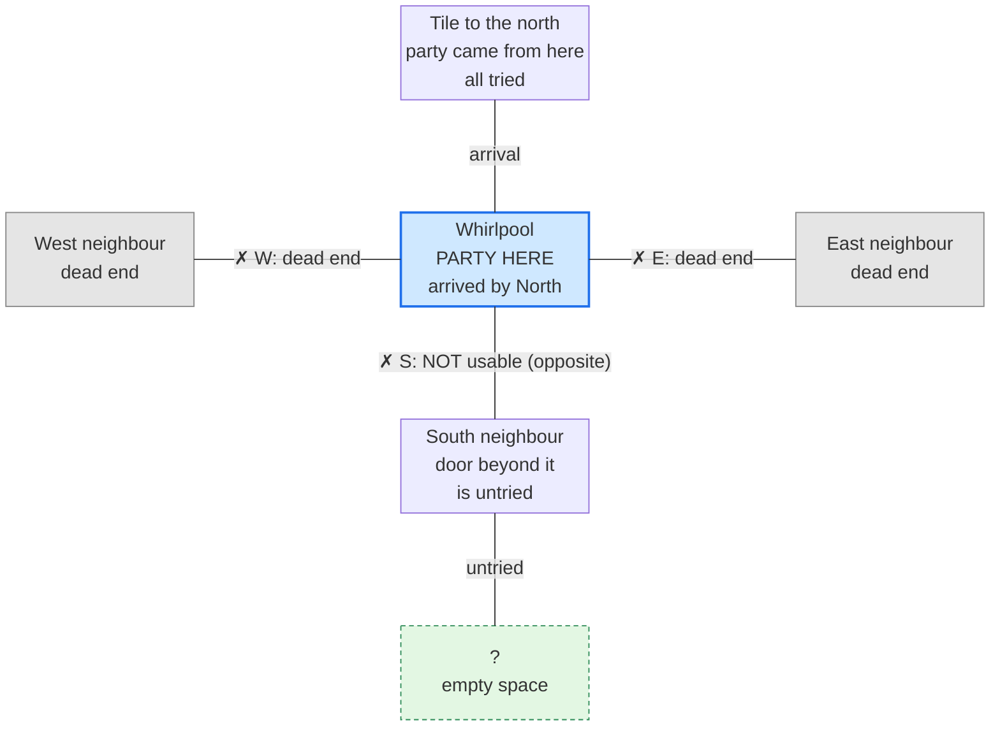

### Test Scenario 15b - Whirlpool opposite doorway, reachable by a detour

As scenario 15, but the east neighbour is a Passable Link to a room that connects back into the Whirlpool.

Expected Outcome: the party can leave east and re-enter from the east doorway, from which the south doorway is usable. So
the untried doorway beyond the south neighbour is found, and there is no swap.

```mermaid
block-beta
  columns 5
  space space N["Tile to the north<br/>all tried"] space space
  space:5
  Wn["West neighbour<br/>dead end"] space Wp["Whirlpool<br/>PARTY HERE<br/>arrived by North"] space E["East room<br/>connects back in<br/>detour: re-enter<br/>from the East"]
  space:5
  space space S["South neighbour<br/>door beyond it<br/>is untried"] space space
  space:5
  space space F["?<br/>empty space"] space space
  N -- "arrival" --- Wp
  Wp -- "✗ W: dead end" --- Wn
  Wp -- "E: link" --- E
  Wp -- "S: usable after the detour" --- S
  S -- "untried" --- F
  classDef party fill:#cfe8ff,stroke:#1f6feb,stroke-width:2px
  classDef dead fill:#e5e5e5,stroke:#888,color:#555
  classDef rubble fill:#ffd6d6,stroke:#c0392b
  classDef front fill:#e3f7e3,stroke:#2e8b57,stroke-dasharray:4 3
  classDef drawn fill:#ffe9c7,stroke:#e08a00,stroke-width:2px
  classDef special fill:#efe3ff,stroke:#7b3fb0
  class Wn dead
  class Wp party
  class F front
```

### Test Scenario 15c - A crossable Whirlpool is not a way forward

The party can reach a Whirlpool with a legal crossing, and every other exit in the Reachable Region is exhausted.

Expected Outcome: the Whirlpool is not a Viable Exit, so the party is stuck and the swap fires.

```mermaid
block-beta
  columns 5
  A["Card A drawn<br/>no South door"] space space space space
  space:5
  P["Party room<br/>every other exit<br/>exhausted"] space W["Whirlpool<br/>crossing is legal"] space B["Level below<br/>NOT counted<br/>as viable"]
  P -- "try N" --> A
  P -- "link" --- W
  W -- "roll 1-2 drops the party, NOT viable" --- B
  classDef party fill:#cfe8ff,stroke:#1f6feb,stroke-width:2px
  classDef dead fill:#e5e5e5,stroke:#888,color:#555
  classDef rubble fill:#ffd6d6,stroke:#c0392b
  classDef front fill:#e3f7e3,stroke:#2e8b57,stroke-dasharray:4 3
  classDef drawn fill:#ffe9c7,stroke:#e08a00,stroke-width:2px
  classDef special fill:#efe3ff,stroke:#7b3fb0
  class A drawn
  class P party
  class W special
  class B dead
```

### Test Scenario 16 - The Chasm is a viable exit

The party can reach a Chasm, and every other exit in the Reachable Region is exhausted.

Expected Outcome: no swap. The card is laid as an ordinary dead end.

```mermaid
block-beta
  columns 5
  A["Card A drawn<br/>no South door"] space space space space
  space:5
  P["Party room<br/>every other exit<br/>exhausted"] space C["Chasm<br/>descend is deliberate<br/>and reusable"] space B["Level below<br/>VIABLE EXIT"]
  P -- "try N" --> A
  P -- "link" --- C
  C -- "descend" --> B
  classDef party fill:#cfe8ff,stroke:#1f6feb,stroke-width:2px
  classDef dead fill:#e5e5e5,stroke:#888,color:#555
  classDef rubble fill:#ffd6d6,stroke:#c0392b
  classDef front fill:#e3f7e3,stroke:#2e8b57,stroke-dasharray:4 3
  classDef drawn fill:#ffe9c7,stroke:#e08a00,stroke-width:2px
  classDef special fill:#efe3ff,stroke:#7b3fb0
  class A drawn
  class P party
  class C special
  class B front
```

### Test Scenario 17 - A swap followed by a Whirlpool drag leaves the pack intact

A move out of a Whirlpool draws a dead-end card and triggers a swap, then the crossing roll drags the party down.

Expected Outcome: the move is cancelled, the pack holds exactly the same set of cards as before the move, no
`deadEndCardSwapped` event is emitted, and the party lands on the level below.

```mermaid
block-beta
  columns 3
  W["Whirlpool<br/>party moves East"] space A["Card A drawn<br/>dead end, swapped for B"]
  space:3
  L["Level below<br/>1-2 on the roll:<br/>whole party dragged here"] space space
  W -- "move E" --> A
  W -- "crossing roll" --> L
  classDef party fill:#cfe8ff,stroke:#1f6feb,stroke-width:2px
  classDef dead fill:#e5e5e5,stroke:#888,color:#555
  classDef rubble fill:#ffd6d6,stroke:#c0392b
  classDef front fill:#e3f7e3,stroke:#2e8b57,stroke-dasharray:4 3
  classDef drawn fill:#ffe9c7,stroke:#e08a00,stroke-width:2px
  classDef special fill:#efe3ff,stroke:#7b3fb0
  class W party
  class A drawn
  class L dead
```

### Test Scenario 18 - A valid card closes a loop with no exit

The party has explored: Gateway, then a tunnel, then a chamber where an earthquake destroyed the tunnel behind it (cutting
off the Gateway). It then went west, north and east through three tunnels. The card drawn for the next move east is a
tunnel with doors W and S, so it **connects**, and its S door meets the chamber's N door, closing a four-tile loop. Every
other door in the loop is tried, and the pack still has cards. (This is the scenario in
`2026-09-30a-swap-dead-end-card-loop-trap.md`.)

Expected Outcome: the card is a Sealing Card, so it is swapped for a connecting card that leaves a Viable Exit, for example
a tunnel with a door toward empty space. The party moves into that card. The log marks the swap with reason `sealed`, and
the original card is back in the pack.

```mermaid
block-beta
  columns 3
  T3["Tunnel SE<br/>doors S E"] space T4["Closing card<br/>doors W S<br/>(a VALID draw)"]
  space:3
  T2["Tunnel NE<br/>doors N E"] space C["Chamber<br/>N door faces T4<br/>other doors tried"]
  space:3
  space space X["Destroyed by<br/>earthquake"]
  space:3
  space space Gw["Gateway<br/>cut off, unreachable"]
  T2 -- "link" --- T3
  C -- "link" --- T2
  C -- "✗ S: blocked" --- X
  X -- "rubble" --- Gw
  T3 -- "try E" --> T4
  T4 -- "meets C's N door" --- C
  classDef party fill:#cfe8ff,stroke:#1f6feb,stroke-width:2px
  classDef dead fill:#e5e5e5,stroke:#888,color:#555
  classDef rubble fill:#ffd6d6,stroke:#c0392b
  classDef front fill:#e3f7e3,stroke:#2e8b57,stroke-dasharray:4 3
  classDef drawn fill:#ffe9c7,stroke:#e08a00,stroke-width:2px
  classDef special fill:#efe3ff,stroke:#7b3fb0
  class T3 party
  class T4 drawn
  class X rubble
  class Gw dead
```

### Test Scenario 19 - A Sealing Card and no card leaves an exit

As scenario 18, but every connecting card left in the pack would also seal the party in.

Expected Outcome: the strict tier finds nothing and, for reason `sealed`, the result is null. The original card is laid
and the party moves in. The warning modal is shown and must be closed. The party is trapped and may quit.

```mermaid
block-beta
  columns 3
  T3["Tunnel SE<br/>doors S E"] space T4["Original card<br/>laid, party moves in<br/>PARTY IS TRAPPED"]
  space:3
  T2["Tunnel NE<br/>doors N E"] space C["Chamber<br/>N door faces T4<br/>other doors tried"]
  space:3
  space space X["Destroyed by<br/>earthquake"]
  space:3
  space space Gw["Gateway<br/>cut off, unreachable"]
  T2 -- "link" --- T3
  C -- "link" --- T2
  C -- "✗ S: blocked" --- X
  X -- "rubble" --- Gw
  T3 -- "E: link" --- T4
  T4 -- "link" --- C
  classDef party fill:#cfe8ff,stroke:#1f6feb,stroke-width:2px
  classDef dead fill:#e5e5e5,stroke:#888,color:#555
  classDef rubble fill:#ffd6d6,stroke:#c0392b
  classDef front fill:#e3f7e3,stroke:#2e8b57,stroke-dasharray:4 3
  classDef drawn fill:#ffe9c7,stroke:#e08a00,stroke-width:2px
  classDef special fill:#efe3ff,stroke:#7b3fb0
  class T4 party
  class X rubble
  class Gw dead
```

### Test Scenario 20 - A dead-end swap does not choose a sealing card

The party is stuck and the drawn card is a dead end. The pack holds a card B1 that connects but has no door toward empty
space (it would seal the party in), and a card B2 that connects and has a door toward empty space.

Expected Outcome: the swap always returns B2, whatever order the random generator would have tried them in. B1 is never
chosen.

```mermaid
block-beta
  columns 5
  R["Previous room<br/>door E<br/>all other doors tried"] space P["Party room<br/>stuck<br/>doors W E"] space A["Card A drawn<br/>no West door<br/>dead end"]
  space:5
  K1["Pack candidate B1<br/>doors W only<br/>would seal the party in<br/>REJECTED"] space space space K2["Pack candidate B2<br/>doors W E<br/>leaves a frontier<br/>CHOSEN"]
  R -- "link" --- P
  P -- "try E" --> A
  classDef party fill:#cfe8ff,stroke:#1f6feb,stroke-width:2px
  classDef dead fill:#e5e5e5,stroke:#888,color:#555
  classDef rubble fill:#ffd6d6,stroke:#c0392b
  classDef front fill:#e3f7e3,stroke:#2e8b57,stroke-dasharray:4 3
  classDef drawn fill:#ffe9c7,stroke:#e08a00,stroke-width:2px
  classDef special fill:#efe3ff,stroke:#7b3fb0
  class P party
  class A drawn
  class K1 dead
  class K2 front
```

### Test Scenario 21 - Only sealing cards connect

As scenario 20, but B2 is not in the pack, so the only connecting card is B1.

Expected Outcome: the strict tier finds nothing, so the connecting tier runs for reason `deadEnd` and returns B1 ("a way
is found"). The party moves into B1, gains the new area, and is trapped there. The warning modal is shown.

```mermaid
block-beta
  columns 5
  R["Previous room<br/>door E<br/>all other doors tried"] space P["Old room<br/>doors W E"] space B["Only connecting card B<br/>doors W only<br/>PARTY MOVES HERE<br/>and is trapped"]
  R -- "link" --- P
  P -- "E: link" --- B
  classDef party fill:#cfe8ff,stroke:#1f6feb,stroke-width:2px
  classDef dead fill:#e5e5e5,stroke:#888,color:#555
  classDef rubble fill:#ffd6d6,stroke:#c0392b
  classDef front fill:#e3f7e3,stroke:#2e8b57,stroke-dasharray:4 3
  classDef drawn fill:#ffe9c7,stroke:#e08a00,stroke-width:2px
  classDef special fill:#efe3ff,stroke:#7b3fb0
  class B party
```

### Test Scenario 22 - Last card guard

As scenario 18, but the closing card is the last card in the pack (`n` is 0 after the draw).

Expected Outcome: no swap and no warning. The card is laid and the party moves in, as today. The pack is empty, so
exploration is over by the rules.

```mermaid
block-beta
  columns 3
  T3["Tunnel SE<br/>doors S E"] space T4["Closing card<br/>doors W S<br/>pack is now EMPTY"]
  space:3
  T2["Tunnel NE<br/>doors N E"] space C["Chamber<br/>N door faces T4<br/>other doors tried"]
  space:3
  space space X["Destroyed by<br/>earthquake"]
  space:3
  space space Gw["Gateway<br/>cut off, unreachable"]
  T2 -- "link" --- T3
  C -- "link" --- T2
  C -- "✗ S: blocked" --- X
  X -- "rubble" --- Gw
  T3 -- "try E" --> T4
  T4 -- "meets C's N door" --- C
  classDef party fill:#cfe8ff,stroke:#1f6feb,stroke-width:2px
  classDef dead fill:#e5e5e5,stroke:#888,color:#555
  classDef rubble fill:#ffd6d6,stroke:#c0392b
  classDef front fill:#e3f7e3,stroke:#2e8b57,stroke-dasharray:4 3
  classDef drawn fill:#ffe9c7,stroke:#e08a00,stroke-width:2px
  classDef special fill:#efe3ff,stroke:#7b3fb0
  class T3 party
  class T4 drawn
  class X rubble
  class Gw dead
```

### Test Scenario 23 - An Earthquake would seal the party in

The party is in a tunnel with an untried door to the north, and tries East. The card drawn is a chamber with doors W, N and S,
and its N and S doors lead to known dead ends. The small cards that chamber will draw, which the player cannot see,
include an Earthquake, which would destroy the tunnel and with it the only way to the untried door.

Expected Outcome: the Entry Dry Run shows no Viable Exit after the earthquake, so the chamber is a Sealing Card. It is
swapped for a card whose dry run does leave a Viable Exit, for example a tunnel with W and E doors, or a chamber with a
door toward empty space. The small cards stay in the pack, unrevealed. The log marks the swap with reason `sealed` and
does not name the earthquake.

```mermaid
block-beta
  columns 3
  F["?<br/>untried door N<br/>of the tunnel"] space D1["Face-down<br/>dead end"]
  space:3
  P["Tunnel P<br/>doors N E"] space C["Chamber drawn East<br/>doors W N S<br/>hidden small cards:<br/>EARTHQUAKE"]
  space:3
  space space D2["Face-down<br/>dead end"]
  F -- "N: untried" --- P
  P -- "try E" --> C
  C -- "✗ N: dead end" --- D1
  C -- "✗ S: dead end" --- D2
  classDef party fill:#cfe8ff,stroke:#1f6feb,stroke-width:2px
  classDef dead fill:#e5e5e5,stroke:#888,color:#555
  classDef rubble fill:#ffd6d6,stroke:#c0392b
  classDef front fill:#e3f7e3,stroke:#2e8b57,stroke-dasharray:4 3
  classDef drawn fill:#ffe9c7,stroke:#e08a00,stroke-width:2px
  classDef special fill:#efe3ff,stroke:#7b3fb0
  class F front
  class P party
  class C drawn
  class D1 dead
  class D2 dead
```

### Test Scenario 24 - A Spell would seal the party in (extension kit)

As scenario 23, but the hidden small card is a Spell. The Spell would replace the tunnel the party came from with the
next card off the pack, and that replacement has no door facing the chamber.

Expected Outcome: the candidate's dry run is made **after** the swap has been applied to the copy, because the
replacement card depends on the pack order the swap produces. A card that leaves a Viable Exit is chosen and the swap is
marked `sealed`. (If the tunnel is the Gateway or a chamber, the Spell fizzles, and there is no swap.)

```mermaid
block-beta
  columns 3
  F["?<br/>untried door N<br/>of the tunnel"] space D1["Face-down<br/>dead end"]
  space:3
  P["Tunnel P<br/>doors N E<br/>to be REPLACED<br/>by the Spell"] space C["Chamber drawn East<br/>doors W N S<br/>hidden small cards:<br/>SPELL (kit)"]
  space:3
  space space D2["Face-down<br/>dead end"]
  F -- "N: untried" --- P
  P -- "try E" --> C
  C -- "✗ N: dead end" --- D1
  C -- "✗ S: dead end" --- D2
  classDef party fill:#cfe8ff,stroke:#1f6feb,stroke-width:2px
  classDef dead fill:#e5e5e5,stroke:#888,color:#555
  classDef rubble fill:#ffd6d6,stroke:#c0392b
  classDef front fill:#e3f7e3,stroke:#2e8b57,stroke-dasharray:4 3
  classDef drawn fill:#ffe9c7,stroke:#e08a00,stroke-width:2px
  classDef special fill:#efe3ff,stroke:#7b3fb0
  class F front
  class P party
  class C drawn
  class D1 dead
  class D2 dead
```

### Test Scenario 25 - No card avoids the hazard sealing

As scenario 23, but every other connecting card left in the pack would also seal the party in (for instance, every
candidate is a chamber with no door toward empty space, and it draws the same earthquake).

Expected Outcome: the strict tier finds nothing and, for reason `sealed`, the result is null. The original chamber is laid
and entered, the earthquake fires, and the party is trapped. The warning modal is shown and must be closed.

```mermaid
block-beta
  columns 3
  F["?<br/>untried door N<br/>now unreachable"] space D1["Face-down<br/>dead end"]
  space:3
  P["Tunnel P<br/>destroyed by<br/>the earthquake"] space C["Chamber<br/>PARTY TRAPPED<br/>warning shown"]
  space:3
  space space D2["Face-down<br/>dead end"]
  F -- "N: untried" --- P
  P -- "✗ W: blocked" --- C
  C -- "✗ N: dead end" --- D1
  C -- "✗ S: dead end" --- D2
  classDef party fill:#cfe8ff,stroke:#1f6feb,stroke-width:2px
  classDef dead fill:#e5e5e5,stroke:#888,color:#555
  classDef rubble fill:#ffd6d6,stroke:#c0392b
  classDef front fill:#e3f7e3,stroke:#2e8b57,stroke-dasharray:4 3
  classDef drawn fill:#ffe9c7,stroke:#e08a00,stroke-width:2px
  classDef special fill:#efe3ff,stroke:#7b3fb0
  class F front
  class P rubble
  class C party
  class D1 dead
  class D2 dead
```

### Test Scenario 26 - A Trap in the same chamber drops the party

As scenario 23, but the chamber also holds a Trap, and the party has no Dwarf.

Expected Outcome: the dry run ends with the party on the level below, where it is not sealed in (its new tile is judged on
its own). There is no swap. With a Dwarf in the party the trap is avoided, the earthquake seals the party, and the card is
swapped as in scenario 23.

```mermaid
block-beta
  columns 5
  F["?<br/>untried door N<br/>of the tunnel"] space D1["Face-down<br/>dead end"] space space
  space:5
  P["Tunnel P<br/>doors N E"] space C["Chamber drawn East<br/>doors W N S<br/>hidden: EARTHQUAKE<br/>and a TRAP, no Dwarf"] space L2["LEVEL BELOW<br/>party lands here<br/>NOT sealed"]
  space:5
  space space D2["Face-down<br/>dead end"] space space
  F -- "N: untried" --- P
  P -- "try E" --> C
  C -- "✗ N: dead end" --- D1
  C -- "✗ S: dead end" --- D2
  C -- "trap: falls down" --> L2
  classDef party fill:#cfe8ff,stroke:#1f6feb,stroke-width:2px
  classDef dead fill:#e5e5e5,stroke:#888,color:#555
  classDef rubble fill:#ffd6d6,stroke:#c0392b
  classDef front fill:#e3f7e3,stroke:#2e8b57,stroke-dasharray:4 3
  classDef drawn fill:#ffe9c7,stroke:#e08a00,stroke-width:2px
  classDef special fill:#efe3ff,stroke:#7b3fb0
  class F front
  class P party
  class C drawn
  class D1 dead
  class D2 dead
  class L2 front
```

### Test Scenario 27 - A draw made later in the chamber (not covered)

The party is standing in the Well. It chooses to draw a small card, and the card is an Earthquake that destroys the tunnel
behind it, cutting it off.

Expected Outcome: no rescue, since no area card is being drawn. The party is trapped and may quit. This is a known gap
(Future Considerations). The same applies to the Bell Rope.

```mermaid
block-beta
  columns 3
  F["?<br/>untried door N<br/>of the tunnel"] space D1["Face-down<br/>dead end"]
  space:3
  P["Tunnel P<br/>doors N E"] space C["The Well (party here)<br/>doors W N S<br/>draws a card: EARTHQUAKE"]
  space:3
  space space D2["Face-down<br/>dead end"]
  F -- "N: untried" --- P
  P -- "link" --- C
  C -- "✗ N: dead end" --- D1
  C -- "✗ S: dead end" --- D2
  classDef party fill:#cfe8ff,stroke:#1f6feb,stroke-width:2px
  classDef dead fill:#e5e5e5,stroke:#888,color:#555
  classDef rubble fill:#ffd6d6,stroke:#c0392b
  classDef front fill:#e3f7e3,stroke:#2e8b57,stroke-dasharray:4 3
  classDef drawn fill:#ffe9c7,stroke:#e08a00,stroke-width:2px
  classDef special fill:#efe3ff,stroke:#7b3fb0
  class F front
  class C special
  class D1 dead
  class D2 dead
```

### Test Scenario 28 - The dry run leaves no trace

Play a game in which the sealing check runs on many moves, some of which swap and some of which do not.

Expected Outcome: except for the swaps themselves, the small pack and its position, the order of the large pack, the random
seed, every armed Test Mode override, and the map are exactly what they would have been if the dry run did not exist. No
events are emitted by it. Replaying the recorded game reproduces every state and event.

```mermaid
sequenceDiagram
  participant R as Real game state
  participant X as Copy of the state
  R->>X: clone
  X->>X: lay the card, move, draw the small cards, apply every hazard
  X-->>R: is there a Viable Exit? (yes or no, nothing else)
  Note over R: small pack, pack order, random seed, test overrides,<br/>and the map are all untouched
```

# Multiplayer (future decision)

Multiplayer is **out of scope for this release**. The original requirement was for the solitaire game, and the
multiplayer state and validators are deliberately separate from solo's, so nothing here changes them. Whether and when to
enable it is a future decision. This section records progress to date and the known gaps so that decision can be made
with the facts.

## Progress to date

A review against the multiplayer engine (`multi.ts`) found the algorithm is **valid for multiplayer in principle**:

- Multiplayer composes each seat's state from the shared cave (tiles, pack, seed) plus that seat's party, then runs the
  same solo `reduce` and `tryMove`. So the algorithm already runs once per player, on that player's own turn and
  location.
- Dead-end markings live on the shared map, so they are global.
- Nothing is stored between calls, so "a player could become unstuck through another player's actions" needs no
  handling: each dead end recomputes from the current map.
- Traps, which would have needed per-party Dwarf and party-split logic, are excluded by decision 1, so that whole
  category of multiplayer complexity does not apply.

## Known gaps (not addressed by this release)

1. **The flag is not threaded.** `compose` passes only `extensionKit`, so multiplayer never swaps today. Enabling it
   means adding `forcedRedraw` to the multiplayer variants (`buildMpGame`, `compose`, and the separate Convex validator in
   `apps/web/convex/multiplayer.ts`), stamped server-side at game creation. It must be a per-game setting for all seats,
   never per seat.
2. **Secret stairways are per seat.** A stairway that exists only as a mirrored link is blocked for a seat that has not
   learnt it (`secretStairGated`), and that gate runs *before* `reduce`. The search would otherwise count such a stair as a
   viable exit, so a genuinely stuck player would be told they are not stuck. `viableExitsCheck` would need the seat's
   known secret doors as an input. Zombie parties bypass this gate.
3. **Fog-of-war-lite.** It hides areas a seat has not entered, but the search uses the full map. The "no viable exits"
   message and the swap event reveal information about unseen areas, so they must go to the acting seat only.
4. **Other parties and concurrent play.** Other parties standing in a room should not block a route through it. In
   concurrent mode a rival's live fight bars entry temporarily; treat that room as passable, which errs toward "not
   stuck". Union subordinates cannot act, so the check applies to the commander only.
5. **Shared pack.** The swap draws from and reorders the shared pack, and the rejected card is returned to it, which
   affects what rivals draw. That is inherent in the rule, but it is a fairness question to accept explicitly.
6. **UI and logs.** The modal, the swap event and the log narration need wiring into the multiplayer UI and game log,
   which are separate from solo's.
7. **Traps, if reconsidered.** If traps are later made viable, multiplayer adds the Dwarf question: `divideParty` (at
   rest, not in a union, at least one other living member) can leave a Dwarf behind as a rear-guard, so a trap becomes
   usable to a party that can divide. Solo has no party split.

# Decisions

Resolved:

1. **Traps**: not a viable exit, to simplify play. A chamber containing a trap is traversed like any other and the
   trap is ignored. This is a known deviation from the printed rule, recorded above. See [Future Considerations](#future-considerations) for the
   solo case where a player sacrifices the Dwarf to reach a trap.
2. **Stuck with no legal move**: after the warning, it is up to the player to quit on their own. No new mechanism is
   needed beyond the existing quit path.
3. **Backtracking versus current tile only**: confirmed as searching the whole Reachable Region, as this document
   specifies.
4. **Multiplayer**: deferred to a future decision. Solo only for this release.

Resolved (raised by the loop-trap review, `2026-09-30a-swap-dead-end-card-loop-trap.md`):

7. **Sealing Cards**: the rescue is extended, as a lookahead before the card is laid, to a card that connects but leaves the
   party in a region with no Viable Exit. This is an extension of the printed rule, which only covers cards that make a
   dead end. The alternative (a rescue after the party has moved, replacing a laid card) was rejected because it needs a
   move undone.
8. **Two-tier swap**: a swap prefers a card that connects and leaves a Viable Exit. Failing that, a dead-end swap accepts any
   connecting card (the printed rule's "a way is found"). A sealing swap returns null and keeps the original. This is
   easy to drop if a stricter reading is wanted.

Resolved (raised by the hazard-sealing review):

9. **Hazard sealing (Earthquake, Spell)**: handled by the same Sealing Card lookahead, by rehearsing the entry on a copy of
   the state (the Entry Dry Run) before the card is laid. No player input is needed. The reactive alternatives (replace the
   chamber in place, reopen an old dead end, rewind the move, refuse to enter) are recorded in the Hazard sealing section and
   not adopted. This reverses the earlier rejection of "peeking at the small pack", which assumed a peek would reveal
   cards; the dry run reveals nothing but the fact that a swap happened.
10. **Later draws**: hazards from the Well and the Bell Rope are not covered (Future Considerations).

Resolved (raised by the special-area review):

5. **Whirlpool traversal**: modelled exactly, as (area, arrival doorway) states for the Whirlpool only. The opposite
   doorway is not usable from an arrival doorway. The Viper Pit is unaffected because the island jump lets the party
   reach every doorway.
6. **Whirlpool as a way forward**: not a Viable Exit, for simplicity and consistency with decision 1. A known deviation
   from the printed rule.

# Future Considerations

## Traps as a viable exit in solo play

Decision 1 ignores traps to keep play simple. Solo has no way to split a party, so it is tempting to say a party
with a Dwarf can never use a trap. That is not quite true: a player can get rid of the Dwarf deliberately. For example,
they can send the Dwarf into a fight with a single strong stranger, such as a lone Dragon in a chamber, so that the Dwarf
is killed. With the Dwarf gone, the party can go back and walk into the trapped chamber, and falls through it.

So in solo a trap can become a genuine way forward at the player's own choice, at the cost of the Dwarf. If traps are
ever made viable exits, this means:

- Usability cannot be decided from the party's makeup at the moment of the dead end alone. A party with a living Dwarf
  has a trap that is not usable *now*, but one it could make usable.
- The rule's phrase "however time consuming, difficult, or dangerous" arguably covers this, and would argue for
  treating a trap as available whenever the party could lose its Dwarf, including by sacrificing it. That would
  suppress the swap in more cases, and needs a decision on how far "could" extends.
- The one-way nature of a fall must be modelled: it lands in the area directly below (skipping any Whirlpool), creates
  that area if it does not exist, and leaves no stairway back. The search would continue from the landing area,
  which may itself be a dead-end pocket.
- A chamber's stored hazards must be confirmed to take effect again on re-entry ("continues in effect"), and pinned
  by a test.

Multiplayer adds `divideParty` as a second way to remove a Dwarf without killing it (see known gap 7).

The same reasoning applies to a crossable Whirlpool (decision 6), which is an eventual, random descent.

Nothing here changes the current specification. It is recorded so the trade-off is not forgotten.

## Hazards from later draws

The Hazard sealing section covers a hazard drawn *on entering* a chamber. The Well and the Bell Rope let the player draw more
small cards later, by choice, while already standing in the chamber. An Earthquake drawn that way can cut the party off
after the fact, and there is no area card being drawn to swap.

Nothing is specified for this, and the party may quit. Possible future handling:

- accept it, as the printed rules do;
- stop the Well or Bell Rope action being offered when its next card would seal the party in (its absence would reveal
  that the next small card is a hazard);
- a reactive rescue after the draw (alternatives in the Hazard sealing section), which needs a pause and a choice.

## Changes from the previous draft

- Step 2 of `viableExitsCheck` no longer swaps at the first card with no exits. The search covers the whole Reachable
  Region and the caller decides, and the swap uses the original move's direction.
- "Unexplored" and "viable" are replaced by Frontier Exits and Passable Links, so a way back is never counted as a way
  forward. Per-player attempt tracking is dropped.
- Level-1 up stairs are Cave Exits and never viable. A Whirlpool drawn on a vertical move is a dead end.
- The attempted exit is treated as attempted, and the would-be map includes the dead-end card, before the check runs.
- The running counter is dropped in favour of computing on demand.
- `swapConsidered` and the checked marks are local to one call, and randomness uses the seeded generator.
- Traps are not viable exits (decision 1); scenario 3 is rewritten to match, and its contradictory outcome removed.
- Multiplayer moved to a future decision, with progress to date and known gaps recorded.
- Special areas reviewed one by one (table); added the pack-integrity requirement for swaps, the Whirlpool drag interaction, the
  Chasm lateral-movement note, and scenarios 14 to 17.
- Decisions 5 and 6 resolved: the Whirlpool is modelled exactly with an Arrival Doorway rule, and is not a viable exit
  (scenarios 15 to 15c).
- Added: retreat exclusion, special areas, feature flag and leaderboard, Test Mode, the modal race risk, traceability, and
  scenarios 4 to 13.
- Loop trap (`2026-09-30a-swap-dead-end-card-loop-trap.md`): added the Sealing Card lookahead when a card connects, a two-tier
  `swapAreaCard` (a swap must not pick a card that seals the party in), the `reason` on the swap event, the last-card guard,
  decisions 7 and 8, and scenarios 18 to 22.
- Hazard sealing: the sealing check now rehearses the whole entry on a copy of the state (the Entry Dry Run), so an Earthquake
  or Spell drawn on entering a chamber is handled by the same swap, with no player input. Added the Hazard sealing section (with
  the reactive alternatives and where input would be needed), decisions 9 and 10, scenarios 23 to 28, and the remaining gap
  (Well and Bell Rope draws) under Future Considerations.
