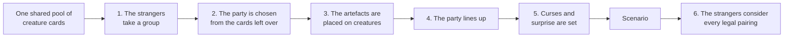
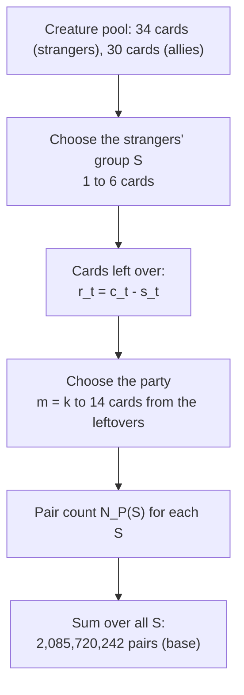
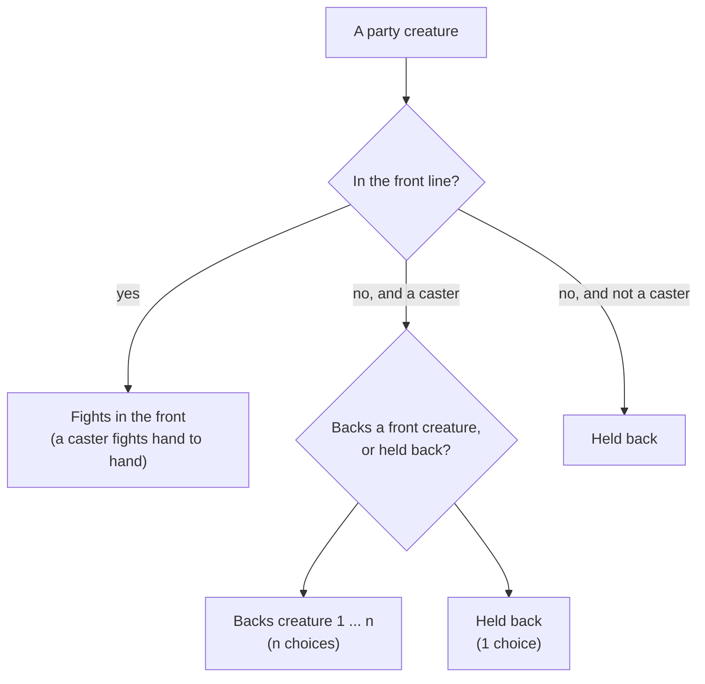
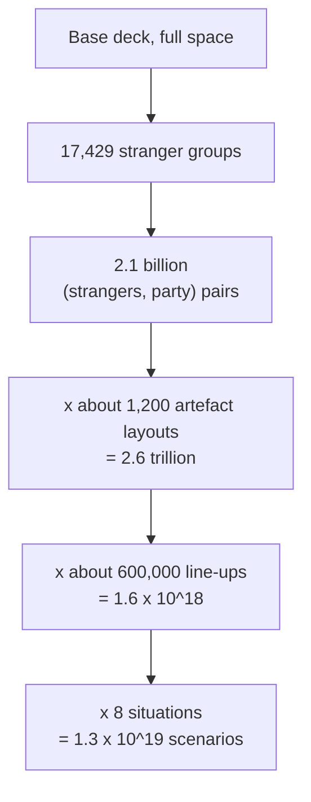

# How Many Different Fights Are There?

## Counting the test scenarios for the stranger-pairing network

**Date:** 05-OCT-2026\
**From:** Mark\
**For:** Peter\
**Related:** [training task specification](2026-10-05-nn-pairing-training-task-spec.md) and [neural-net requirements](2026-10-04-nn-stranger-pairing-requirements.md)\
**Source of the numbers:** the game's own deck tables (`smallPack.ts` and `creatures.ts` in the engine). The counting script is in Appendix A.

---

## 1. The question, and the short answer

To train a program to pair the strangers against the party, we first have to decide **which fights to show it**. The natural instinct is to show it *every* fight: every possible group of strangers, against every possible party, with every possible arrangement of the artefacts. This paper counts how many fights that would be, and shows where each number comes from.

**The short answer:** far too many to show it all. The count runs into the billions even for the simplest version of the problem, and into the tens of trillions of trillions once the kit is included. But the count is revealing in other ways. The enormous numbers come almost entirely from large, rare fights, and the small fights that dominate real play can be covered exhaustively.

| What is being counted | Base deck | Extension kit |
|---|---|---|
| Groups of 1–6 strangers | 17,429 | 103,433 |
| Stranger group × party (the party at least as large as the group) | 2.1 billion | 535 billion |
| … × where the artefacts are | $2.6 \times 10^{12}$ | $7.0 \times 10^{17}$ |
| … × how the party lines up | $1.6 \times 10^{18}$ | $7.0 \times 10^{24}$ |
| … × the situation (curses, surprise) | **$1.3 \times 10^{19}$** | **$5.6 \times 10^{25}$** |

Each row multiplies the one above by a factor we derive step by step below. The last row is the total number of distinct **fight set-ups** in the full problem. For comparison, the base game's small fights (one or two strangers against a party of up to three) number about 120 million, and with up to three strangers and a party of four, about six billion.

---

## 2. What is one "scenario"?

A scenario is **everything the strangers' player would need to know in order to choose a pairing**, set at the moment the strangers attack. It has five parts:

1. **The strangers**: which creatures, 1 to 6 of them.
2. **The party**: which creatures, at least as many as the strangers, up to 14.
3. **The artefacts**: which creature, if any, bears each fight artefact.
4. **The party's line-up**: who is in the front line, who is backing whom in the background, and who is held back.
5. **The situation**: curses on the party, and whether the strangers have the advantage of surprise.

For each such set-up the strangers can choose among several **pairings**, and the program's job is to choose well. Section 8 counts those pairings; the main count is of set-ups.



Each box adds a **choice**, and the number of scenarios is what you get when you multiply the number of choices at each step. That is the *multiplication principle*, and everything below is an application of it.

---

## 3. The cards

The game has one small pack, shared by everyone. The party is picked from it and the rest is the chamber draw pile. So the strangers and the party **draw from the same finite set of cards**: if the party takes the one Hero, no stranger can be the Hero. This is the most important fact in the counting, because it makes the two choices *depend* on each other.

### 3.1 The creature cards

| Creature | Copies (base) | Kit adds | Copies (kit) | As stranger? | As ally? |
|---|---|---|---|---|---|
| Hero | 1 | | 1 | yes | yes |
| Woman-Hero | 1 | | 1 | yes | yes |
| Ogre | 3 | | 3 | yes | yes |
| Troll | 3 | | 3 | yes | yes |
| Priest | 3 | | 3 | yes | yes |
| Man | 6 | | 6 | yes | yes |
| Woman | 3 | +1 | 4 | yes | yes |
| Dwarf | 3 | +1 | 4 | yes | yes |
| Wizard | 3 | | 3 | yes | yes |
| Giant | 3 | | 3 | yes | yes |
| Unicorn | 1 | | 1 | yes | yes |
| Dragon | 3 | | 3 | yes | **never** (never friendly) |
| Sorcerer | 1 | | 1 | yes | **never** (always hostile) |
| Spectre | 3 | | 3 | **excluded from version 1** | **never** |
| Apprentice | | +1 | 1 | yes | yes |
| Lion | | +1 | 1 | yes | yes |
| Scholar | | +1 | 1 | yes | yes |
| Witch | | +3 | 3 | yes | yes |
| Thief | | +1 | 1 | yes | yes |
| Wolf | | +1 | 1 | yes | yes |
| Demon | | +1 | 1 | **excluded** | **never** |
| **Total** | **37** | **+11** | **48** | | |

The Spectre is left out of version 1 because it can only be fought by magic (or a Sword or Shield) and needs its own rules in the pairing program. The Demon is left out for the same reason, and because it never appears in the chamber the party occupies. So:

- the **strangers** can be drawn from **34** base cards, or **44** with the kit;
- the **party** can be drawn from **30** base cards, or **40** with the kit (the Dragons, the Sorcerer and the Spectres are never allies, and the Demon never is either).

The ally pool sizes (30 and 40) agree with the ceilings in the earlier feasibility study (§2.6.3).

### 3.2 The artefact cards

There is **one copy of each** fight artefact in the pack: the Magic Sword, the Magic Staff, the Ring, the Eye of God and the Strength Potion in the base game, and with the kit the Magic Axe, the Magic Shield and the Elixir. Treasure such as Gold and Silver has no effect on a fight and is not counted.

Who may bear each artefact comes from your table, *ARTEFACTS – WHO CAN USE?*, read through "uses artefacts as":

| Artefact | May be borne by |
|---|---|
| Magic Sword | Man, Woman, Thief, Hero, Woman-Hero, and the priest class |
| Magic Staff | The priest class only (Priest, Witch, Scholar, Wizard, Apprentice; the Sorcerer as a Wizard) |
| The Ring | Man, Woman, Thief, Hero, Woman-Hero, the priest class, and the Dwarf |
| Magic Axe (kit) | As the Ring |
| Magic Shield (kit) | Man, Woman, Thief, Hero, Woman-Hero |
| Strength Potion | The party only; a Man, Woman or Hero |
| Elixir (kit) | The party only |
| Eye of God | Not borne: it works if it is in the area |

---

## 4. Step 1: the strangers' group

A group of strangers is a **multiset**: it matters how many of each type there are, not which individual copy. (Three Ogres drawn in any order are the same group.)

Suppose creature type $t$ has $c_t$ cards. A group takes $s_t$ of them, with $0 \le s_t \le c_t$, and the group's size is $k = \sum_t s_t$. The number of groups of size $k$ is the coefficient of $x^k$ in a **generating polynomial**:

$$
G(x) \;=\; \prod_{t} \bigl(1 + x + x^2 + \cdots + x^{c_t}\bigr), \qquad
\#\text{groups of size }k \;=\; [x^k]\,G(x).
$$

Each factor stands for one creature type, and the term $x^j$ says "take $j$ copies of this type". Multiplying the factors adds up the choices.

**A tiny example.** Take a deck with two Dwarves and one Hero. The polynomial is

$$
(1 + x + x^2)(1 + x) \;=\; 1 + 2x + 2x^2 + x^3 .
$$

Read off the coefficients: one way to take nothing; two ways to take one card (a Dwarf or the Hero); two ways to take two ({Dwarf, Dwarf} or {Dwarf, Hero}); one way to take all three.

Applying this to the real strangers' pool, for groups of 1 to 6:

| Group size $k$ | 1 | 2 | 3 | 4 | 5 | 6 | **Total** |
|---|---|---|---|---|---|---|---|
| Base deck | 13 | 87 | 403 | 1,454 | 4,342 | 11,130 | **17,429** |
| Extension kit | 19 | 181 | 1,159 | 5,634 | 22,228 | 74,212 | **103,433** |

The numbers grow quickly with $k$: most of the groups are large ones. Hold on to that, because it matters in Section 9.

---

## 5. Step 2: the party, from the cards left over

Now the cards the strangers took are gone from the pool. If the strangers' group $S$ took $s_t$ copies of type $t$, the party can take at most

$$
r_t(S) \;=\; c_t - s_t
$$

copies, and only from the creatures that can be allies (the set $A$). The party must be at least as large as the strangers, $m \ge k$, and at most 14, so the number of parties for a given group is

$$
N_P(S) \;=\; \sum_{m=k}^{14} \;[x^m]\; \prod_{t \in A} \bigl(1 + x + \cdots + x^{r_t(S)}\bigr).
$$

This is the same generating-polynomial idea, with the smaller supply $r_t$ in place of $c_t$. The two choices are **linked** through $r_t$: the more of a type the strangers use, the fewer the party can have.

**Worked example.** Let the strangers be an Ogre and a Dwarf ($k = 2$). The party draws from the base pool minus one Ogre and one Dwarf. The number of different parties of each size is:

| Party size $m$ | 2 | 3 | 4 | 5 | 6 | 7 | 8 |
|---|---|---|---|---|---|---|---|
| Parties | 63 | 251 | 779 | 1,997 | 4,382 | 8,429 | 14,457 |

| Party size $m$ | 9 | 10 | 11 | 12 | 13 | 14 | **Total** |
|---|---|---|---|---|---|---|---|
| Parties | 22,393 | 31,633 | 41,065 | 49,275 | 54,878 | 56,868 | **286,470** |

So one two-creature stranger group already faces **286,470** different parties.

**All stranger groups together.** Adding up $N_P(S)$ over every group gives the number of (strangers, party) pairs:

$$
N_{\text{pairs}} \;=\; \sum_{S} N_P(S).
$$

| Group size $k$ | Pairs, base deck | Pairs, extension kit |
|---|---|---|
| 1 | 4,310,311 | 264,686,636 |
| 2 | 23,302,988 | 2,020,067,223 |
| 3 | 86,610,664 | 10,421,910,636 |
| 4 | 248,099,319 | 40,929,957,129 |
| 5 | 580,312,862 | 130,454,644,039 |
| 6 | 1,143,084,098 | 350,842,167,612 |
| **Total** | **2,085,720,242** | **534,933,433,275** |

These are **exact counts**, computed by enumerating the stranger groups and applying the polynomial for each. The kit total is about 250 times the base total, because the kit adds 10 creature cards to the strangers' pool (the Demon is excluded), and the numbers of groups and parties both grow quickly.



---

## 6. Step 3: where the artefacts are

For each artefact, the possible holders are: **nobody** (it is not in play), or **any creature type present that may bear it**. If $e_a$ creature types in play may bear artefact $a$, the artefact has $1 + e_a$ possible placements. The artefacts are placed independently, so the placements multiply. The Eye of God is either in the area or not (a factor of 2), and the Strength Potion is the party's alone:

$$
L(S,P) \;=\; 2 \,\bigl(1 + e_{\text{potion}}\bigr)\prod_{a \in \mathcal{A}} \bigl(1 + e_a\bigr),
$$

where $\mathcal{A}$ is the set of artefacts the strangers could bear (Sword, Staff and Ring for the base deck; the Axe and Shield too for the kit). For the kit there is one more factor, $(1 + \tau)$ with $\tau$ the number of party creature types, for the party's Elixir.

**Worked example.** Strangers: Ogre and Dwarf. Party: Hero, Man and Priest.

| Artefact | Creature types in play that may bear it | $e_a$ | Placements $1 + e_a$ |
|---|---|---|---|
| Magic Sword | Hero, Man, Priest | 3 | 4 |
| Magic Staff | Priest | 1 | 2 |
| The Ring | Hero, Man, Priest, Dwarf | 4 | 5 |
| Strength Potion (party only) | Hero, Man | 2 | 3 |
| Eye of God | in the area or not | | 2 |

$$
L \;=\; 4 \times 2 \times 5 \times 3 \times 2 \;=\; 240 .
$$

So this one stranger-and-party combination has **240** different artefact layouts. The Ogre cannot bear the Sword or the Staff, which is why it contributes nothing to those rows.

**Averaging over the whole space.** The number of layouts varies enormously with the size of the party: a large party offers many more bearers. Averaging $L(S,P)$ over all pairs (estimated from a random sample, see Section 10) gives:

| | Mean layouts per pair |
|---|---|
| Base deck | about 1,200 |
| Extension kit | about 1.3 million |

Multiplying each pair count by this mean gives the **second row of the table in Section 1**: $2.1 \times 10^9 \times 1.2 \times 10^3 \approx 2.6 \times 10^{12}$ for the base deck.

**What this count does not capture.** Two creatures of the same type are treated as interchangeable, so "the Sword on Man 1" and "the Sword on Man 2" are one layout. And in real play the strangers carry an artefact only if they were drawn with it, and the default loadout decides who holds it. The count above is the number of *states the program might be asked about*, not the number that will occur in play.

---

## 7. Step 4: how the party lines up

Once the strangers attack, the party has already deployed. The program must be shown the line-up it faces. For a party of $m$ creatures, split into $C$ casters (Priest, Wizard, Witch, Scholar, Apprentice) and $N$ non-casters, a line-up is:

1. Choose a **front line** of size $n \ge k$ (at least as many as the strangers). It contains $a$ casters and $b$ non-casters, with $a + b = n$. Casters in the front line fight hand to hand.
2. Every **caster not in the front line** either backs one of the $n$ front creatures, or is held back: $n + 1$ choices each.
3. Every **non-caster not in the front line** is held back (one choice).



Adding up over every size of front line, the number of line-ups is

$$
U(P,k) \;=\; \sum_{\substack{a,\,b \\ a + b \,\ge\, k}} \binom{C}{a}\binom{N}{b}\,(a + b + 1)^{\,C - a}.
$$

Here $\binom{C}{a}\binom{N}{b}$ counts the ways to pick *which* creatures are in front, and $(a+b+1)^{C-a}$ counts the choices for the $C-a$ casters left behind.

**Worked example.** The party from the earlier example: the Hero, the Wizard, the Priest, the Man and the Dwarf, facing two strangers ($k=2$). There are $C = 2$ casters (Wizard, Priest) and $N = 3$ non-casters (Hero, Man, Dwarf).

| Front line size $n$ | 2 | 3 | 4 | 5 | **Total** |
|---|---|---|---|---|---|
| Line-ups | 46 | 43 | 13 | 1 | **103** |

For instance, for $n=2$ the sum is $27 + 18 + 1 = 46$. The term $27$ comes from two non-casters in front ($\binom{3}{2}=3$ ways), with each of the two casters backing one of 2 front creatures or held back ($3^2=9$ choices): $3 \times 9 = 27$.

Averaged over the whole space, a party has about **600,000** line-ups in the base deck and about **10 million** with the kit. Those means are dominated by the very large parties, and the formula treats identical creatures as distinct, so these are over-estimates. They are the reason the generator does not try to show every line-up. The four **party policies** in the training specification (random-legal, greedy, cautious and magic-heavy) each pick one representative line-up from this large set.

---

## 8. Steps 5 and 6: the situation, and the strangers' options

**The situation.** Two things change the dice without changing who is in the fight: the **curses** on the party (0 to 3, each subtracting one from the party's die rolls), and the strangers' **surprise** (0 or 1). That gives $4 \times 2 = 8$ combinations. The dungeon level does not change the strength or the dice in a single round (it only matters for the Ring's invulnerability, which affects casualties and is out of scope), so it is not counted. The Eye is already in the layout count.

**The strangers' options.** In version 1 each stranger who fights engages a different front-line creature, one-to-one (the larger group's step (d) joins, two against one, are a later version). If there are $k$ fighting strangers and $n$ party creatures in the front line, the number of ways to pair them is the number of **injections** from the strangers to the front line:

$$
P(n,k) \;=\; \frac{n!}{(n-k)!}.
$$

| Strangers $k$ | Front line $n$ | Pairings |
|---|---|---|
| 2 | 3 | 6 |
| 3 | 4 | 24 |
| 4 | 6 | 360 |
| 5 | 8 | 6,720 |
| 6 | 10 | 151,200 |
| 4 | 14 | 24,024 |
| 6 | 14 | 2,162,160 |

Stranger casters can also stay in the background to back a stranger who fights, which multiplies these counts further. The program's task, for each scenario, is to choose among these pairings. The number of scenarios is counted **before** this choice, because the choice is the output.

---

## 9. Putting it together

The total number of scenarios in a space is

$$
|\Omega| \;=\; \underbrace{8}_{\text{situation}} \times \sum_{S}\;\sum_{P}\; L(S,P)\;\times\; U(P,k).
$$

The six spaces we considered:

- **Full**: strangers 1 to 6, party up to 14.
- **Small**: strangers 1 to 3, party up to 4.
- **Tiny**: strangers 1 to 2, party up to 3.

Each exists for the base deck and for the extension kit.

| Space | Stranger groups | Pairs | × layouts | × line-ups | × situation (**scenarios**) |
|---|---|---|---|---|---|
| Base, tiny | 100 | 29,138 | $3.1 \times 10^{6}$ | $1.5 \times 10^{7}$ | **$1.2 \times 10^{8}$** |
| Base, small | 503 | 455,244 | $9.0 \times 10^{7}$ | $7.4 \times 10^{8}$ | **$5.9 \times 10^{9}$** |
| Base, full | 17,429 | 2,085,720,242 | $2.6 \times 10^{12}$ | $1.6 \times 10^{18}$ | **$1.3 \times 10^{19}$** |
| Kit, tiny | 200 | 174,099 | $1.1 \times 10^{9}$ | $6.0 \times 10^{9}$ | **$4.8 \times 10^{10}$** |
| Kit, small | 1,359 | 4,918,764 | $1.1 \times 10^{11}$ | $1.0 \times 10^{12}$ | **$8.2 \times 10^{12}$** |
| Kit, full | 103,433 | 534,933,433,275 | $7.0 \times 10^{17}$ | $7.0 \times 10^{24}$ | **$5.6 \times 10^{25}$** |

The "Pairs" and "Stranger groups" columns are exact. The next three columns are estimates: they depend on averages over the pair space that were computed from a random sample (Section 10). Because the averages are dominated by a few very large parties, treat the big numbers as **orders of magnitude**.



### 9.1 Why we cannot simply do them all

Suppose evaluating one scenario, trying every pairing the strangers could choose and scoring each one exactly, took one thousandth of a second (an assumption we have yet to measure). The time to cover each space is:

| Space | Scenarios | Time at 1 ms each |
|---|---|---|
| Base, tiny | $1.2 \times 10^{8}$ | about 33 hours |
| Base, small | $5.9 \times 10^{9}$ | about 68 days |
| Kit, tiny | $4.8 \times 10^{10}$ | about 1.5 years |
| Kit, small | $8.2 \times 10^{12}$ | about 260 years |
| Base, full | $1.3 \times 10^{19}$ | about 400 million years |
| Kit, full | $5.6 \times 10^{25}$ | about $2 \times 10^{15}$ years |

A thousand times faster (a microsecond each) brings the base tiny space to two minutes and the base small space to under two hours. The full spaces stay out of reach at any plausible speed.

### 9.2 The count is not the same as the likelihood

Look again at the table of stranger groups in Section 4. Of the 17,429 groups in the base deck, **11,130 (64%) have six strangers**, and those account for 55% of all pairs. Yet six strangers can only occur in a Great Hall, at level 4 or deeper. By the draw odds in the feasibility study, a chamber at level 4 or deeper (four cards drawn) holds this many strangers:

| Strangers drawn | 1 | 2 | 3 | 4 |
|---|---|---|---|---|
| Base deck | 22.8% | 38.5% | 27.2% | 6.8% |
| Extension kit | 27.5% | 38.1% | 22.5% | 4.8% |

So **88% of those draws hold one to three strangers**, while most of the *count* comes from groups of five and six. The space is enormous mainly in the places the game almost never goes. This is why sampling uniformly from the whole space would be a mistake: the training data would be almost all huge fights that rarely happen. The sample should be **weighted by how often a fight occurs in play**, with the full space present only as a thin tail.

---

## 10. How the numbers were computed

- **Exact:** the stranger groups (Section 4) and the pairs (Section 5) are exact counts. Each group is enumerated and the polynomial for the leftover cards is evaluated.
- **Sampled:** the mean number of layouts and the mean number of line-ups (Sections 6 and 7) were estimated by drawing 3,000 pairs at random (1,500 for the full kit space), each chosen uniformly from all pairs, and averaging $L$ and $U$ over them. A group is drawn with probability proportional to $N_P(S)$, and a party is then drawn uniformly from those available to that group.
- **Reproducible:** the script is in Appendix A, with a fixed random seed.

---

## 11. What is left out of the count

- **Spectres and the Demon** among the strangers (version 1 limit, Section 3).
- **Unicorn rule:** the Unicorn is allied only while the party has a Woman. The count lets the Unicorn join any party, so it is very slightly high.
- **Individual traits:** a creature's number of dragons slain, and any other history, are not counted.
- **Artefacts without a combat effect:** the Talisman, Flute, Carpet, Lotus Dust and so on.
- **The Sorcerer's reductions** from Lotus Dust or Holy Water.
- **Strangers outnumbering the party's front line.** The larger side's step (d) opens a second decision, and is a later version.
- **Identical creatures** are treated as one when counting artefact layouts, and as separate when counting line-ups. The two simplifications push in opposite directions.

---

## 12. What we propose to do

The counts point to a **hybrid** plan:

1. **Cover the small spaces exhaustively.** Every base-deck tiny and small combination of stranger group, party and artefact layout (3.1 million and 90 million), each with a representative line-up from the four party policies and a sampled situation. Many of these collapse to the same *strength profile* (the same strength, magic, caster flag and gear for every creature), so the working set will be smaller. This gives a fully covered check that the program is right on the fights that occur most.
2. **Sample the full space for training**, weighted by how often a fight occurs in play (Section 9.2), with coverage reports showing which parts of the space are thin.
3. **Treat the kit run the same way**, but exhaustive only for the tiny space.

**For your review.** The size of the problem suggests two questions for you:

1. Are the artefact layouts a fair description of what can happen? In particular, is it right to let the strangers bear *any* eligible artefact, when in real play they carry one only if it was drawn with them?
2. Is it a problem that the count treats identical creatures as interchangeable, or should two Men carrying different artefacts count as different parties?

---

## Appendix A — the counting script

For readers who want to check the numbers. It needs only Python 3.

```python
import random, math
from math import comb

# Cards per creature type (small pack). Spectre (v1) and Demon are excluded.
base_sup = {'HER':1,'WHR':1,'OGR':3,'TRL':3,'PRI':3,'MAN':6,'WMN':3,'DWF':3,
            'WIZ':3,'DRG':3,'SOR':1,'GNT':3,'UNI':1}
kit_sup  = dict(base_sup); kit_sup.update({'WMN':4,'DWF':4,'APR':1,'LIO':1,
            'SCH':1,'WIT':3,'THF':1,'WLF':1})
never_ally = {'DRG','SOR'}                       # never friendly
casters  = {'PRI','WIZ','WIT','SCH','APR','SOR'}
human    = {'HER','WHR','MAN','WMN','THF'}
priestc  = {'PRI','WIT','SCH'}; wizc = {'WIZ','APR','SOR'}
elig = {'SWD': human|priestc|wizc, 'STF': priestc|wizc,
        'RNG': human|priestc|wizc|{'DWF'}, 'AXE': human|priestc|wizc|{'DWF'},
        'SHD': human}
potion_ok = {'HER','WHR','MAN','WMN'}

def stranger_sets(types, sup, max_s):           # step 1: multisets of size 1..max_s
    out = []
    def rec(i, cur, size):
        if i == len(types):
            if size >= 1: out.append(dict(cur))
            return
        t = types[i]
        for c in range(0, min(sup[t], max_s - size) + 1):
            if c: cur[t] = c
            rec(i + 1, cur, size + c)
            if c: del cur[t]
    rec(0, {}, 0)
    return out

def party_tables(ally, rem, max_p):             # step 2: coefficients of the product
    n = len(ally)
    suf = [[0] * (max_p + 1) for _ in range(n + 1)]
    suf[n][0] = 1
    for i in range(n - 1, -1, -1):
        for s in range(max_p + 1):
            suf[i][s] = sum(suf[i + 1][s - c] for c in range(rem[ally[i]] + 1) if s - c >= 0)
    return suf

def layouts(S, P, arts, kit):                   # step 3: L(S,P)
    prod = 2                                    # Eye of God present or not
    for a in arts:
        prod *= 1 + sum(t in elig[a] for t in S) + sum(t in elig[a] for t in P)
    prod *= 1 + sum(t in potion_ok for t in P)  # Strength Potion (party only)
    if kit: prod *= 1 + len(P)                  # Elixir (party only)
    return prod

def lineups(P, k):                              # step 4: U(P,k)
    C = sum(c for t, c in P.items() if t in casters)
    N = sum(c for t, c in P.items() if t not in casters)
    return sum(comb(C, a) * comb(N, b) * (a + b + 1) ** (C - a)
               for a in range(C + 1) for b in range(N + 1) if a + b >= k)

# Exact pair count for a space (strangers 1..max_s, party k..max_p):
def pair_count(sup, max_s, max_p):
    types = list(sup); ally = [t for t in types if t not in never_ally]
    total = 0
    for S in stranger_sets(types, sup, max_s):
        k = sum(S.values())
        rem = {t: sup[t] - S.get(t, 0) for t in ally}
        suf = party_tables(ally, rem, max_p)
        total += sum(suf[0][m] for m in range(k, max_p + 1))
    return total

print(pair_count(base_sup, 6, 14))   # 2,085,720,242
print(pair_count(kit_sup, 6, 14))    # 534,933,433,275

# Worked examples
print(layouts({'OGR':1,'DWF':1}, {'HER':1,'MAN':1,'PRI':1}, ['SWD','STF','RNG'], False))  # 240
print(lineups({'HER':1,'WIZ':1,'PRI':1,'MAN':1,'DWF':1}, 2))                                # 103
```

The sampled averages in Sections 6 and 7 use a seeded random draw over these same functions.
