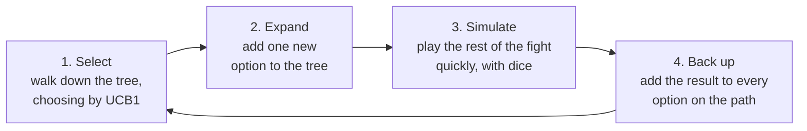
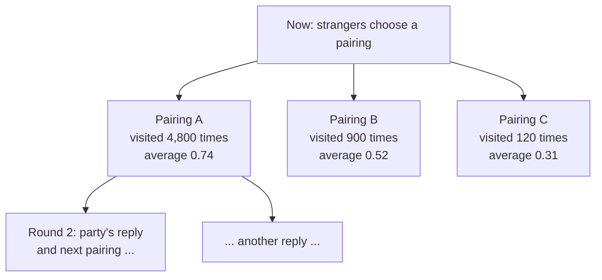
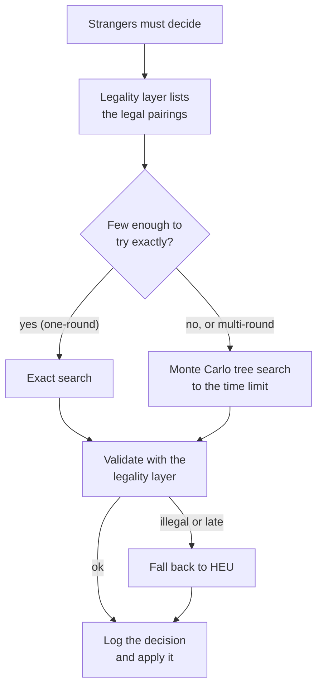

# Monte Carlo Methods for Stranger Pairing

## A primer and an implementation specification

**Date:** 06-OCT-2026\
**Status:** Draft for review. Nothing here is decided except where marked.\
**Related:** [training task spec (neural net)](2026-10-05-nn-pairing-training-task-spec.md), [neural-net requirements](2026-10-04-nn-stranger-pairing-requirements.md), [scenario-space report](2026-10-05-test-scenario-space-report.md), [technical spec](2026-10-03-combat-revision-technical-spec.md) §5\
**Reads best as:** sections 1 and 2 first, which assume no prior knowledge. Sections 3 onwards are the specification.

---

## 1. Summary

**The idea.** A Monte Carlo method decides by **trying things**. To judge a pairing, the program plays the rest of the fight many times, rolling the dice each time, and counts how often the strangers do well. It then picks the pairing that did best. Nothing is trained in advance, and there is no model to ship. The game's own rules, run as a **simulator**, are the whole intelligence.

**Why it is attractive here.**
- **No training, no data, no Python.** It uses the rules engine we already have to build (the M1 and M2 milestones).
- **It looks ahead.** It can play several rounds forward, which is the chess-like problem we want to solve and which the exact one-round search cannot see.
- **It copes with dice.** Chance is part of the simulation, not an awkward extra.
- **It explains itself.** For each decision we can show every option considered, how often it was tried and how it did.
- **It is the search half of the strongest game programs.** If a neural network is wanted later, it plugs into this method rather than replacing it (section 7).

**Where it is not the best tool.**
- **A single round is better solved exactly.** For one round the answer can be computed exactly by trying every pairing (training task spec §2). Monte Carlo would only approximate it. It earns its place for **multi-round lookahead**, for **fights with too many pairings to try exhaustively**, and for **uncertainty about what the player will do**.
- **It spends time while the game is running.** A network is slow to train and fast to use. Monte Carlo is the opposite. The game must be able to afford the decision time (section 4.6).

**Recommendation.** Build it as the next rung after the exact search: first as a one-round sanity check against the exact answer, then as the multi-round search. Specified below.

---

## 2. Primer: what Monte Carlo means

### 2.1 Estimating odds by playing

Take one match: the Ogre (strength 5) against a Man (strength 3), no bonuses. Both sides roll a d6 and add their strength. The chance that the strangers win can be worked out exactly by listing the 36 dice outcomes. Another way is to **play the match**: roll the dice, see who wins, and repeat. After 1,000 plays, if the Ogre won 722 times, the estimate is 72.2%. The exact answer is $26/36 = 72.2\%$ (plus a tie chance of $4/36$).

That is the whole idea, named after the casinos of Monte Carlo: **estimate something by random trials, and average the results.** It sounds crude, but it works for questions that are far too large to list, which is where it is useful.

### 2.2 How accurate is it?

The more trials, the better, but with diminishing returns. If each trial scores 0 or 1 (a loss or a win), the error of the average after $n$ trials is about

$$
\mathrm{SE} \;=\; \frac{\sigma}{\sqrt{n}}, \qquad \sigma \le \tfrac{1}{2}.
$$

In words: the typical error shrinks with the **square root** of the number of trials. To halve the error, you need four times as many trials. Concretely:

| Trials $n$ | 100 | 1,000 | 10,000 | 100,000 |
|---|---|---|---|---|
| Typical error (at most) | 0.050 | 0.016 | 0.005 | 0.0016 |

To tell apart two options whose true scores differ by $\delta$, with about 95% confidence, you need roughly

$$
n \;\approx\; \left(\frac{1.96\,\sigma\sqrt{2}}{\delta}\right)^{2}.
$$

For options 0.33 apart (like the two Ogre-and-Dwarf pairings in the training spec) a few dozen trials are enough. For options 0.01 apart, about 19,000 are needed. This is why the method suits **clear differences** and struggles with close calls, and why **how many trials we can afford** matters.

### 2.3 Choosing among many options: don't waste trials

If there are 1,000 possible pairings, spending the same number of trials on each wastes most of them on obviously poor options. A better scheme is a **bandit**: try each option a few times, then spend more trials on the ones that look promising, while still occasionally testing the others in case early luck misled us.

The standard rule, called **UCB1**, scores each option $i$ as

$$
\mathrm{score}_i \;=\; \bar{x}_i \;+\; c\sqrt{\frac{\ln N}{n_i}},
$$

where $\bar{x}_i$ is the option's average result so far, $n_i$ is how many times it has been tried, $N$ is the total number of trials, and $c$ sets how adventurous we are. The first term favours options that have done well. The second is a **bonus for options tried rarely**, which shrinks as an option is tested more. Each trial goes to the option with the highest score. The textbook value is $c=\sqrt{2}$, and we tune it.

### 2.4 Looking ahead: Monte Carlo tree search

A fight has several steps: the strangers pair, the dice are rolled, creatures die, then the next round starts and the sides choose again. That is a **tree** of choices. **Monte Carlo tree search** (MCTS) grows the part of the tree that matters, guided by the bandit idea above, and repeats four steps many times:



1. **Select.** Starting at the current position, repeatedly pick the child option with the best UCB1 score, until reaching a position with an option not yet tried.
2. **Expand.** Add that option to the tree.
3. **Simulate** (also called a **rollout**). From there, play the fight to the end (or for a fixed number of rounds) using quick, simple rules for both sides, with random dice. Score the outcome.
4. **Back up.** Add that score to the totals of every option on the path from the root, so those options' averages improve.

After a set number of repetitions (or a time limit), pick the option at the top of the tree that was **visited most**. Visits are a steadier signal than averages, because a promising option gets more trials.



The search spends most of its trials on pairing A, tested at depth, and only a few on the poor options. That is how it can look several rounds ahead without trying everything.

### 2.5 What Monte Carlo is not

- **It does not learn between games.** Each decision starts from scratch and thinks for the time it is given.
- **It is not guaranteed to find the best move.** It finds a good one and gets better with more time. With few trials it can be fooled by luck.
- **It needs a fast copy of the rules.** The method is only as good as the simulator, and as fast.

---

## 3. Where it fits this project

| Question | Best tool | Why |
|---|---|---|
| One round, strangers attack, party's line-up known | **Exact search** (training spec §2) | The score is exact arithmetic; no sampling needed |
| Fights with up to about 2 million pairings (6 strangers against 14) | **Monte Carlo over a sample of pairings** | Too many to try; the bandit finds good ones |
| Several rounds ahead (persisting matches, casualties, retreat) | **Monte Carlo tree search** | There is no exact formula; the simulator is the answer |
| The party's reply is uncertain (we don't know how the player behaves) | **Monte Carlo, averaging over party policies** | Sampling handles uncertainty naturally |
| Deploy (step b) and redeploy (step d) | **Monte Carlo tree search** | They are decisions against a reply, which suits a tree |

**Scope of this specification:** the **strangers' pairing decisions** (engage, redeploy, deploy) in a **whole fight**, with the one-round exact answer as a sanity check.

**Dependencies.** The fast simulator needs the **M2 round engine** (persistent matches, alternating roles), and the legal moves come from the **M1 legality layer**. Until those exist, only the one-round sanity check (task 2 in section 10) can be built, over the standalone evaluator from the training spec.

---

## 4. The design

### 4.1 The simulator

Everything depends on one function: **play the fight forward**, fast, from any position.

```
simulate(state, strangerPolicy, partyPolicy, seed) -> outcome
```

- **Pure.** It takes a state and returns a new one, changing nothing. This is how the game engine already works (`reduce`).
- **Seeded.** The dice come from the seed, so the same seed gives the same fight. This matters for fair comparisons (section 4.5) and for replaying a run.
- **Fast.** The speed sets how many trials fit in the time we have. Target (proposed, to be measured): **at least 20,000 simulated fights per second** on the server. A fight that ends in a few rounds is a small amount of arithmetic.
- **Two policies.** Both sides need a way to choose moves inside a rollout (section 4.2).

### 4.2 The simple policies used inside rollouts

A rollout has to choose moves for both sides, quickly. We use two kinds:

- **The strangers' rollout policy:** `HEU`, the rank-match heuristic (strongest against strongest), or random-legal for a looser estimate. This is only the "quick play" inside a rollout. The search itself replaces it at the real decision.
- **The party's policy:** the four named **party policies** from the training spec (`RLG`, `GRD`, `CAU`, `MAG`). We don't know how the player will behave, so **each rollout draws one policy at random** from the set (or from a weighting based on real play). The estimate then averages over the likely behaviours. This is a form of **determinisation**: turning an uncertain opponent into one sampled opponent per trial.

### 4.3 What counts as a good result: the reward

Every rollout ends with a number between 0 and 1, the **reward**. This is the most important choice, and it is **still open** (open item O1). Candidate definitions, from simplest to most ambitious:

| Code | Definition | Notes |
|---|---|---|
| `R1` | **Matches won in round 1**, ties half | The same score as the exact one-round search. It makes the sanity check possible. |
| `R2` | The strangers **win the fight**: the party is wiped out, or retreats | Simple, but it ignores how well the strangers did on the way. |
| `R3` | **Value destroyed, minus value lost**, scaled to 0 to 1 (party creatures killed against strangers killed, by victory points) | Rewards a close win over a costly one. Needs scaling choices. |

Proposed: build with `R1` (to check the machinery against exact), then `R3` for real play, keeping `R2` as a reported number.

### 4.4 The search

Two versions, built in order.

**Flat Monte Carlo (the simple one).** List the candidate pairings. Give each an equal number of rollouts, or spread them with the bandit rule. Pick the one with the best average. This is a few dozen lines, and is the method of section 2.1 applied to pairings.

**UCT tree search (the real one).** The four-step loop of section 2.4. Each node in the tree is a decision: the strangers' pairing now, then the party's reply, then the strangers' pairing next round, and so on. Details:

- **Selection** uses UCB1: $\bar{x}_i + c\sqrt{\ln N / n_i}$ (section 2.3).
- **Progressive widening.** A single decision can have millions of pairings, far too many to give each a turn. We only let a node consider $k$ options once it has been visited $n$ times, with
  $$
  k(n) \;=\; \lceil C\, n^{\alpha} \rceil, \qquad \alpha \approx \tfrac{1}{2}.
  $$
  New options are added **best first**, ranked by `HEU` or by a cheap score, so the search looks at the sensible pairings early and the odd ones only if there is time.
- **Rollout depth.** Play to the end of the fight, or stop after a few rounds and score the position with the reward applied to its current state.
- **Final choice.** The option with the **most visits** at the root, since that is steadier than the highest average.

### 4.5 Handling the dice

The dice are the source of the randomness, and there are two good ways to treat them:

- **Sample them in the rollouts** (the usual way). Each rollout rolls its own dice. The tree is made of **decisions only**, and each option's average smooths out the luck. This is called **open-loop** search.
- **Use the exact one-round answer where we have it.** The expected matches won in round 1 is computed exactly (the 36-outcome enumeration), and the **later rounds are sampled**. This removes dice noise from the first round, which is the part we can solve.

**Common random numbers.** When comparing two candidate pairings, give both **the same dice** in a given trial. Then luck affects both alike, and the *difference* between them is estimated far more precisely than if each had its own dice. This is a standard trick that can cut the trials needed several-fold, and the seeded simulator makes it easy.

### 4.6 Time budget and where it runs

Monte Carlo is an **anytime** method: it can be stopped whenever and returns the best answer so far. That makes the budget a **setting**, not a hard requirement.

| Setting | Proposed default | Notes |
|---|---|---|
| Time limit per decision | **400 ms** | Inside Convex's one-second limit for a mutation, with room for the rest of the move |
| Trial limit | 50,000 | Whichever limit is reached first |
| Fallback | `HEU` | Used if the search cannot finish or hits an error |



If 400 ms is too little, there are two ways out: **run the search in a Convex action** (up to ten minutes, not atomic with the player's move), or **precompute** the answer for the common small fights. These are decided after the timings are measured (open item O3).

**Difficulty comes free.** The budget is a difficulty dial: a handful of trials plays like a casual opponent; thousands play strongly. So the same code serves the novice, standard and expert levels in the technical spec §5.4.

### 4.7 Reproducibility

- **Every decision is logged as an ordinary action**, with the search settings and the seed. Replay never re-runs the search (technical spec §5.2), so a game replays exactly even though search results depend on chance.
- **For evaluation, runs are seeded**: the same seed and settings give the same search, so a run can be repeated and compared.

---

## 5. The rules are not reimplemented

A common worry is that Monte Carlo means writing the rules a second time. It does not. The rules already live in the engine: the **strength** calculation, the **legality** layer and the **round engine**. Monte Carlo **calls them**, many times, as its simulator. If a rule changes, the search uses the new rule automatically. That is one of its advantages over a trained model, which would need retraining.

What is needed from the engine:

| Needed | From | Milestone |
|---|---|---|
| Legal pairings and legal replies | Legality layer | M1 |
| Strength, dice and match outcomes | Strength module | M1 |
| Alternating rounds, persistence, casualties, ending a fight | Round engine | M2 |
| The simple rollout policies | Strategy `standard` and the party policies | M2 and the training spec |
| A fast, pure `simulate` with a seed | New, built on the above | M2 |

---

## 6. A worked example

The position from the training spec §2: strangers Ogre (5) and Dwarf (1), against a Hero with the Magic Sword (7) and a Man (3). The strangers can pair as:

- **A:** Ogre against Hero, Dwarf against Man. Exact score 0.444.
- **B:** Ogre against Man, Dwarf against Hero. Exact score 0.778.

**Flat Monte Carlo, 1,000 rollouts per option.**
1. For each of the 1,000 trials, roll the dice for both matches. Score the trial as the number of matches the strangers won (ties half).
2. Average each option's 1,000 trials: roughly 0.44 for A and 0.78 for B, each with an error of about 0.015.
3. The gap of 0.33 is more than 20 times the error, so **B is chosen with near certainty**. The same answer as the exact search, from sampling alone.

Now a harder case. Two options differing by 0.01 need about 19,000 trials each to separate (section 2.2). In a real game those two would matter little, which is a useful property: **the method's uncertainty is greatest exactly where the choice matters least.**

**Where it pulls ahead.** Suppose B wins the first round but costs the strangers the Dwarf, and then the Hero's reply in round 2 turns the fight. The one-round score cannot see this. Rollouts to the end of the fight can. That is the case Monte Carlo is for, and why it needs the M2 round engine.

---

## 7. Compared with the other approaches

| | Exact search | **Monte Carlo** | Trained network |
|---|---|---|---|
| Training or data needed | No | **No** | Yes, a lot |
| Looks several rounds ahead | No | **Yes** | Only if trained to |
| Time to decide | Short (one round) | **Adjustable, the longest** | Very short |
| Follows rule changes automatically | Yes | **Yes** | No, retrain |
| Can explain itself | Yes | **Yes: the options, visits and averages** | Weakly |
| Result guaranteed best | Yes (one round) | No, improves with time | No |
| Needs a fast simulator | No | **Yes** | For training data |
| Runs in the game | Yes | **Yes, if time allows** | Yes |

**How they combine.** The strongest game programs (AlphaZero and its relatives) use **both**: Monte Carlo tree search, with a **trained network** supplying two things: a first guess at which options look promising (a *policy*), and a quick estimate of a position's value in place of a long rollout. So building Monte Carlo search first is **not a detour** from the neural-net plan. The network, if it is built, **improves** the search rather than replacing it. The staged plan in the requirements (exact search, then lookahead, then a network) is consistent with that.

---

## 8. Success criteria

Targets marked *(proposed)* are re-set after the first measurements.

| ID | Criterion | Target |
|---|---|---|
| MC-1 | **Simulator determinism:** the same state and seed always give the same fight | 100% on 100,000 fights |
| MC-2 | **Simulator speed**, fights per second on the target server | $\ge$ 20,000 *(proposed; to be measured)* |
| MC-3 | **Agreement with exact** on one-round scenarios (reward `R1`): the search picks an option whose exact score equals the optimum | $\ge$ 95% at the default budget *(proposed)* |
| MC-4 | **Regret against exact** on the same scenarios | $\le$ 2% *(proposed)* |
| MC-5 | **Strength against `HEU`** in whole-fight play against the spread of party policies (the arena of the training spec) | Win rate above 50% with a confidence interval above 0 |
| MC-6 | **Strength against `expert`** (the one-round exact search played every round) | Above 50% *(this is the test that lookahead helps)* |
| MC-7 | **Strength rises with budget:** win rate at 1,000, 10,000 and 50,000 trials | Rising, with a plot |
| MC-8 | **Decision time** at the default budget, and that the fallback triggers | Within the limit; fallback under 1% |
| MC-9 | Legality: every decision passes the legality layer | 100% |

**Go/no-go.** MC-3 and MC-4 gate the machinery: if sampling can't reproduce the exact one-round answer, something is wrong. MC-6 is the real prize. If Monte Carlo can't beat `expert` over whole fights, multi-round lookahead is not paying off with this reward, and the reward (section 4.3) or the simulator should be reconsidered before any network is trained.

---

## 9. Run records

Each evaluation run writes the **same two files as the neural-net training task** (the JSON replay file and the 3-letter-mnemonic printout, training task spec §9), with these additions.

**JSON additions**, per decision: the **search settings** (`method`, `trials`, `timeMs`, `c`, `alpha`, `rewardCode`), the **seed**, and the **root statistics**: for each option considered, `visits`, `meanReward` and the rounded standard error. A replay re-runs the search with the recorded seed and settings and must reproduce the same visits and means exactly.

**Printout additions.** The same style, **one line per option considered at the root of a decision**, so the reader sees what the search weighed. Columns (all 3-letter codes, uppercase, right-aligned numbers):

| Col | Meaning |
|---|---|
| `SCN#` | Scenario number (as in the JSON) |
| `DCN` | Decision number within the fight |
| `RNK` | Rank of this option by visits (1 = chosen) |
| `PAIR` | The pairing, as `OGR>MAN DWF>HER` (stranger > party creature) |
| `VIS` | Visits (trials spent on this option) |
| `MRW` | Mean reward |
| `SEM` | Standard error of the mean |
| `EXA` | The exact one-round score, where known (for the sanity check) |
| `CH` | `*` if chosen |

Example, scenario 1 from section 6 after 1,000 trials:

```
SCN# DCN RNK PAIR                VIS   MRW   SEM   EXA CH
   1   1   1 OGR>MAN DWF>HER     812 0.779 0.014 0.778 *
   1   1   2 OGR>HER DWF>MAN     188 0.441 0.031 0.444
```

A run's listing opens with the same banner, header and **KEY** block as the training listing, extended with the codes above. The width is whatever the columns need.

---

## 10. Deliverables and tasks

- [ ] 1. **Simulator** — a pure, seeded `simulate` over the M2 round engine, with the party policies and `HEU` as rollout policies; determinism and speed tests (MC-1, MC-2). *Depends on M1 and M2.*
- [ ] 2. **Flat Monte Carlo on one round** — over the standalone evaluator of the training spec, with common random numbers; compare with the exact optimum (MC-3, MC-4). *Can start now.*
- [ ] 3. **UCT tree search** — selection, expansion, rollout and back-up, with progressive widening; the settings of section 4.6
- [ ] 4. **Rewards and opponent model** — `R1`, `R2`, `R3`, and the party-policy mix; a decision on which reward to ship (O1)
- [ ] 5. **Arena evaluation** — whole-fight play against `HEU` and `expert`, budget curves (MC-5, MC-6, MC-7)
- [ ] 6. **Time-budget spike** — measure the search inside a Convex mutation and an action; decide where it runs (MC-8, O3)
- [ ] 7. **Run records** — the additions of section 9, with `replay` reproducing every visit count
- [ ] 8. **Verify** — all suites pass; the engine-spec is updated for any engine export added

**Not in this specification:** a trained network (it plugs in later, section 7), the player's own AI, and anything after stranger pairing.

---

## 11. Open items

- **O1 — What is a win for the strangers?** (section 4.3). This is the same open question as in the neural-net requirements, and the choice shapes everything. It needs your decision before task 4.
- **O2 — How the player behaves.** The party policies are guesses. Real play data from the game logs would be better, and needs your separate go-ahead since it is production data.
- **O3 — Where the search runs.** In the mutation (atomic, but about 400 ms) or in an action (more time, not atomic) or precomputed for the common cases. To be decided after the timing spike.
- **O4 — The simulator's speed.** *Measured 06-OCT-2026 (Appendix C): 140,000 to 350,000 fights per second on one core, so the 20,000 target is met with a wide margin. The remaining uncertainty is the cost of the search on top, and fights longer than the 1.4 rounds of the lopsided random scenarios.*
- **O5 — The M2 dependency.** Tasks 1 and 3 onwards need the round engine. Only task 2 can start without it.
- **O6 — Combining with the exact search.** Whether a single round should always use the exact answer and Monte Carlo only for multi-round, or whether Monte Carlo should handle both for simplicity. Proposed: exact for one-round, Monte Carlo for the rest.

---

## Appendix A — the search in pseudocode

```
function search(root, budget):
    repeat until budget is spent:
        node = root
        # 1. Select: walk down by UCB1, widening as visits grow
        while node is fully expanded and not terminal:
            node = child of node maximising  mean + c * sqrt(ln(visits(node)) / visits(child))
        # 2. Expand: add the next best untried option
        if node is not terminal:
            node = add_child(node, next_option(node))
        # 3. Simulate: play on with quick policies and sampled dice
        reward = simulate(node.state, strangerPolicy, sample(partyPolicies), seed)
        # 4. Back up: update every node on the path
        for n in path(root, node):
            n.visits += 1
            n.total  += reward
    return child of root with the most visits
```

## Appendix B — glossary

| Term | Meaning |
|---|---|
| **Monte Carlo** | Estimating something by averaging many random trials |
| **Rollout / simulation** | Playing a position forward quickly, with random dice, to see how it ends |
| **Reward** | The number from 0 to 1 that scores how well a rollout went for the strangers |
| **Bandit / UCB1** | A rule for spending trials: favour good options, with a bonus for rarely tried ones |
| **MCTS / UCT** | Tree search that grows the promising part of the tree, using UCB1 |
| **Progressive widening** | Adding more options to a node only as it is visited more |
| **Determinisation** | Replacing an uncertain opponent with one sampled opponent per trial |
| **Open-loop** | A tree made of decisions only, with the dice sampled inside rollouts |
| **Common random numbers** | Giving every option the same dice in a trial, so differences are measured sharply |
| **Anytime algorithm** | One that can be stopped at any moment and returns the best answer so far |

## Appendix C — the first spike (06-OCT-2026)

A first lean simulator exists in **`packages/pairing-lab`** (task 1 of section 10, built on the `monte-carlo` branch). It is a **spike**: every open rule is a switch set to the default proposed in the [questions for Peter](2026-10-04-questions-for-peter.md), so nothing here is validated until he answers. It is not part of the engine and is not shipped to the browser.

**What it is.** A pure, seeded `simulate(scenario, rules, partyStyle, strangerStyle, seed)` that plays a whole fight forward and returns the outcome and the three rewards `R1`, `R2` and `R3` (section 4.3). It uses its own small state and a small seeded random generator (the engine's own `rollDie` does BigInt arithmetic on every roll). It reuses only the engine's pure capability table and creature data. There is a random scenario generator that draws from the real card counts, and the four party styles `GRD`, `CAU`, `MAG` and `RLG` (training spec §6.1). The strangers' `GRD` is the `HEU` baseline.

**The default switches** (in `rules.ts`, `DEFAULT_RULES`):

| Switch | Default | Question |
|---|---|---|
| `strangersAttackFirst` | yes | Q1: who attacks in round 1 |
| `alternate` | yes | Q1: the roles swap every round |
| `strangerCasualty` | `nominate` (Peter's text: the nominated stranger is spared on 4–6) | Q3 |
| `shieldWardsBackers` | yes (the card text) | O2 |
| `staffPriest` | 2 (the card) | D3 |
| `partyRetreatRatio` | 0.5: the simulated player retreats once its strength falls below half the strangers' | new: not yet a question for Peter |
| `maxRounds` | 30 | safety cap |

Also built in, following the engine or the rules text: matches persist while unresolved, a two-creature party front line loses by nomination and a die (Ring +1, 7 counts as 6), a level 4+ Ring bearer cannot be killed, surprise applies in round 1 only, and a Spectre, Demon or Sybil is never a stranger.

**Checks.** 52 tests, all passing. They include a **parity test against the engine's own `previewPlan`** (the strength arithmetic matches on 11 positions: Sword, Staff, Shield, the Sorcerer, the Eye, two against one), and statistical checks, for example a one-against-one Ogre against a Man is won by the Ogre 81.25% of the time ($26/32$, because ties persist), whichever side attacks first.

**Measured speed** (Apple M3 Max, Node 26, one thread, 20,000 random scenarios per row, rules at their defaults, strangers using `GRD`):

| Scenarios | Party style | Fights per second | Microseconds per fight | Rounds per fight |
|---|---|---|---|---|
| base | `GRD` | 237,000 | 4.2 | 1.4 |
| base | `CAU` | 154,000 | 6.5 | 3.6 |
| base | `MAG` | 226,000 | 4.4 | 1.5 |
| base | `RLG` | 244,000 | 4.1 | 1.7 |
| kit | `GRD` | 278,000 | 3.6 | 1.4 |
| kit | `CAU` | 215,000 | 4.7 | 3.3 |
| kit | `MAG` | 290,000 | 3.4 | 1.4 |
| kit | `RLG` | 304,000 | 3.3 | 1.7 |
| base, 3 or fewer strangers | `GRD` | 351,000 | 2.8 | 1.3 |
| base, 5 or more strangers | `GRD` | 142,000 | 7.1 | 1.9 |

That is **seven to seventeen times** the 20,000 fights per second proposed for MC-2, before any tuning. A search that spends 400 ms could therefore run roughly 55,000 to 140,000 fights on one core, before the cost of the search itself.

**Caveats to bear in mind when reading those numbers.**
- **The random fights are lopsided.** The party wins about 88% of them, usually in one or two rounds, because the generator makes the party at least as large as the strangers. For search, use the **strength-balanced generator** (C.1), which gives contested fights of any size.
- **The speed is of the simulator only.** A tree search adds its own bookkeeping on top.
- **Simplifications.** Casters back a match only through the larger side's redeploy step. The strangers' loadout is taken from the scenario, not re-run each round. Step (d) chooses greedily from fixed strength deficits. A defeated invulnerable stranger is treated as an ordinary casualty. Not modelled: consumables during a fight, the Scroll, the Sorcerer's Lotus Dust and Holy Water reductions, and the Eye's other effects.
- **The simulated player** is the four named styles plus the retreat ratio. Nothing in this spike has been compared with how people actually play.

**Run it:** `pnpm --filter @sorcerers-cave/pairing-lab test` (the tests) and `pnpm --filter @sorcerers-cave/pairing-lab bench` (the speed table above).

### C.1 Size limits, the balanced generator, and speed at every size (06-OCT-2026)

**The limits.** The simulator has no size limit of its own. The generator's ceilings are the game's: **30 allies in the base deck and 40 with the kit** (the creature cards that can ever be friendly, shared with the strangers), and **up to 20 strangers** (a Mutiny). These are the named constants `MAX_PARTY` and `MAX_STRANGERS` in `scenario.ts`. The earlier limit of 14 was our own, chosen for the exhaustive counts and the fixed-slot network input. **It still applies to the exact one-round search and the neural-net task**; it does not apply to Monte Carlo (training spec §3).

**The balanced generator.** `balancedScenario(seed, deck, { band, maxStrangers })` draws the strangers, then adds allies until the party's total strength is within a band of the strangers' (default 0.7 to 1.4 times). Big parties therefore appear only against big or strong stranger groups, so the fights are contested.

**Speed on balanced fights** (Apple M3 Max, Node 26, one thread, 10,000 fights per row, defaults, `GRD` v `GRD`):

| Strangers | Mean party v strangers | Fights per second (base) | Fights per second (kit) | Strangers win (base) | Party wins (base) | Party retreats (base) |
|---|---|---|---|---|---|---|
| 1–3 | 2.9 v 2.0 | 309,000 | 324,000 | 22% | 63% | 15% |
| 4–6 | 5.9 v 4.7 | 138,000 | 136,000 | 14% | 61% | 25% |
| 7–12 | 10.3 v 8.6 | 75,000 | 80,000 | 8% | 58% | 34% |
| 13–20 | 15.0 v 15.5 | 49,000 | 43,000 | 5% | 31% | 64% |

The **slowest row is 43,000 fights per second**, still more than twice the proposed 20,000 for MC-2. At 400 ms a decision, that is about 17,000 fights even for the largest fights, or about 120,000 for small ones.

**One thing these results show.** As the fights get bigger, the simulated party **retreats** more and more (64% of the 13–20 stranger fights). The retreat rule (`partyRetreatRatio`, 0.5) is an assumption of mine, and in large fights it decides more outcomes than the dice. A realistic model of when a player retreats matters most exactly where the search is hardest.
