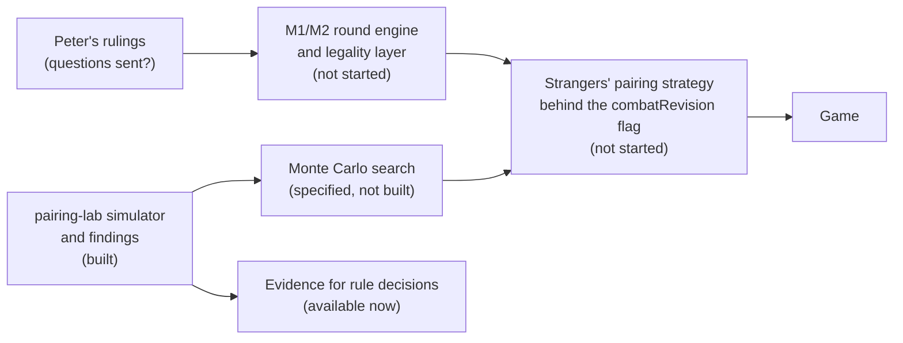

# Pairing Lab: What Was Built, What Was Tested, What We Learned

## A report on the stranger-pairing research, and what it means for the game

**Date:** 06-OCT-2026\
**From:** Mark\
**Branch:** `monte-carlo` (commits `acc6283` and `7d2cc38`, plus the uncommitted items listed in section 9)\
**Related:** [Monte Carlo spec](2026-10-06-monte-carlo-pairing-spec.md), [training task spec](2026-10-05-nn-pairing-training-task-spec.md), [scenario-space report](2026-10-05-test-scenario-space-report.md), [questions for Peter](2026-10-04-questions-for-peter.md)

---

## 1. Summary

**What exists.** A small research package, `packages/pairing-lab`, containing a **fast, seeded fight simulator**, a **scenario generator** that follows the real card counts, four **simulated player styles**, and 72 passing tests. Every open combat rule is a switch set to the default we proposed in the questions for Peter. It is **not part of the game**: it is a separate package, not wired into the engine, the server or the browser.

**What it showed.**

| Finding | Strength of evidence |
|---|---|
| The simulator is fast: **43,000 to 324,000 complete fights per second** on one core, depending on fight size, against a 20,000 target | Measured, repeatable |
| Its strength arithmetic **matches the engine's own `previewPlan`** on 11 positions | Tested |
| **Who attacks first (Peter's question 1) barely matters** for outcomes | Measured, in the model |
| Peter's stranger casualty rule makes the strangers about **2 points harder to beat** than today's, but only when they outnumber the party (question 3) | Measured, in the model |
| The Priest Staff bonus (+1 or +2) and the Shield-wards-backers rule have **negligible effect** | Measured, in the model |
| The simple "strongest against strongest" pairing is **worse than random** for the first round | Measured, in the model |
| A **whole-fight view of a pairing finds gains the one-round exact score misses**: about half of the available improvement | Measured, in the model |
| When the strangers **outnumber** the party, how well they gang up matters by tens of points; in other fights, pairing matters by 1 to 2 points | Measured, in the model |
| Which pairing is best is **stable** against the retreat rule and the strangers' later play, but **sensitive to how the party plays later rounds**; blending party behaviours cuts that sensitivity by roughly half to two thirds | Measured, in the model |

**Results are now stored and printable.** Every simulated run can be written as an exact JSON file (replayable) and as a line-printer listing with **one scenario per line**, plus an optional **one match per line** detail listing (section 2.7).

**What it means for the game today: nothing has changed.** The engine, the server and the browser are untouched. What we have is **evidence for decisions** (which rule questions matter, where intelligence pays off) and **tooling** for the next steps. Section 6 says exactly what could be used, and what stands in the way.

**The most important caveat.** Every result is about the **simulated model**. The scenarios, the four party styles and the retreat rule are our inventions, and nothing has been compared with how people actually play. Real play data is the largest single improvement we could make (section 8).

**Top follow-ups.** Send the questions to Peter; define the strangers' "win" (the reward); model when a player retreats; make the whole-fight labels from a blend of party behaviours; target the outnumbered-party gang-up decision first; commit the experiments as replayable runs. Section 8 has the full list.

---

## 2. What was built

### 2.1 The package

`packages/pairing-lab` (TypeScript, tested with vitest). It imports only the engine's **pure** pieces: the capability table (who may use which artefact) and the creature and card data. It does not use the engine's game state, which is large and cloned on every action.

| File | What it does |
|---|---|
| `rules.ts` | The fight arithmetic: strength, the Eye, Shield, Ring, Staff, dice bonuses, the 36 dice outcomes, the casualty roll, invincibility |
| `sim.ts` | The simulator: plays a whole fight forward and returns the outcome and three rewards |
| `policies.ts` | The four player styles (section 2.3) |
| `scenario.ts` | Random and strength-balanced scenario generators drawn from the real card counts |
| `runlog.ts` | Run records: every scenario with its inputs and outcome, JSON output, and exact replay |
| `listing.ts` | The line-printer listings: one scenario per line, and one match per line |
| `mnemonics.ts` | The 3-letter creature and treasure codes, identical to the game log's (a test asserts this) |
| `cli.ts` | The `report` command that simulates a run and writes the files |
| `rng.ts` | A small seeded random generator. The engine's own `rollDie` does BigInt arithmetic on every roll, which is far too slow |
| `types.ts` | The data types, including the switches and two experiment hooks |
| `README.md` | Usage and commands |

### 2.2 What the simulator does

`simulate(scenario, rules, partyStyle, strangerStyle, seed)` is **pure and seeded**: the same inputs always give the same fight, and it never changes the scenario it is given. It plays the round flow of *Each Round is Fought* on lean state:

1. **(b)** the defender deploys at least as many creatures as the attacker has unengaged;
2. **(c)** the attacker pairs its unengaged creatures one-to-one against the deployed front line;
3. **(d)** the larger side redeploys: unengaged creatures join a match as the second front-liner (never two against two), or casters back it;
4. **(e)** each match is fought: one die a side, strength totals, surprise in round 1, the Ring bonus, curses;
5. **(f)** matches with an empty front line dissolve; background creatures become unengaged; the simulated player may retreat.

**Matches persist** while unresolved (a tie). A two-creature front line that loses a match loses one creature by nomination and a die roll (a Ring adds 1; 7 counts as 6). A level 4 or deeper Ring bearer cannot be killed. The result is the outcome (`strangersWin`, `partyWin`, `retreat` or `cap`), rounds played, survivors, value lost, and three rewards:

| Reward | Meaning |
|---|---|
| `R1` | The share of the first round's matches the strangers won (ties half) |
| `R2` | 1 if the strangers win or the party retreats, 0 if the party wins |
| `R3` | Value destroyed minus value lost, scaled to 0 to 1 (by victory points) |

### 2.3 The simulated players

Both sides use the same four **styles**. A style decides who deploys, who engages whom, and who joins or backs a match.

| Style | Behaviour |
|---|---|
| `GRD` greedy | Strongest creatures deploy; engages strongest against strongest; casters back the strongest match. As the strangers' style, this is the **`HEU` baseline** |
| `CAU` cautious | Lowest-value creatures deploy; **never joins or backs** in later rounds |
| `MAG` magic-heavy | Non-casters deploy; casters back matches round-robin |
| `RLG` random | Random legal choices |

### 2.4 The rules as switches (all defaults, none validated)

Each open rule is a switch on `Rules`, set to the default in the questions for Peter:

| Switch | Default | Peter's question |
|---|---|---|
| `strangersAttackFirst` | yes | Q1 |
| `alternate` | yes (roles swap each round) | Q1 |
| `strangerCasualty` | `nominate` (his text: the nominated stranger is spared on 4 to 6) | Q3 |
| `shieldWardsBackers` | yes (the card text) | new, O2 |
| `staffPriest` | 2 (the card) | D3 |
| `partyRetreatRatio` | 0.5: the simulated player retreats when its strength is under half the strangers' | **new, not yet asked** |
| `maxRounds` | 30 | safety cap |

### 2.5 The generators and limits

- `randomScenario(seed, deck, options)` builds a fight from the real small-pack card counts, so the strangers and the party **share the same finite pack**.
- `balancedScenario(seed, deck, options)` draws the strangers, then adds allies until the party's total strength is **within a band (default 0.7 to 1.4) of the strangers'**, so fights are contested.
- **Limits follow the game:** up to **30 allies in the base deck and 40 with the kit** (the creature cards that can ever be friendly), and up to **20 strangers** (a Mutiny). The earlier cap of 14 was our own, chosen for the exhaustive counts and the neural-net input.
- Not modelled: Spectre, Demon and Sybil (version 1), the Scroll, consumables used in a fight, the Sorcerer's Lotus Dust and Holy Water reductions, and the Eye's other effects.

### 2.6 Three experiment hooks

- `round1Engage`: replaces the strangers' round-1 pairing, so we can ask what a given first pairing is worth once the rest of the fight plays out.
- `round1PartyStyle`: fixes how the party deploys in round 1, whatever its style is afterwards, so formation and later behaviour can be separated.
- `trace`: called for every match as it is resolved, with the creatures, strength totals, die bonuses, dice and result. It never changes the outcome. It drives the match-detail listing.

### 2.7 Storing and reading the results

Until this was added, **nothing was stored**: `simulate` returned an outcome in memory and the experiments printed averages. A run is now stored as two or three files, all from the same records:

| File | What it is |
|---|---|
| `NAME.json` | Every scenario **in full** (not just a seed) with its outcome, plus the run settings and rules. Version 1. Replayable |
| `NAME.log` | **One scenario per line**: set-up (deck, level, curses, Eye, surprise, sizes), the result (how it ended, rounds, survivors, value lost, the three rewards, the seed), then both sides' creatures and artefacts as 3-letter codes. Uppercase, fixed width, game-log style, with a banner, header, footer, summary and key |
| `NAME.matches.log` | **One match per line**, for the first N scenarios: round, match number, both sides' strengths, die bonuses, dice, result, and who fought whom (`~` marks background casters) |

The width is as wide as the widest value in the run, so **nothing is ever truncated** (a party of 40 prints in full), and every row in a listing has the same width. Creatures and artefacts use the same codes as the game's own log, with `+` for an artefact borne, `!` a Strength Potion, `^` the Elixir and `*n` dragons slain.

```
report -- --count 5000 --deck kit --party GRD --detail 50     writes runs/NAME.log, .json and .matches.log
report -- --replay runs/NAME.json                             re-simulates every scenario and checks every outcome
```

The files go to `packages/pairing-lab/runs/`, which is git-ignored (a run of 5,000 kit scenarios is a 1.5 MB listing and a 4.6 MB JSON file, simulated and written in under two seconds). A small **golden listing** is committed as a test snapshot, so any change to the format or the rules shows up in review. A replay of 5,000 scenarios reproduced every outcome exactly.

A sample, scenario 102 of the kit run (one line per scenario, shortened here):

```
SCN# DCK LVL CRS EYE SUP NP NS END RDS PAL SAL PVL SVL    R1    R2    R3 SEED PARTY ...
   1 KIT   6   1 -     1 13 19 SWN   1   0  19  72   0 1.000 1.000 0.688  102 SCH+STF WMN MAN ...
```

---

## 3. What was tested

The tests come in two kinds: **checks that the code is right** (section 3.1) and **experiments that measure the model** (sections 4 and 5). The distinction matters: the first are repeatable tests in the repository; the second are measurements whose scripts were throwaway (section 9).

### 3.1 Correctness tests (in the repository, all passing)

72 tests, run with `pnpm --filter @sorcerers-cave/pairing-lab test`. They cover:

- **Strength arithmetic**: the Sword, Axe, Staff, Ring, Shield, the Eye, the Sorcerer's special case, background casters, dragon kills, the Elixir and the Strength Potion.
- **Dice and outcomes**: the 36 outcomes (Ogre 5 against Man 3 gives 26 wins, 4 ties, 6 losses); a gap beyond 5 decides a match in advance; the worked example from the training spec (a pairing scoring 28/36).
- **Casualty rules**: the nominated creature dies on 4 to 6 for the party, the other for the strangers (as Peter wrote it); the Ring and the 7-counts-as-6 rule.
- **Parity with the engine**: the lab's strengths equal the engine's own `previewPlan` on **11 positions**: Sword; a Wizard fighting in front; a Wizard or Priest backing with the Staff; a party Shield against a Wizard and against the Sorcerer; a stranger Shield; the Eye (including the Sorcerer reduced by 2, not zeroed); two against one; a stranger Hero with a Sword beside a Staff-bearing Priest.
- **Simulator behaviour**: determinism; the scenario is not modified; every fight terminates with consistent counts; value lost equals the points of the creatures killed; a level 4 Ring bearer cannot be killed; a retreat happens when outmatched and never when switched off; the casualty switch runs; the largest sizes (30 and 40 allies, 20 strangers) run correctly.
- **Statistical checks**: a one-against-one Ogre against a Man is eventually won by the Ogre **81.25% of the time** (26 out of 32, because ties persist), whichever side attacks first; round-1 surprise raises the strangers' chances; a strong party overwhelms one weak stranger.
- **The generators**: deterministic per seed; never more copies of a creature than the deck holds; no Spectre or Demon as a stranger; no Dragon, Sorcerer, Spectre or Demon as an ally; each artefact appears at most once; the balanced band is respected over 2,000 seeds per deck; sizes up to the ceilings are produced.

**What these do not prove:** that the *rules defaults* are what Peter intends, or that the *flow* matches the future engine round flow (the engine has none yet). Parity covers the strength arithmetic only.

---

## 4. Experiments on the rules and on pairing

All use the **base deck**, the default rules, and **the same dice seeds for every row** (so rows are directly comparable). "Balanced" means the strongest creatures of the party (as many as there are strangers) are within 0.7 to 1.4 times the strangers' strength. The party style is `GRD` and the strangers' `GRD` (`HEU`) unless stated.

### 4.1 Speed

Apple M3 Max, Node 26, one thread. Repeatable with `pnpm --filter @sorcerers-cave/pairing-lab bench`.

| Fights (balanced, strength-matched) | Mean party v strangers | Fights per second (base) | (kit) |
|---|---|---|---|
| 1 to 3 strangers | 2.9 v 2.0 | 309,000 | 324,000 |
| 4 to 6 strangers | 5.9 v 4.7 | 138,000 | 136,000 |
| 7 to 12 strangers | 10.3 v 8.6 | 75,000 | 80,000 |
| 13 to 20 strangers | 15.0 v 15.5 | 49,000 | 43,000 |

Random (unbalanced) fights ran at 140,000 to 350,000 per second. The party size alone, with 4 strangers, went from 120,000 at a party of 14 to 64,000 at 26. The slowest case measured was a cautious party, 6 against 24, at 29,000. **Every measured case is above the 20,000 target.** At 400 ms a decision, that is about 17,000 fights in the largest fights and about 120,000 in small ones. This is the simulator only: a search adds its own cost.

### 4.2 Which rule questions matter (40,000 balanced fights)

| Switch | Strangers win | Party wins | Party retreats |
|---|---|---|---|
| Defaults | 6.5% | 85.9% | 7.5% |
| Strongest stranger dies (today's rule) | 6.5% | 85.9% | 7.5% (identical) |
| Priest Staff +1 | 6.6% | 85.4% | 7.8% |
| Shield does not ward stranger backers | identical to defaults | | |
| Party attacks first | identical to defaults | | |
| Roles never swap | identical to defaults | | |
| Party never retreats | 12.2% | 86.1% | 0% |

Several rows are **identical to the last decimal**, which looked suspicious, so I checked. Two reasons, both genuine:

- **Roles:** with greedy on both sides, the pairing is the same whoever attacks, and the dice are used in the same order. With **random** choices on both sides (30,000 balanced fights), the three role settings gave 9.26%, 9.43% and 9.10% strangers wins, within noise. **Who attacks first does not matter.**
- **Casualty rule and Shield:** they only apply in situations that balanced fights with a larger party rarely reach, so I measured them where they can apply (next).

**Where the strangers outnumber the party** (30,000 fights, party strength 0.6 to 1.6 times the strangers'):

| Switch | Strangers win | Party loses (points) | Strangers lose (points) |
|---|---|---|---|
| Peter's casualty text | 66.3% | 8.78 | 3.93 |
| Strongest stranger dies (today) | 64.6% | 8.60 | 4.17 |
| Priest Staff +1 | 66.8% | | |
| Shield does not ward backers | 66.3% (no change) | | |
| Party never retreats | 74.6% | 9.30 | 4.01 |

**Peter's casualty rule makes the strangers about 2 points harder to beat** where it applies. The Staff and Shield rules are negligible. **The retreat assumption moves the win rate by 6 to 8 points**, more than any rule: it changes how often the strangers win, but section 5 shows it barely changes *which pairing is best*.

### 4.3 How the players' styles compare

| Style | Strangers win (strangers' style varied, party `GRD`) | Strangers win (party's style varied, strangers `GRD`) |
|---|---|---|
| `GRD` | 6.5% | 6.5% |
| `CAU` | 5.9% | **19.5%** |
| `MAG` | 6.4% | 6.9% |
| `RLG` | 6.7% | 8.1% |

A **cautious party** (cheapest creatures in front, no later gang-ups) gives the strangers three times as many wins. How the **strangers** pair barely moves the result in these fights (6.5% against 5.9% to 6.7%), because the larger party reshapes the matches in its own redeployment step.

**When the strangers outnumber the party,** their choices matter a great deal: about 66% wins with gang-ups (`GRD` or `MAG`), 57.9% with random choices, and 41.8% with none (`CAU` never gangs up). The high-stakes decision is the **larger side's gang-up in step (d)**.

### 4.4 Is the "strongest against strongest" pairing any good? (round 1)

Round-1 matches won by the strangers (R1): `GRD` pairing 0.2266; `RLG` (random) pairing **0.2391**. **Rank-matching is worse than random**, which agrees with the worked example in the training spec: giving up the match you were going to lose anyway can win you another.

### 4.5 One round or the whole fight? (3,600 balanced fights)

For fights with 2, 3 and 4 strangers (1,200 each), every possible first pairing (2, 6 or 24) was played out as **1,000 whole fights**. The pairing was chosen on one set of dice and **judged on a fresh set**, so luck does not flatter the result.

| Strangers | Strangers' win rate with `HEU` | With the pairing the one-round exact score prefers | With the best whole-fight pairing | Same pick as the one-round score | Best and worst measurably differ |
|---|---|---|---|---|---|
| 2 | 7.2% | 7.4% | 7.9% | 81% (chance 50%) | 35% of fights |
| 3 | 5.8% | 6.8% | 8.1% | 53% (chance 17%) | 73% |
| 4 | 5.3% | 6.3% | 7.3% | 35% (chance 4%) | 90% |

**The one-round exact score improves on `HEU` but captures only about half of the available whole-fight gain.** The gains are 1 to 2 points of win rate, small in absolute terms because the party wins 86 to 94% of these fights anyway. The whole-fight figure is a **lower bound**: it is picked from only 1,000 fights per candidate.

### 4.6 The size of the space (exact counts)

The strangers and the party share a finite pack, so the number of (strangers, party) pairs can be counted exactly. The method and the equations are in the [scenario-space report](2026-10-05-test-scenario-space-report.md).

| Space | (strangers, party) pairs |
|---|---|
| Base, party up to 14 | 2,085,720,242 |
| Base, party up to 20 | 3,038,791,569 |
| Base, party up to 30 (the ceiling) | 3,074,621,698 |
| Kit, party up to 14 | 534,933,433,275 |
| Kit, party up to 20 | 1,932,353,102,937 |
| Kit, party up to 40 (the ceiling) | 2,538,904,748,551 |

With the artefact layouts, the party's line-ups and the situation, the full base space is about 1.3 times ten to the 19th fights, and the kit's about 5.6 times ten to the 25th. **Exhaustive coverage is impossible; sampling is required.** Most of the count comes from large fights that rarely occur (64% of the stranger groups have six strangers, but six can only appear in a Great Hall), so samples should be **weighted by how often a fight happens**.

### 4.7 A lesson from reading the listings: small per-match edges compound

The first kit listing showed scenario 102: 13 party against 19 strangers, balanced on total strength (62 against 78), yet the party was wiped out in **one round**, with the strangers winning 12 to 13 of the 13 first-round matches. I suspected a bug and added the trace hook to look. It is **not a bug**. The scenario has a curse (minus 1 on every party roll) and the strangers have first-round surprise (plus 1 on every stranger roll), a **2-point swing on every match** that the "balanced" band, which counts raw strength only, does not see. With a small edge in strength as well, each match is 80 to 90% for the strangers, and over 13 matches that is close to a sweep.

**Consequences.** In large fights a small, systematic edge decides the whole fight early, so results are bimodal: one side crushes the other. (1) The balanced generator should include the **die bonuses** (curses, surprise, Ring) in its balance. (2) We should expect the **whole-fight value** of a pairing to matter less in very large fights, where the law of large numbers works for whichever side has the edge. Both are follow-ups (section 8.2).

---

## 5. The sensitivity test: can we trust the whole-fight labels?

**The question.** The whole-fight value of a pairing depends on assumptions I invented: how the party plays, when it retreats, how the strangers play on. If the best pairing changes when those change, a label made under one assumption just teaches that assumption.

**The method.** For each fight (3 strangers: 400 fights; 4 strangers: 250 fights; balanced, base deck) I played every first-round pairing for 500 fights **under each of eight sets of assumptions**. I chose the best pairing under one set and **judged it under another on fresh dice**. The **regret** is how much worse that pairing does than the one chosen under the second set (whole-fight value R3, times 1,000). A **control** repeats the baseline on different dice, so dice noise is not mistaken for sensitivity. The available gain of the best pairing over `HEU` is about **17 to 20** on this scale, which is the yardstick.

**The confound I found in my own first design.** Changing the party's style also changed its round-1 deployment, which decides who the strangers face. Only the later behaviour belongs in this test, because a trained model sees the actual formation. So I added the `round1PartyStyle` hook and re-ran with **the formation held fixed**. Both runs are in the table.

| Judged under… | Regret, formation varies (3 / 4 strangers) | Regret, formation fixed (3 / 4 strangers) | As a share of the gain |
|---|---|---|---|
| Control: same assumptions, other dice | 0.0 / 0.7 | 0.0 / 0.7 | noise only |
| The strangers play the rest at random | -0.2 / 0.3 | -0.2 / 0.3 | none |
| The party never retreats | 0.4 / 1.0 | 0.4 / 1.0 | negligible |
| The party retreats readily (0.8) | 2.7 / 3.2 | 2.7 / 3.2 | about 15% |
| A magic-heavy party | 6.9 / 13.3 | 0.1 / 0.3 | none once the formation is fixed |
| A random party | 2.9 / 4.4 | 4.0 / 4.7 | about 25% |
| **A cautious party** | **10.3 / 8.9** | **6.4 / 7.2** | **about 35 to 40%** |

**Conclusions.**

- **Robust:** the retreat rule and the strangers' later play barely change which pairing is best. That settles my earlier worry that the retreat assumption drove the labels. It changes the win rates, not the ranking.
- **Sensitive:** how the party plays the later rounds, mainly **whether it gangs up**. A pairing chosen against a greedy party loses about 35 to 40% of its edge against a cautious one, and the reverse is worse.
- **Argmax is unstable; values are stable.** The same assumptions on different dice pick the same pairing in only 66% (3 strangers) and 48% (4 strangers) of fights, because many scenarios have near-ties, yet the regret is near zero. **Labels should be values or regrets, never "which pairing won".**

**Does a blend fix it?** (300 fights, 3 strangers, formation fixed.) A pairing chosen against a **blend** of party styles (each simulated fight draws its style at random from the four) was compared with pairings chosen under a single style:

| Chosen under | Worst regret across the party styles | Regret if the party retreats readily |
|---|---|---|
| A single style (greedy, cautious or random) | 4.9 to 7.5 | 2.7 to 9.7 |
| **The blend of four styles** | **2.3** | 5.0 |

**The blend cuts the worst-case loss across party styles by roughly half to two thirds**, to about 13% of the available gain. It does **not** cover the retreat assumption, so the blend should vary the retreat ratio too. **Recommendation: draw the party style and the retreat ratio per simulated fight, and use values or regrets as labels.**

---

## 6. What is available to use in the game

**Nothing is in the game.** The engine, the server and the browser are unchanged, and the package is not imported by any of them. The table says what each piece could be used for, and what stands in the way.



| What | Status | Use |
|---|---|---|
| **Findings about the rules** (section 4.2) | **Ready** | Tell Peter which questions matter: question 1 is low-stakes (any default will do); question 3 shifts outcomes about 2 points where it applies; the Staff and Shield questions are not worth pressing |
| **The simulator** | **Ready as a tool** | Balance and difficulty analysis; "what if" tests of any rule switch; evaluating any proposed strangers' strategy against the four party styles |
| **The scenario-space counts** | **Ready** | Sizing any exhaustive or sampled approach |
| **Stored, replayable run records and listings** | **Ready** | Audit any result; give Peter a printout; replay a run after a change to the simulator to see exactly what moved |
| **Whole-fight pairing labels** | **Possible now; generator not built** | A dataset for a network, or a baseline for a search; with the blended assumptions of section 5 (follow-up 2) |
| **A Monte Carlo strangers' strategy** | **Specified, not built** | The search over the simulator (tasks 2 to 8 of the spec) |
| **A trained network** | **Specified, not built** | Needs the labels above and a decision on the reward |
| **Anything the player can see** | **Not ready** | Needs the engine's round flow (M1 and M2), a stranger strategy hook behind `combatRevision`, validators, logging and UI. The lab's simulator is not the engine and cannot be used in the game |

**How a strategy would eventually reach the game.** The technical spec (§5) already defines a `StrangerStrategy` interface, with decisions logged as ordinary actions so that replay never runs a strategy, and an engine **legality layer** that validates every choice and falls back to the `standard` strategy. A Monte Carlo strategy would sit behind that interface, run inside the mutation with a time budget (about 400 ms proposed), and be switched on per game by `combatRevision`. Existing games, saved codes and goldens would be unaffected. **None of that exists yet; it depends on the round engine (M2).**

**The simulator must be re-validated against the engine once M2 exists.** Today it re-implements the round flow on lean state with simplifications (section 7). The parity test covers the strength arithmetic only.

---

## 7. Assumptions and limitations

| # | Limitation | Effect on the conclusions |
|---|---|---|
| L1 | **Nothing is validated against real play.** The scenario mix, the four party styles and the retreat rule are inventions | **High.** All win rates are about the model. Rankings are more trustworthy than absolute numbers |
| L2 | **The open rules are defaults, not rulings** (Peter's questions 1 to 4, casualty, Staff, Shield) | Medium. Section 4.2 shows most do not change the results; the casualty rule and the round structure would need re-running |
| L3 | **Retreat is a single ratio rule** and always succeeds | Medium. Moves win rates a lot; barely moves the ranking of pairings |
| L4 | **The simulated player has four fixed styles.** Real players blend, adapt and make mistakes | High for the party-style sensitivity; the blend helps but weights are guesses |
| L5 | **Step (d) is greedy,** from fixed strength deficits; the larger side's choices are crude | Medium. It matters most where the strangers outnumber the party |
| L6 | **The strangers' loadout comes from the scenario,** not re-run each round; a dead bearer's gear is lost | Low. Strangers rarely bear artefacts (82 to 100% bear none) |
| L7 | **Not modelled:** Spectre, Demon, Sybil, the Scroll, fight consumables, the Sorcerer's Lotus Dust and Holy Water reductions, the Eye's other effects | Low to medium |
| L8 | **A defeated invulnerable stranger is treated as an ordinary casualty** (the rule says it vanishes with the Ring) | Low |
| L9 | **The pairing experiments cover 2 to 4 strangers, the base deck, and a greedy party formation** in the whole-fight comparison | Medium. Bigger fights and the kit are untested for pairing value (speed was tested) |
| L10 | **Whole-fight values pick from 500 to 1,000 fights per candidate,** so they are lower bounds on achievable gain | Low; stated where it applies |
| L11 | **The balanced generator's weights** (artefact probabilities, curse odds, stranger counts) are rough | Medium |
| L12 | **Only the first-round pairing was evaluated;** later rounds use a fixed style. This is not a full tree search | By design; it is the cheap version of the question |
| L13 | **The experiments in sections 4.2 to 4.5 came from throwaway scripts** (section 9); the sensitivity script is kept but uncommitted | Medium for audit |

---

## 8. Follow-ups

### 8.1 Decisions needed (from you, or from Peter)

1. **Send the questions to Peter.** The PDF needs regenerating first. Priority items: the attacker role and alternation, persistence, the stranger casualty rule, the Shield-and-backers point, and a **retreat rule for the simulated player** (not yet a question).
2. **Define a win for the strangers (open item O1).** It sets the reward, hence the labels and what "strongest" means everywhere.
3. **Decide the blend.** Which party styles, which retreat ratios, with what weights, for generating labels. Until real data exists, an equal blend is a reasonable default.
4. **Real play data (O2/O4).** Party formations and retreat behaviour from the Convex game logs would replace the invented styles. This is production data and needs your separate go-ahead.

### 8.2 Engineering, in suggested order

| # | Task | Why |
|---|---|---|
| 1 | **Express the experiments as stored runs.** The run records and listings now exist (section 2.7); what remains is to re-create the experiments of sections 4.2 to 4.5 and 5 as committed, documented runs that write them | Closes L13 |
| 2 | **Make the whole-fight label generator,** with the blended assumptions, regret labels, common random numbers across candidates and at least 1,000 fights per candidate | The dataset for any network, and the baseline for a search |
| 3 | **Target the outnumbered-party gang-up first** (step d). It is where the strangers' choices move outcomes by tens of points, and the current training task excludes it | Highest leverage |
| 4 | **Flat Monte Carlo on one round,** compared with the exact answer (Monte Carlo spec tasks 2 and MC-3/MC-4) | Checks the machinery |
| 5 | **Extend the pairing experiments** to 5 and 6 strangers (sampled or shortlisted, not exhaustive), the kit, and the party's different formations | Closes L9 |
| 5a | **Include the die bonuses (curses, surprise, Ring) in the balanced generator's band** (section 4.7) | Makes "balanced" mean contested |
| 6 | **Improve the simulated player:** a proper retreat model; adaptive styles; a stronger step (d) | Closes L3, L5 |
| 7 | **UCT tree search** over the simulator, then arena tests against `HEU` and the exact one-round search (Monte Carlo spec MC-5 to MC-7) | The real prize: lookahead |
| 8 | **Timing spike in Convex** (mutation against action, 400 ms budget) | Decides where a search can run |
| 9 | **Re-validate the simulator against the engine** once the round engine (M2) exists | Required before any game use |
| 10 | **Update the M0 to M2 task list** to drop the questions the code settled | Housekeeping |

### 8.3 Sequencing against the game

The game cannot use any of this until the **round engine (M2)** exists. Items 2 to 8 above can proceed in parallel, because they depend only on the lab. The Monte Carlo spec's task 1 (the simulator) is **done** in the lab form; its engine form waits for M2.

---

## 9. Reproducibility and state of the repository

**Committed and pushed** (branch `monte-carlo`):
- `acc6283`: the Monte Carlo spec.
- `7d2cc38`: `packages/pairing-lab` (simulator, generators, policies, 70 tests at that commit), the lockfile change, and Appendix C of the Monte Carlo spec.

**Uncommitted** (at the time of writing), taking the suite to **90 passing tests**:
- the `round1PartyStyle` and `trace` hooks, with tests;
- the run records, the two listings, the mnemonics, the `report` command and its `jiti` dependency, with tests and a golden snapshot;
- `src/sensitivity.test.ts`, the sensitivity experiment (section 5). It only runs with `SENS=1`, so it is safe in the normal run, but it is untidy;
- this report.

**Reproducible from the sensitivity script** (section 5): from `packages/pairing-lab`, with `SENS=1`:

- the first run (formation varies): `SENS=1 SENS_N3=400 SENS_N4=250 SENS_R=500 npx vitest run src/sensitivity.test.ts`
- the clean run (formation fixed): the same with `FIXED_FORMATION=1`
- the blend run: `MIX=1 FIXED_FORMATION=1 SENS_K=3 SENS_N3=300` (and the same `SENS=1`, `SENS_R=500`)

**Not reproducible as committed code:** the experiments in sections 4.2 to 4.5 were run from **throwaway scripts that I deleted** after use. The methods are described precisely above (scenario filters, sizes, seeds, and the design of choosing on one set of dice and judging on another). Re-creating them as committed, documented experiments with run records is follow-up 1 in section 8.2.

---

## Appendix: terms

| Term | Meaning |
|---|---|
| **HEU** | The simple baseline pairing: strongest stranger against strongest party creature, and so on in order |
| **Whole-fight value** | How well a pairing does over the entire fight, found by playing the rest of the fight many times |
| **R3** | Value destroyed minus value lost, scaled to 0 to 1 |
| **Regret** | How much worse a chosen pairing does than the best available one |
| **Common random numbers** | Giving every candidate the same dice, so differences between candidates are measured sharply |
| **Balanced fight** | A fight whose two sides have similar total strength, so the result is contested |
| **Step (d)** | The larger side's redeployment: unengaged creatures join a match (two against one) or back it |
| **Blend** | Drawing a party style and a retreat ratio at random for each simulated fight, so the labels do not depend on one assumption |
