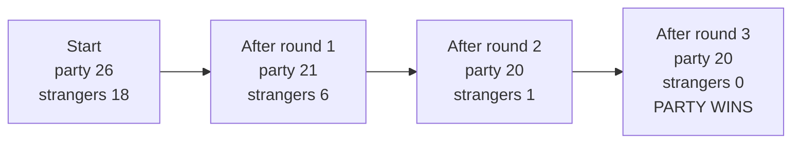

# Scenario 3555: A Battle Explained in Plain English

## A worked example from the pairing simulator

**Date:** 07-OCT-2026\
**Run:** `bal-kit-pGRD-sGRD-seed1-n5000` (extension kit, balanced fights, greedy party against greedy strangers, base seed 1, 5,000 scenarios)\
**Scenario:** number 3555, seed 3555\
**Related:** [pairing lab findings report](2026-10-06-pairing-lab-findings-report.md), [Monte Carlo spec](2026-10-06-monte-carlo-pairing-spec.md)

This walks through one simulated fight, round by round and match by match, so that the listings the simulator prints can be read and checked against the rules. It is a **simulation under our proposed default rules** (section 7), not a recorded game.

---

## 1. The result in one paragraph

A party of 26 allies fought 18 strangers led by the Sorcerer. The strangers attacked first, with the advantage of surprise, but the party won 12 of the 18 first-round matches and killed 12 strangers while losing 5 creatures. In round 2 the party attacked and killed five of the six remaining strangers. In round 3 it overwhelmed the Sorcerer, the last survivor. The party won in **three rounds with 20 of its 26 creatures alive**.



The scenario's line in the printed listing (`runs/bal-kit-pGRD-sGRD-seed1-n5000.log`):

```
SCN# DCK LVL CRS EYE SUP NP NS END RDS PAL SAL PVL SVL    R1    R2    R3 SEED
3555 KIT   4   0 -     1 26 18 PWN   3  20   0  24  89 0.306 0.000 0.367 3555
```

Read left to right: scenario 3555, kit deck, level 4, no curses, no Eye of God, the strangers have surprise (1), 26 in the party, 18 strangers; it ended with the party winning (`PWN`) after 3 rounds, with 20 party survivors and no stranger survivors; the party lost 24 points of value and the strangers 89; the three rewards are 0.306, 0.000 and 0.367.

---

## 2. The set-up

**Conditions.** Dungeon level 4, no curses, no Eye of God. The strangers have the **surprise** bonus: plus 1 on every die roll, in round 1 only. The party has plus 1 on every roll for the **Ring**, which a Man in the party is wearing.

The figure after each creature is its **total strength** (fighting strength plus magical power, with any artefact bonus). A creature fighting in the front line uses its total.

**The party: 26 allies, total strength 112**

| Creature | Total | Notes |
|---|---|---|
| Apprentice | 9 | Carries the Magic Sword; magic 7 |
| Wizard, Wizard | 7 each | Magic 5 each |
| Wizard | 9 | Carries the Magic Staff; magic 7 |
| Giant, Giant | 7 each | |
| Troll (with Elixir) | 6 | The Elixir adds a permanent 2 |
| Ogre, Ogre | 5 each | |
| Witch | 5 | Magic 4 |
| Priest | 4 | Magic 2 |
| Dwarf (with Magic Axe) | 4 | |
| Troll | 4 | |
| Unicorn | 4 | |
| Man (wearing the Ring) | 3 | The Ring: plus 1 on every party roll |
| Man (four others) | 3 each | |
| Scholar | 3 | Magic 1 |
| Woman (four) | 2 each | |
| Wolf | 2 | |
| Dwarf | 1 | |

**The strangers: 18, total strength 84**

| Creature | Total | Notes |
|---|---|---|
| **Sorcerer** | **13** | Magic 9: the strongest creature in the game |
| Giant | 7 | |
| Dragon, Dragon, Dragon | 6 each | |
| Hero | 5 | |
| Ogre | 5 | |
| Witch, Witch | 5 each | Magic 4 each |
| Troll | 4 | |
| Woman-Hero | 4 | |
| Priest, Priest | 4 each | Magic 2 each |
| Lion | 3 | |
| Man | 3 | |
| Thief | 2 | |
| Dwarf, Dwarf | 1 each | |

The party's total (112) is 1.33 times the strangers' (84). That is inside the generator's "balanced" band of 0.7 to 1.4, but at its top end, and the party has **8 more creatures**. As section 6 explains, the extra numbers matter more than the strength ratio.

---

## 3. How a match works (the rules in use)

Every fight is a set of **matches**. In each match each side adds up its creatures' strengths, rolls one die, and adds the die and its bonuses. The higher total wins.

- **A lone loser dies.** If the losing side had one creature in the front line, it dies.
- **A two-creature loser loses one.** If the losing side had two fighting together, the loser nominates one; on a die roll of 4 to 6 the nominated creature dies, otherwise the other one does. (For the strangers, as Peter's text is written, the nominated creature is spared on 4 to 6.)
- **A tie changes nothing.** The match is unresolved and goes on next round.
- **Gang-ups.** If one side has more creatures than the other, the larger side's spare creatures may join a match as a second fighter (never two against two).
- **Backers.** Casters (Wizards, Witches, Priests and so on) can stay behind a fighter and add their magic to its strength.
- **Round order.** The roles alternate. In round 1 the strangers attack, in round 2 the party, in round 3 the strangers again. The defender lines up first, the attacker pairs against that line, and then the larger side redeploys its spare creatures.

---

## 4. Round 1: the strangers attack

The party lined up **18 fighters**, its strongest, to meet the 18 strangers, and the strangers paired off strongest against strongest. The party's **8 spare creatures** then joined matches as second fighters, so 8 of the 18 matches were two against one.

Both sides have a bonus on every roll: **plus 1 for the party** (the Ring) and **plus 1 for the strangers** (surprise). "Totals" below are strength, plus the die, plus the bonus.

| # | Party | Strangers | Strength | Dice (party / strangers) | Totals | Winner | Who fell |
|---|---|---|---|---|---|---|---|
| 1 | Apprentice + Man | **Sorcerer** | 12 v 13 | 3 / 6 | 16 v 20 | Strangers | Apprentice (nominated; roll 6) |
| 2 | Wizard | Giant | 9 v 7 | 5 / 4 | 15 v 12 | Party | Giant |
| 3 | Wizard + Dwarf | Dragon | 8 v 6 | 2 / 6 | 11 v 13 | Strangers | Dwarf (nominated; roll 6) |
| 4 | Wizard | Dragon | 7 v 6 | 6 / 5 | 14 v 12 | Party | Dragon |
| 5 | Giant | Dragon | 7 v 6 | 2 / 4 | 10 v 11 | Strangers | Giant (party's) |
| 6 | Giant | Hero | 7 v 5 | 4 / 2 | 12 v 8 | Party | Hero |
| 7 | Troll | Ogre | 6 v 5 | 5 / 3 | 12 v 9 | Party | Ogre |
| 8 | Ogre + Man | Witch | 8 v 5 | 3 / 3 | 12 v 9 | Party | Witch |
| 9 | Ogre + Woman | Witch | 7 v 5 | 3 / 6 | 11 v 12 | Strangers | Woman (nominated; roll 4) |
| 10 | Witch | Troll | 5 v 4 | 2 / 3 | 8 v 8 | **Tie** | nobody |
| 11 | Priest + Woman | Priest | 6 v 4 | 3 / 6 | 10 v 11 | Strangers | Woman (nominated; roll 6) |
| 12 | Dwarf + Woman | Priest | 6 v 4 | 5 / 1 | 12 v 6 | Party | Priest |
| 13 | Troll + Woman | Woman-Hero | 6 v 4 | 6 / 1 | 13 v 6 | Party | Woman-Hero |
| 14 | Unicorn | Man | 4 v 3 | 4 / 4 | 9 v 8 | Party | Man |
| 15 | Man + Wolf | Lion | 5 v 3 | 2 / 3 | 8 v 7 | Party | Lion |
| 16 | Scholar | Thief | 3 v 2 | 4 / 4 | 8 v 7 | Party | Thief |
| 17 | Man | Dwarf | 3 v 1 | 5 / 4 | 9 v 6 | Party | Dwarf |
| 18 | Man | Dwarf | 3 v 1 | 4 / 5 | 8 v 7 | Party | Dwarf |

**Tally:** the party won 12 matches, the strangers 5, and 1 was a tie. That agrees with the listing's first reward (0.306), which is the strangers' share of the round-1 matches: 5½ out of 18.

**The party lost 5 creatures:** the Apprentice (a creature worth no points), a Dwarf, a Giant, and two Women.
**The strangers lost 12:** a Giant, a Dragon, the Hero, the Ogre, a Witch, a Priest, the Woman-Hero, the Man, the Lion, the Thief and both Dwarves.

**At the end of round 1: 21 party creatures against 6 strangers.** The survivors were the Sorcerer, two Dragons, a Witch, a Troll and a Priest.

**Two close calls worth noticing.**
- **Match 1.** The Sorcerer, with two creatures against him, was almost evenly matched on strength (12 against 13). He rolled a 6 against a 3 and won by 20 to 16. The Apprentice (nominated, and cheap) fell, and the Man survived.
- **Match 5.** A Dragon beat a Giant by a single point (11 to 10). Without the strangers' surprise bonus the Giant would have won.

---

## 5. Rounds 2 and 3

### Round 2: the party attacks

The roles swapped. The strangers no longer had surprise, so their bonus is 0, and the party kept its plus 1 for the Ring. With six strangers left, the party brought its spare creatures in as second fighters, and in the last match **two casters stood behind the front line adding their magic**.

| # | Party | Strangers | Strength | Dice (party / strangers) | Totals | Winner | Who fell |
|---|---|---|---|---|---|---|---|
| 1 | Man + Giant | **Sorcerer** | 10 v 13 | 2 / 3 | 13 v 16 | Strangers | Man (nominated; roll 4) |
| 2 | Wizard + Dwarf | Dragon | 11 v 6 | 6 / 6 | 18 v 12 | Party | Dragon |
| 3 | Ogre + Troll | Witch | 11 v 5 | 1 / 6 | 13 v 11 | Party | Witch |
| 4 | Witch + Troll | Troll | 9 v 4 | 2 / 2 | 12 v 6 | Party | Troll |
| 5 | Priest + Ogre | Priest | 9 v 4 | 6 / 4 | 16 v 8 | Party | Priest |
| 6 | Wizard + Unicorn, backed by Wizard and Scholar | Dragon | 19 v 6 | 1 / 2 | 21 v 8 | Party | Dragon |

**At the end of round 2: 20 party creatures against the Sorcerer alone.** He had beaten another pair, a Man and a Giant, by 16 to 13, and one Man fell.

### Round 3: the Sorcerer is overwhelmed

Only the Sorcerer was left. The party put a Giant and a Troll in front and stood **six casters behind them**: three Wizards, a Witch, a Priest and a Scholar.

| # | Party | Strangers | Strength | Dice (party / strangers) | Totals | Winner | Who fell |
|---|---|---|---|---|---|---|---|
| 1 | Giant + Troll, backed by three Wizards, a Witch, a Priest and a Scholar | **Sorcerer** | 37 v 13 | 1 / 6 | 39 v 19 | Party | The Sorcerer |

Even with the party's worst die roll (1) and the Sorcerer's best (6), the party still won by 20 points. A strength gap of 24 is more than one die can overturn (the most a die roll can swing is 5), so the match was decided before the dice were rolled.

---

## 6. Why it went this way

1. **Numbers decided it, not strength.** The party was only 1.33 times as strong overall, but it had 26 creatures against 18. Having spare creatures lets the larger side gang up (two against one), and later bring its casters in as backers. Both multiply strength in a match.
2. **Surprise lasts one round.** The strangers' plus 1 helped them win 5 matches in round 1, and decided the Dragon against the Giant. From round 2 it was gone.
3. **Small edges compound across many matches.** In round 1 the party's average edge per match was slight, but with 18 matches that adds up to a clear lead, and every strangers' loss thinned out the next round. The first-round result (12 wins to 5) set up the rest.
4. **The Sorcerer is hard to kill.** Strength 13 meant that two ordinary creatures against him were never a safe bet (twice he won against a pair). He fell only when the whole caster group could be brought to bear.

---

## 7. What this does and does not show

**It is a simulation.** It follows our proposed default rules: the strangers attack first, roles alternate, matches persist, and a stranger's two-creature loss follows Peter's written casualty rule. These defaults are being confirmed with Peter. The party plays the **greedy** style: its strongest creatures fight first, spares join the matches where they help most, and the party retreats if its strength falls below half the strangers'. Nothing here has been compared with how people really play.

**It shows how to read the output.** The listing line, the match table and the casualty rules all reconcile: the party's losses add up to 24 points of value (Apprentice 0, Dwarf 2, Giant 7, two Women at 5, Man 5), the 6 creatures lost leave 20 alive, and the strangers' 18 deaths account for the 89 points.

**It is typical, not special.** In the whole run, the party wins about 62% of these balanced kit fights, retreats about 21% of the time, and the strangers win about 17%. This scenario, in which the party wins with 20 of 26 alive, is an ordinary result for a fight where the party has the larger numbers.

---

## 8. How to reproduce it

The scenario is generated from the run's settings and the scenario number, and replays exactly:

```
pnpm --filter @sorcerers-cave/pairing-lab report -- --replay runs/bal-kit-pGRD-sGRD-seed1-n5000.json
```

The match-by-match narrative above comes from replaying this one scenario with the simulator's **trace** hook, which reports every match, every casualty and the end of every round. The package's printed listings show the match tables directly:

```
pnpm --filter @sorcerers-cave/pairing-lab report -- --count 5000 --deck kit --party GRD --strangers GRD --detail 50
```

(`--detail N` writes the one-match-per-line listing for the first N scenarios; scenario 3555 is beyond the first 50, so it is not in that file. Making any scenario's story available on request, an `--explain` option, is a suggested follow-up.)
