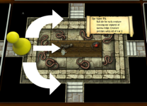
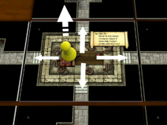
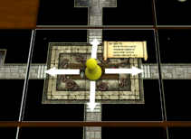
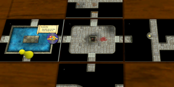

# SC Notes – Precise Locations in Special Chambers

Currently, the game is treating all movement between areas as moving the party from the centre of the current tile to the centre of the next tile. This works (sort-of) for passageways and standard chambers, but it doesn't make much sense “in-game”. For example, if your party is in the centre of the chamber surrounded by Strangers, why would you be restricted to withdrawing only via the doorway through which you arrived?

I have always thought of the game as a “stealth/exploration” game. In such  a game, it makes sense to be restricted to withdrawing via the doorway that you used to enter - IF it is the case that on entering a new area your party is always “sneaking” and “hovering” (hidden from Strangers' view) – in the doorway.

If the game doesn't implement sub-locations within a tile, there are two implications:

1. Lack of sub-locations for party tokens means that four areas (Deep Pool, Viper Pit, Whirlpool & Chasm) can't work properly for movement.
2. Lack of sub-locations for dropped treasure can't work properly for treasure retrieval.

“If it is the Whirlpool, Viper pit or Deep pool, the player leaves his token just inside the doorway (*) and may proceed across the barrier and through another doorway on the following turn.”

## VIPER PIT

Viper pit. “On first turning the card over you move your tokens onto it, but not onto the narrow ledge. On the following turn, you may either go back to the area you were last in or cross one segment of the narrow ledge and, if you wish, try to leave by that doorway. To cross another segment and proceed through that doorway requires another turn.

Any treasure carried by a creature who falls off the ledge remains in the pit, and is recoverable only by a party with the charmed flute. Treasure may be deliberately cast into the pit.

A stairway or trap leading to the viper pit comes out on a safe island in the middle.”

**PV Notes/Interpretation:** Viper Pit is the first area that relies heavily on being able to position the party precisely.

### CASE ONE

When entering the area from North, East, West or South (N/E/W/S),  you must stop in the doorway.

On your next turn you may:

 - If you have the Magic Flute, then reveal all secret doors and/or charm the snakes and collect any treasure that is in the pit.
 - Go back the way you came, if the way is still open.
 - Navigate clockwise or anti-clockwise around the narrow ledge to one of the two nearest other N/E/W/S doorways (rolling a die for each creature), and you may leave via that route if the way is open.
 - Jump onto the central island (rolling a die for each creature), and leave via an UP or Down (U/D) secret doorway, if such exists, and if you have discovered it.
 - Having changed sub-location within the tile, you may finish your turn there, and start your next turn without delay.

### CASE TWO

When entering via a secret stairway from Up or Down, you land on the central island.

On your next turn you may:

 - If you have the Magic Flute, then reveal all secret doors and/or charm the snakes and collect any treasure that is in the pit.
 - Go back the way you came, if the way is still open.
 - Leave via a different secret doorway on the central island that is not the one you arrived through - if such exists, and if you have discovered it.
 - Jump from the central island onto one of the four N/E/W/S doorways (rolling a die for each creature), and you may leave via that route, if the way is open).
 - Having changed sub-location within the tile, you may finish your turn there, and start your next turn without delay.

### CASE THREE 

When entering via a trap from Up or Down, you land on the central island.

On your next turn you may:

 - If you have the Magic Flute, then reveal all secret doors and/or charm the snakes and collect any treasure that is in the pit.
 - Leave via a secret doorway on the central island - if such exists, and if you have discovered it.
 - Jump from the central island onto one of the four N/E/W/S doorways (rolling a die for each creature), and you may leave via that route, if the way is open).
 - Having changed sub-location within the tile, you may finish your turn there, and start your next turn  without delay.

### Jumping to a central island.

I play the jumping/swimming house rule for Viper Pit and Deep Pool, even though the rules do not specify that you can.

My reasoning is :
The Viper Pit island is described as “safe” - but it cannot be safe if you can't leave it. Without the jumping action, and without a Magic Carpet, falling down a trap onto the central island would be an unavoidable Total Party Kill, and I believe Mr. Donnelly did not have that kind of game in mind when he designed it.

## DEEP POOL

Deep pool. On first turning the card over you move your token onto it, but not across the water. On the following turn you may either move back to the area you were last in or cross the water and proceed through any doorway. If a giant has to carry across more than one load of heavy treasure there is a delay of one turn per additional load before the party can proceed.

Heavy treasure that has to be left behind is left in the doorway. Treasure may be deliberately cast into the pool, and is recoverable only by a giant.

A stairway or trap leading to the deep pool comes out on an island in the middle. Treasure may be left on this island.

Deep Pool also relies upon sub-locations, in much the same way:

### CASE ONE:

When entering the area from N/E/W/S,  you must stop in the doorway.

On your next turn, you may:

 - Cast treasure in to the Pool.
 - Collect any treasure that has been dropped in the doorway that you are standing in.
 - Get a giant in your party to recover any treasure that is in the pool.
 - Go back the way you came, if the way is still open.
 - Swim to any of the other N/E/W/S doorways (provided only a giant is carrying heavy treasure), and you may leave via that route if the way is open.
 - Swim to the central island (provided only a giant is carrying heavy treasure), collect any treasure that has been dropped there, and leave via an UP or Down (U/D) secret doorway, if such exists, and if you have discovered it.
 - Having changed sub-location within the tile, you may finish your turn there, and start your next turn without delay.

### CASE TWO

When entering via a secret doorway, you land on the central island.

On your next turn, you may:

 - Cast treasure in to the Pool.
 - Collect any treasure that has been dropped on the central island.
 - Get a giant in your party to recover any treasure that is in the pool.
 - Go back the way you came, if the way is still open.
 - Leave via an U/D secret doorway that is not the one you used to enter, if such exists, and if you have discovered it.
 - Swim to any of the N/E/W/S doorways (provided only a giant is carrying heavy treasure), and you may leave via that route if the way is open.
 - Having swum to a sub-location within the tile, you may finish your turn there, and start your next turn without delay.

### CASE THREE

When falling down a trap, you land on the central island.

On your next turn, you may:

 - Cast treasure in to the Pool.
 - Collect any treasure that has been dropped on the central island.
 - Get a giant in your party to recover any treasure that is in the pool.
 - Leave via an U/D secret doorway, if such exists, and if you have discovered it.
 - Swim to any of the N/E/W/S doorways (provided only a giant is carrying heavy treasure), and you may leave via that route if the way is open.
 - Having swum to a sub-location within the tile, you may finish your turn there, and start your next turn without delay.

## WHIRLPOOL

Whirlpool. Basically like the viper pit, except that you roll only once for the entire party. Any stairway leading to this area is considered blocked. A trap to this area sends you down another level.

The Whirlpool is not really like the Viper Pit, in that there is no central island – hence the special rules:

### CASE ONE

When  entering the area from North, East, West or South (N/E/W/S),  you must stop in the doorway.

On your next turn you may:

 - Go back the way you came, if the way is still open.
 - Navigate clockwise or anti-clockwise through the shallows to one of the two nearest other N/E/W/S doorways (rolling a die once for the party), and you may leave via that route if the way is open.
 - Having changed sub-location within the tile, you may finish your turn there, and start your next turn without delay.

### CASE TWO

When attempting to enter via a secret stairway from Up or Down, you find it blocked - you can only return to the tile you just left – just as if you had encountered a dead end.

### CASE THREE

When entering via a trap, you fall into the Whirlpool and end up one level further down.

## CHASM
The Chasm also relies on sub-locations, but is simpler because there is no jumping:
Chasm. On the turn following entry you may either go back the way you came in, or descend to the next level. A stairway up or down to the chasm leads to the island or column in the middle, from where the party can only descend, except to trace its steps up a stair. A trap to here sends you down a further level.

### CASE ONE

When entering the area from N/E/W/S,  you must stop in the doorway.

On your next turn, you may:

 - Go back the way you came, if the way is still open.
 - Go down one level.

### CASE TWO

When entering via a secret doorway U/D, you land on the central island/column.

On your next turn, you may:

 - Go back the way you came, if the way is still open.
 - Leave via an U/D secret doorway that is not the one you used to enter, if such exists, and if you have discovered it.
 - Go down one level.

### CASE THREE

When entering via a trap, you can only descend, and end up one level further down.

## DROPPED TREASURE / ARTEFACTS

As I think I intimated in my previous notes, the thorny issue of dropping treasure is something I have never been able to adequately resolve via house rules.

One could make a case that dropping treasure in precise locations is only strictly important for Viper Pit, Deep Pool and Chasm. Under this approach, anything dropped whilst in the doorway, or in the centre, of a standard chamber just “automatically” finds its way to the centre of the chamber, being added to anything that may already be there. The in-game argument for this is:

1. If there are Strangers there already guarding treasure, the they will find what you dropped after you leave.
2. If there are no Strangers, then what you dropped can easily be found later (by you, or in a multi-player game by another party – so it “may as well” be in the centre.

If you adopt a very minimalist approach, then precise dropping of treasure is only strictly necessary for Viper Pit and Deep Pool – since these are the only two areas where Mr. Donnelly specifically mentions it. But you then have to explain why dropping treasure precisely in Whirlpool or Chasm is not allowed – I find that very difficult to justify.

Here is a typical example of why precise location of treasure is important:

Imagine that you have arrived in a chamber with only one viable exit. This could arise because your party fell down a trap, or the doorway you arrived by is no longer open (Spell, Earthquake...). You have no Magic Carpet, no Giant, and your only way to proceed is across the Deep Pool.

Below is a mock-up showing my preferred solution:

The party stops in the East doorway of the Deep Pool. Next turn, they drop heavy treasure and swim to the South doorway. The dropped treasure is represented by a Dropped Item Token.

Now the party have 3 chances to find an open route.

This is the approach I have actually used when playing Solitaire with cardboard – just set aside the dropped cards and mark their location with a token – but I never implemented this for the TTS version, mainly due to the difficulty of having to explain this unorthodox approach to players. Also, in multiplayer, the tokens would have to be identifiable in case there were more than pile of dropped stuff. It all gets horribly complicated.

Personally, I favour implementing precise dropping of items for all of Viper Pit, Deep Pool, Whirlpool and Chasm. I argue that it enhances the game by providing additional opportunities for “advanced” strategies – especially in multiplayer, such as:

1.	If you possess the Magic Flute, then the Viper Pit becomes your very own “safe deposit box”! Just throw any treasure into the pit, and no-one else can get at it until you return...
2.	Dropping the Eye of God temporarily. You have built up a primarily non-magical focused party, and picked up the Eye. But now you want to drop it for a while, because you have something highly magical that you absolutely must do; you know you will be cursed, but you intend to pick the Eye back up later. Exploiting both secret doors and Deep Pool/Viper Pit/Whirlpool/Chasm is the best way to reduce the chances of another party being able to get to it by dropping it in a place that is not easy for others to access.
3.	The Dropped Item Token approach is (I think) consistent with Mr. Donnelly's ideas for Hidden Cards in competitive play. If another player has dropped something in one doorway of the Deep Pool, a token indicates that something is there, but you don't know what it is. An expert player could even exploit this by dropping something trivial/unwanted on side of the Deep Pool before crossing  – hoping to trick another player into wasting time trying to get to what they assume must be heavy treasure...

As I have said before, I also favour precise location of the Party token for standard chambers (if the code must exist for special chambers, why not?). The token should be located in the doorway until  any of the following (if they are appropriate) have happened:

 - Drawn small cards.
 - Survived Traps & Hazards.
 - Been presented with the Withdraw/Approach/Attack options.

